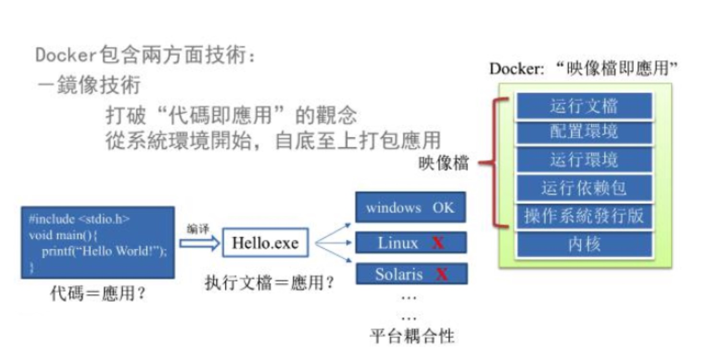

### 课程大纲
1. Docker 简介
2. Docker 安装
3. Docker 常用命令
4. Docker 镜像
5. Docker 容器数据卷
6. DockerFile 解析
7. Docker 常用安装
8. 本地镜像发布到阿里云

### Docker 简介
1. 前提知识 + 课程定位
  - 前提知识
    - 强制，熟悉 Linux 命令和相关背景知识 ps top
    - [下载地址](http://www.atguigu.com/download.shtml#linux)
2. 是什么
  - 为什么会有docker出现
    - 一款产品从开发到上线，从操作系统，到运行环境，再到应用配置。作为开发+韵味之间的写作我们需要关心很多东西，这也是很多互联网不得不面对的问题，特别是各种版本的迭代之后，不同版本环境的兼容，对运维人员都是考验
    - Docker之所以发展如此迅速，也是因为它对此给出了一个标准化的解决方案。
    - 环境配置如此麻烦，换一台机器，就要重来一次，费事费力。很多人想到，能不能从根本上解决问题，软件可以带环境安装？也就是说，安装的时候，把原始环境一摸一样的复制过来。开发人员利用Docker可以消除协作编码时“在我的机器上可以正常工作”的问题。
    
    - 之前在服务器配置一个应用的运行环境，要安装各种软件，Java/Tomcat/MySQL/JDBC驱动包等。安装和配置这些东西有很多麻烦就不说了，它还不能跨平台。假如我们在Windows上安装的这些环境，到了Linux又得重新装。况且结算不跨操作系统，换另一台同样操作系统的服务器，要移植应用也是非常麻烦的。
    - 传统上认为，软件编码开发/测试结束后，所产出的成果即是程序或是能够编译执行的二进制字节码等(java为例)。而为了让这些程序可以顺利执行，开发团队也得准备完备的部署文件，让运维团队得以部署应用程式，开发需要清楚的告诉运维部署团队，用的全部配置文件+所有软件环境。不过，即便如此，荏苒常常发生部署失败的状况。
    - Docker镜像的设计，使得Docker得以打破过去[程序即应用]的观念。透过镜像(images)将作业系统核心除外，运作应用程式所需要的系统环境，由下而上打包，达到应用程式跨平台间的无缝接轨运作。
  - docker理念
    - Docker是基于Go语言实现的云开源项目
    - Docker的主要目标是"Build,Ship and Run Any App,Anywhere"，也就是通过对应用组件的封装、分发、部署、运行等生命周期的管理，使用APP(可以是一个WEB应用或数据库应用等等)及其环境能够做到“一次封装，到处运行”
    - Linux容器技术的出现就解决了这样一个问题，而Docker就是在它的基础上发展过来的。将应用运行在Docker容器上面，而Docker容器在任何操作系统上面都是一致的，这就实现了跨平台、跨服务器。只需要一次配置好环境，换到别的机子上就可以一键部署好，大大简化了操作
  - 一句话
    - 解决了运行环境和配置问题软件容器，方便做持续集成并有助于整体发布的容器虚拟化技术 
3. 能干嘛
  - 之前的虚拟机技术
    - 虚拟机就是带环境安装的一种解决方案
    - 它可以在一种操作系统里面运行另一种操作系统，比如在Windows系统里面运行Linux系统。应用程序对此毫无感知，因为虚拟机看上去跟真是系统一摸一样，而对于底层系统来说，虚拟机就是一个普通文件，不需要了就删掉，对其他部分毫无影响。这类虚拟机完美的运行了另一套系统，能够使应用程序，操作系统和硬件三三者之间的逻辑不变。
    - 虚拟机的缺点：资源占用多、冗余步骤多、启动慢
  - 容器虚拟化技术
    - 由于前面虚拟机存在这些缺点，Linux发展出了另一种虚拟化技术：Linux容器(Linux Containers，缩写为LXC)
    - **Linux容器不是模拟一个完整的操作系统**，而是对进程进行隔离。有了容器，就可以将软件运行所需要的所有资源打包到一个隔离的容器中。容器与虚拟机不同，不需要捆绑一整套操作系统，只需要软件工程所需的库资源和设置。系统因此而变得高效率轻量并保证部署在任何环境中的软件都能始终如一的运行。
    - 比较了Docker和传统虚拟化方式的不同之处：
      - 传统虚拟机技术是虚拟出一套硬件后，在其上运行一个完整操作系统，在该系统上在运行所需要应用进程；
      - 而容器内的应用进程直接运行于宿主的内核，容器内没有自己的内核，**而且也没有进行硬件虚拟**。因此容器要比传统虚拟机更为轻便。
      - 每个容器之间互相隔离，每个容器有自己的文件系统，容器之间不会互相影响，能区分计算资源。
  - 开发/运维(DevOps)
    - 一次构建、随处运行
      - 更快速的应用交付和部署
      - 更边界的升级和扩缩容
      - 更简单的系统运维
      - 更高效的计算资源利用
  - 企业级
    - 新浪
    - 美团
    - 蘑菇街
    - ......
4. 去哪下
  - 官网
    - docker 官网：http://www.docker.com
    - docker 中文网站：https://www.docker-cn.com/
  - 仓库
    - Docker Hub官网：https://hub.docker.com/