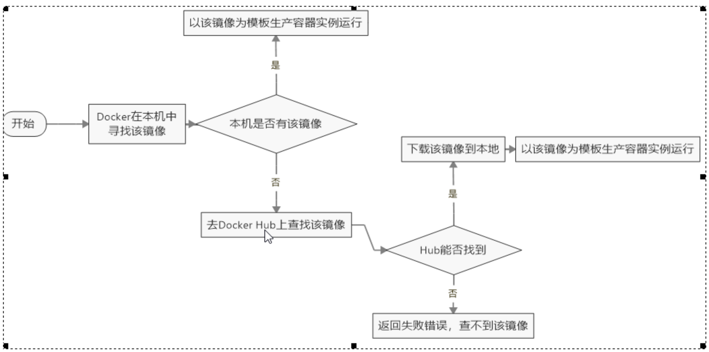
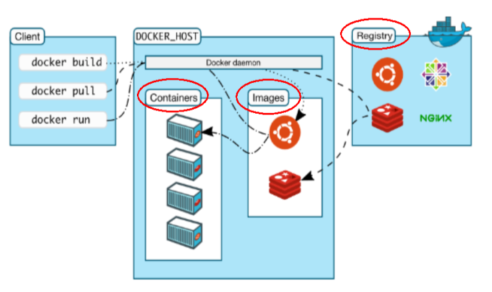
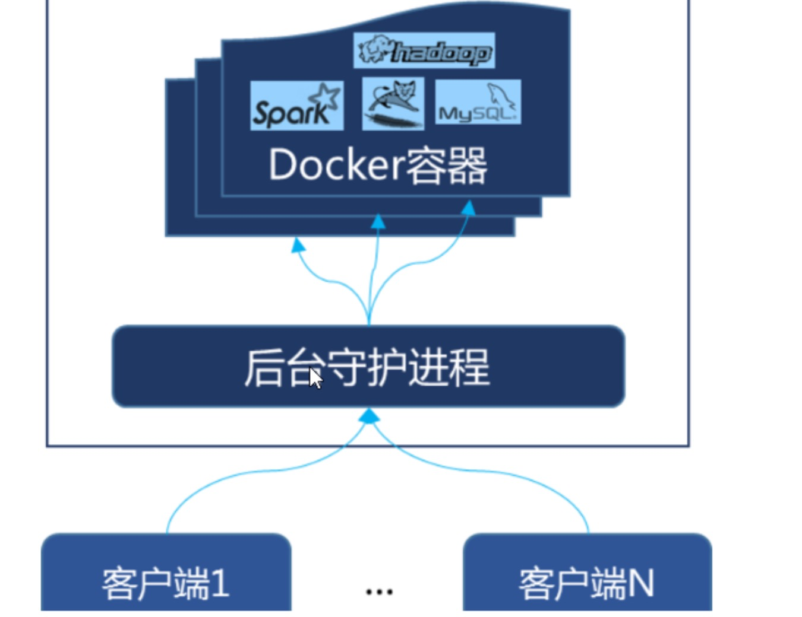
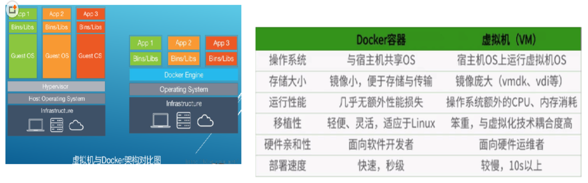

### Docker 安装
1. 前提说明
  - Docker 支持以下的 CentOS 版本
  - CentOS 7(64-bit)
  - CentOS 6.5(64-bit)或更高的版本
  - 查看自己的内核
    - uname 命令用于打印当前系统相关信息(内核版本号、硬件架构、主机名称和操作系统类型等)
    ```
    uname -r
    ```
2. Docker 的基本组成
  - Docker 架构图
  - **镜像(image)**
    - Docker 镜像(image)就是一个**只读**的模版。镜像可以用来创建 Docker 容器，**一个镜像可以创建很多容器**
  - **容器(container)**
    - Docker 利用容器(Container)独立运行的一个或一组应用。**容器是用镜像创建的运行实例**
    - 它可以被启动、开始、停止、删除。每个容器都是相互隔离的、保证安全的平台。
    - **可以把容器看作是一个简易版的Linux环境**(包括 root 用户权限、进程空间、用户空间和网络空间等)和运行在其中的应用程序
    - 容器的定义和镜像几乎一摸一样，也是一堆层的统一视角，唯一区别在于容器的最上面那一层是可读可写的
  - **仓库(repository)**
    - 仓库(Repository)是**集中存放镜像**文件的场所。
    - 仓库和仓库注册服务器(Registry)是有区别的。仓库注册服务器上往往存放着多个仓库，每个仓库中又包含了多个镜像，每个镜像有不同的标签(tag)
    - 仓库分为公开仓库和私有仓库两种形式。
    - **最大的公开仓库是 Docker Hub(https://hub.docker.com/)**
    - 存放了数量庞大的镜像供用户下载。国内的公开仓库包括阿里云、网易云等
  - 小总结
    - Docker 本身是一个容器运行载体或称之为管理引擎。我们把应用程序和配置依赖打包好形成一个可交付的运行环境，这个打包好的运行环境就是image镜像文件。只有通过这个镜像文件才能生成 Docker 容器。image 文件可以看作是容器的模板。Docker 根据 image 文件生成容器的实例。同一个 image 文件，可以生成多个同时运行的容器实例。
    - image 文件生成的容器实例，本身也是一个文件，称为镜像文件
    - 一个容器运行一种服务，当我们需要的时候，就可以通过 docker 客户端创建一个对应的运行实例，也就是我们的容器
    - 至于仓储，就是放了一堆镜像的地方，我们可以把镜像发布到仓储中，需要的时候从仓储中拉下来就可以了
3. 安装步骤
  - CentOS6.8 安装 Docker
  - CentOS7 安装 Docker
4. 永远的Helloworld
  - 阿里云镜像加速
  - 网易云加速
    - 基本同上述阿里云
  - 启动Docker后台容器(测试运行hello-world)
    - `docker run hello-world`
    - run 干了什么
    
5. **底层原理**

### Docker 架构图


### CentOS6.8 安装 Docker
- `yum install -y epel-release`
- `yum install -y docker-io`
- 安装后的配置文件：`/etc/sysconfig/docker`
```yml
other_args = DOCKER_CERT_PATH=/etc/docker
DOCKER_NOWARN_KERNEL_VERSION=1
```
- 启动 Docker 后台服务：`service docker start`
- docker version 验证

### CentOS7 安装 Docker
- 官网中文安装参考手册
- 确定你是 CentOS7 及以上版本`cat /etc/redhat-release`
- yum 安装 gcc 相关
  - CentOS7 能上外网
  - `yum -y install gcc`
  - `yum -y install gcc-c++`
- 卸载旧版本
```
$ sudo yum remove docker \
                  docker-client \
                  docker-client-latest \
                  docker-common \
                  docker-latest \
                  docker-latest-logrotate \
                  docker-logrotate \
                  docker-engine
```
- 安装需要的软件包
```
$ sudo yum install -y yum-utils \
  device-mapper-persistent-data \
  lvm2
```
- 设置 stable 镜像仓库
  - 太坑：`sudo yum-config-manager --add-repo https://download.docker.com/linux/centos/docker-ce.repo`
  - 推荐：`sudo yum-config-manager --add-repo https://mirrors.aliyun.com/docker-ce/linux/centos/docker-ce.repo`
  - `cat /etc/yum.repos.d/docker-ce.repo`
- 更新 yum 软件包索引`yum makecache fast`
- 安装 DOCKER CE`yum -y install docker-ce`
- 启动 docker`systemctl start docker`
- 测试
  - `docker version`
  - `docker run hello-world`
- 配置镜像加速
  - `mkdir -p /etc/docker`
  - `vim /etc/docker/daemon.json`
  ```yml
  # 网易云
  {"registry-mirrors": ["http://hub-mirror.c.163.com"]}

  # 阿里云
  {"registry-mirrors": ["https://{自己的编码}.mirror.aliyuncs.com"]}
  ```
  - `systemctl daemon-reload`
  - `systemctl restart docker`
- 卸载
  - `systemctl stop docker`
  - `yum -y remove docker-ce`
  - `rm -rf /var/lib/docker`

### 阿里云镜像加速
1. 是什么`https://dev.aliyun.com/search.html`
2. 注册一个属于自己的阿里云账户(可复用淘宝账号)
3. 获得加速器地址连接
  - [登陆阿里云开发者平台](https://cr.console.aliyun.com/cn-hangzhou/instances/mirrors)
  - 获取加速器地址`/etc/docker/daemon.json`
  ```
  sudo mkdir -p /etc/docker
  sudo tee /etc/docker/daemon.json <<-'EOF'
  {
    "registry-mirrors": ["https://hdradlf0.mirror.aliyuncs.com"]
  }
  EOF
  sudo systemctl daemon-reload
  sudo systemctl restart docker
  ```
4. 配置本机 Docker 运行镜像加速器
  - centOS6.5需要对文件进行配置
  - `vim /etc/sysconfig/docker`
  - 将获得的自己账户下的阿里云加速地址配置进`other_args="--registry-mirror=https://你自己的账号加速信息.mirror.aliyuncs.com"`
5. 重新启动 Docker 后台服务：`service docker restart`
6. Linux 系统下配置完加速器需要检查是否生效`ps -ef|grep docker`

### Docker 底层原理
1. Docker 是怎么工作的
  - Docker 是一个 Client-Server 结构的系统，Docker 守护进程运行在主机上，然后通过 Socket 连接从客户端访问，守护进程从客户端接受命令并管理运行在主机上的容器。**容器，是一个运行时环境，就是我们前面说到的集装箱**
  
2. 为什么 Docker 比较比 VM 快
  - docker 有着比虚拟机更少的抽象层。由于 docker 不需要 Hypervisor 实现硬件资源虚拟化，运行在 docker 容器上的程序直接使用的都是实际物理机的硬件资源。因此在 CPU、内存利用率上 docker 将会在效率上有明显优势
  - docker 利用的是宿主机的内核，而不需要 Guest OS。因此，当新建一个容器时，docker 不需要和虚拟机一样重新加载一个操作系统内核。仍而避免引寻、加载操作系统内核多个比较费时资源的过程，当新建一个虚拟机时，虚拟机软件需要加载 Guest OS，返回新建过程是分钟级别的。而 docker 由于直接利用宿主机的操作系统，则省略了多个过程，因此新建一个 docker 容器只需要几秒钟。
  