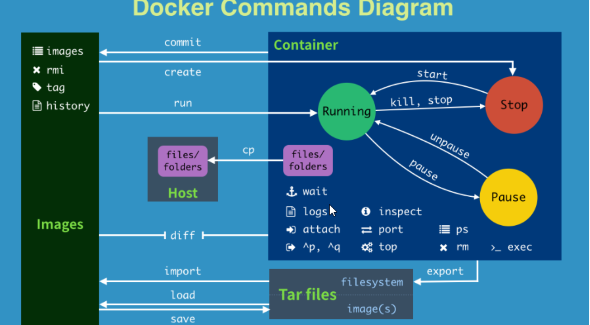

### Docker 常用命令
1. 帮助命令
  - `docker version`
  - `docker info`
  - `docker --help`
2. 镜像命令
3. 容器命令
4. 小总结

### 镜像命令
1. `docker images`
  - 列出本地主机上的镜像
    - `REPOSITORY`：标示镜像的仓库源
    - `TAG`：镜像的标签
    - `IMAGE ID`：镜像ID
    - `CREATED`：镜像创建时间
    - `SIZE`：镜像大小
    - 同一仓库源可以有多个TAG，代表这个仓库源的不同个版本，我们使用 REPOSITORY:TAG 来定义不同的镜像，默认是使用 latest 镜像
  - OPTIONS 说明：
    - `-a`：列出本地所有的镜像（含中间映射层）
    - `-q`：只显示镜像 ID
    - `--digests`：显示镜像的摘要信息
    - `--no-trunc`：显示完整的镜像信息
2. `docker search`某个xxx镜像名字
  - 网站`https://hub.docker.com`
  - OPTIONS 说明：
    - `--no-trunc`：显示完整的镜像描述
    - `-s`：列出收藏数不小于指定值的镜像
    - `--automated`：只列出 automated build 类型的镜像
3. `docker pull`某个xxx镜像名字
  - 下载镜像
  - `docker pull 镜像名字[:TAG]`
4. `docker rmi`某个xxx镜像名字ID，`-f`
  - 删除单个`docker rmi -f 镜像ID`
  - 删除多个`docker rmi -f 镜像名1:TAG 镜像名2:TAG`
  - 删除全部`docker rmi -f $(docker images -qa)`
5. 思考：结合我们Git的学习心得，是否有 `docker commit / docker push ???`

### 容器命令
1. **有镜像才能创建容器，这是根本前提(下载一个CentOS镜像演示)**
  - `docker pull centos`
2. 新建并启动容器
  - **`docker run [OPTIONS] IMAGE [COMMAND] [ARG...]`**
    - OPTIONS 说明
    - **启动交互式容器**
      - 使用镜像`centos:latest`以交互模式启动一个容器，在容器内执行`/bin/bash`命令`docker run -it centos /bin/bash`
3. 列出当前所有**正在运行**的容器`docker ps [OPTIONS]`
  - `-a`：列出当前所有**正在运行**的容器+**历史上运行过**的
  - `-l`：显示最近创建的容器
  - `-n`：显示最近 n 个创建的容器
  - **`-q`：静默模式，是显示容器编号**
  - `--no-trunc`：不截断输出
4. 退出容器
  - exit：容器停止退出
  - ctrl+P+Q：容器不停止退出
5. 启动容器：`docker start 容器 ID 或者容器名`
6. 重启容器：`docker restart 容器 ID 或者容器名`
7. 停止容器：`docker stop 容器 ID 或者容器名`
8. 强制停止容器：`docker kill 容器 ID 或者容器名`
9. 删除已停止的容器：`docker rm 容器 ID`
  - 一次性删除多个容器
    - `docker rm -f $(docker ps -a -q)`
    - `docker ps -a -q | xargs docker rm`
10. **重要**
  - **启动守护式容器**
    - `docker run -d 容器名`
  - 查看容器日志`docker logs -f -t --tail 容器ID`
    - `-t`：是加入时间戳
    - `-f`：跟随最新的日志打印
    - `--tail`：数字显示最后多少条
    ```
    docker run -d centos /bin/sh -c "while true;do echo hello zzyy;sleep 2;done"
    ```
  - 查看容器内运行的进程`docker top 容器ID`
  - 查看内容内部细节`docker inspect 容器ID`
  - 进入正在运行的容器并以命令行交互
    - `docker exec -it 容器ID bashShell`
    ```
    docker exec -t 容器ID ls -l /tmp
    ```
    - 重新进入`docker attach 容器ID`
    - 上述两个区别
      - attach 直接进入容器启动命令的终端，不会启动新的进程
      - exec 是在容器中打开新的终端，并且可以启动新的进程
  - 从容器内拷贝文件到主机上
    - `docker cp 容器ID:容器内路径 目的主机路径`
    ```
    docker cp 容器ID:/tmp/yum/log /root
    ```



### 容器命令 - 新建并启动容器 - OPTIONS 说明
1. `--name="容器新名字"`：为容器指定一个名称
2. `-d`：后台运行容器，并返回容器 ID，也即启动守护式容器
3. **`-i`：以交互模式运行容器，通常与 -t 同时使用**
4. **`-t`：为容器重新分配一个伪输入终端，通常与 -i 同时使用**
5. `-P`：随机端口映射
6. `-p`：指定端口映射，有以下四种格式
  - ip:hostPort:containerPort
  - ip::containerPort
  - **hostPort:containerPort**
  - containerPort
```
docker run -it [images ID]
```

### 启动守护式容器
1. 使用镜像 `centos:latest` 以后台模式启动一个容器`docker run -d centos`
2. 问题：然后 `docker ps -a` 进行chance，会发现容器已经退出
3. 很重要的要说明一点：**Docker 容器后台运行，就必须有一个前端进程**
4. 容器运行的命令如果不是哪些**一直挂起的命令**(比如运行top，tail)，就是会自动退出的
5. 这个是 docker 的机制问题，比如你的 web 容器，我们以 nginx 为例，正常情况下，我们配置启动服务只需要启动相应的 service 即可。例如`service nginx start`
6. 但是这样做，nginx 为后台进程模式运行，就导致 docker 前台没有运行的应用，这样的容器后台启动后，会立即自杀因为他觉得他没事做了
7. 所以，最佳的解决方案是，将你要运行的程序以前台进程的形式运行