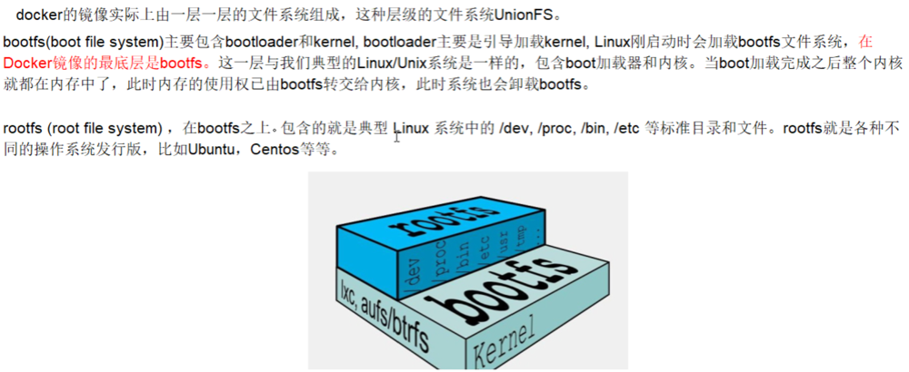

### Docker 镜像
1. 是什么
  - 镜像是一种轻量级、可执行的独立软件包，**用来打包软件运行环境和基于运行环境开发的软件**，它包含运行某个软件所需的所有内容，包括代码、运行时、库、环境变量和配置文件
  - UnionFS（联合文件系统）
    - Union文件系统是一种分层、轻量级并且高性能的文件系统，它支持**对文件系统的修改作为一次提交来一层层的叠加**，同时可以将不同目录挂载到同一个虚拟文件系统下。Union文件系统是 Docker 镜像的基础。镜像可以通过分层来进行集成，基于基础镜像（没有父镜像），可以制作各种具体的应用镜像。
    - 特性：一次同时加载多个文件系统，但从外面看起来，只能看到一个文件系统，联合加载会把各层文件系统叠加起来，这样最终的文件系统会包含所有底层的文件和目录
  - Docker 镜像加载原理
  
    - 对于一个精简的OS，rootfs 可以很小，只需要包括最基本的命令、工具和程序库就可以了，因为底层直接用 Host 的 kernel，自己只需要提供 rootfs 就行了。由此可见对于不同的 linux 发型版本，bootfs 基本是一致的，rootfs会有差别，因此不同的发行版本可以公用bootfs
  - 分层的镜像
    - 以我们的 pull 为例，在下载的过程中我们可以看到 docker 的镜像好像是在一层一层的正在下载
  - 为什么 Docker 镜像要采用这种分层结构呢
    - 最大的一个好处就是 - 共享资源
    - 比如：有多个镜像都从相同的 base 镜像构建而来，那么宿主机只需要在磁盘上保存一份 base 镜像，同时内存中也只需要加载一份 base 镜像，就可以为所有容器服务了。而且镜像的每一层都可以被共享
2. 特点
  - Docker 镜像都是只读的，当容器启动时，一个新的可写层被加载到镜像的顶部。这一层通常被称作“容器层”，“容器层”之下的都是“镜像层”
3. Docker 镜像 commit 操作补充
  - `docker commit` 提交容器副本使之成为一个新的镜像
  - `docker commit -m="提交的描述信息" -a="作者" 容器ID要创建的目标镜像名:[标签名]`
  - 案例演示
    - 从 Hub 上下载 tomcat 镜像到本地并成功运行`docker run -it -p 8080:8080 tomcat`
      - `-p`：主机端口:docker 容器端口
      - `-P`：随机分配端口`docker run -it -P tomcat`
      - `i`：交互
      - `t`：终端
    - 故意删除上一步镜像生产 tomcat 容器的文档
    ```
    docker ps
    docker exec -it 容器ID /bin/bash
    cd webapps
    rm -rf docs
    ```
    - 也即当前的 tomcat 运行实例是一个没有文档内容的容器，以它为模板 commit 一个没有 doc 的 tomcat 新镜像 zzyy/tomcat02
    ```
    docker commit -a="zzyy" -m="tomcat without docs" 容器ID zzyy/tomcat02:1.2
    ```
    - 启动我们的新镜像并和原来的对比