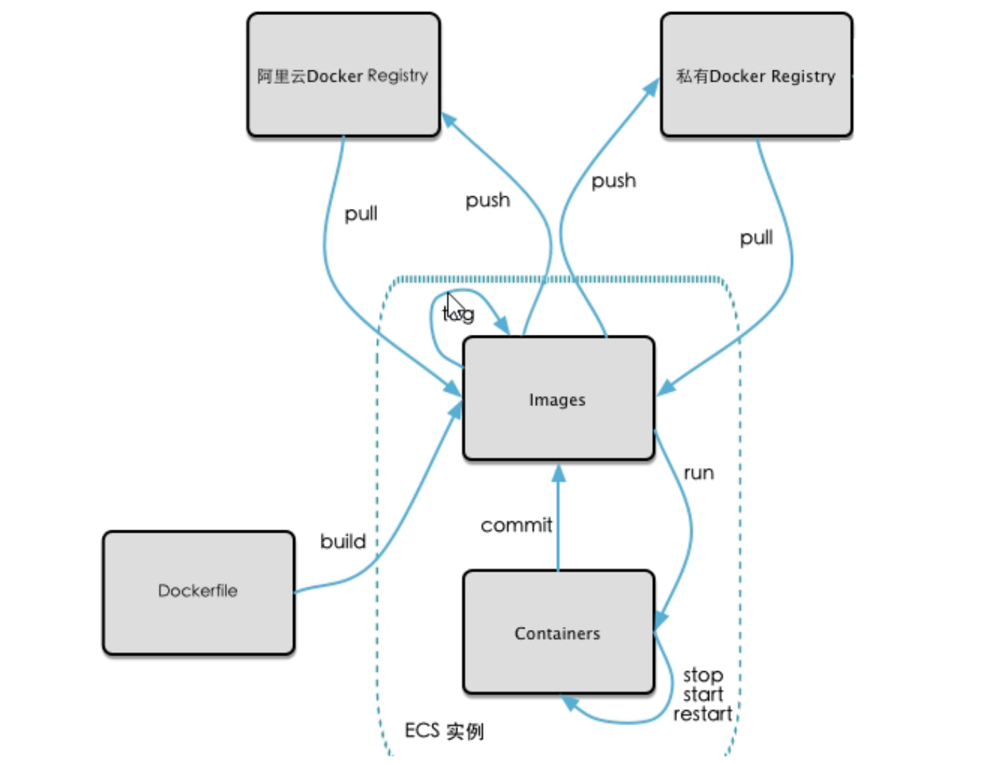

### 本地镜像发布到阿里云
1. 本地镜像发布到阿里云流程

2. 镜像的生成方法
  - 前面的 DockerFile
  - 从容器创建一个新的镜像`docker commit [OPTIONS] 容器ID [REPOSITORY[:TAG]]`
  ```
  docker commit -a zzyy -m "new mycentos 1.4 from 1.3" 容器ID mycentos:1.4
  docker images
  docker run -it mycentos:1.4
  ```
3. 将本地镜像推送到阿里云
  - 本地镜像素材原型
  - 阿里云开发者平台`https://dev.aliyun.com/search.html`
  - 创建仓库镜像
    - 命名空间
    - 仓库名称
  - 将镜像推送到 registry
  ```
  docker login --username=registry.cn-hangzhou.aliyuncs.com
  docker tag [ImageId] registry.cn-hangzhou.aliyuncs.com/zy/mycentos:[镜像版本号]
  docker push registry.cn-hangzhou.aliyuncs.com/zy/mycentos:[镜像版本号]
  ```
  - 公用云可以查询到`dev.aliyun.com   zy/mycentos`
  - 查看详情
4. 将阿里云上的镜像下载到本地
```
docker pull registry.cn-hangzhou.aliyuncs.com/zy/mycentos1.4.1
```