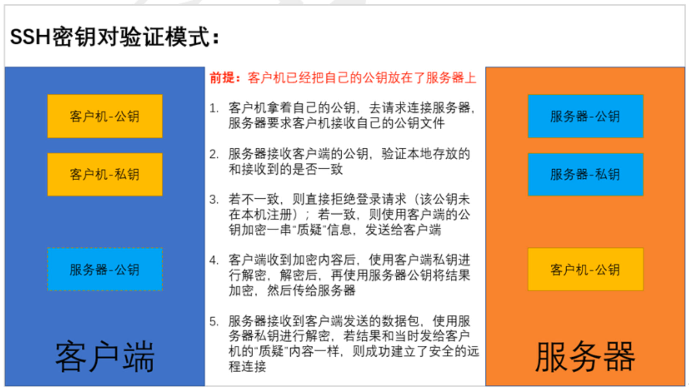
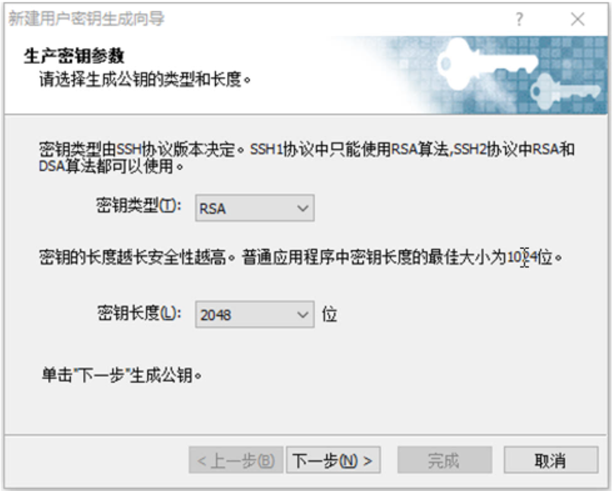
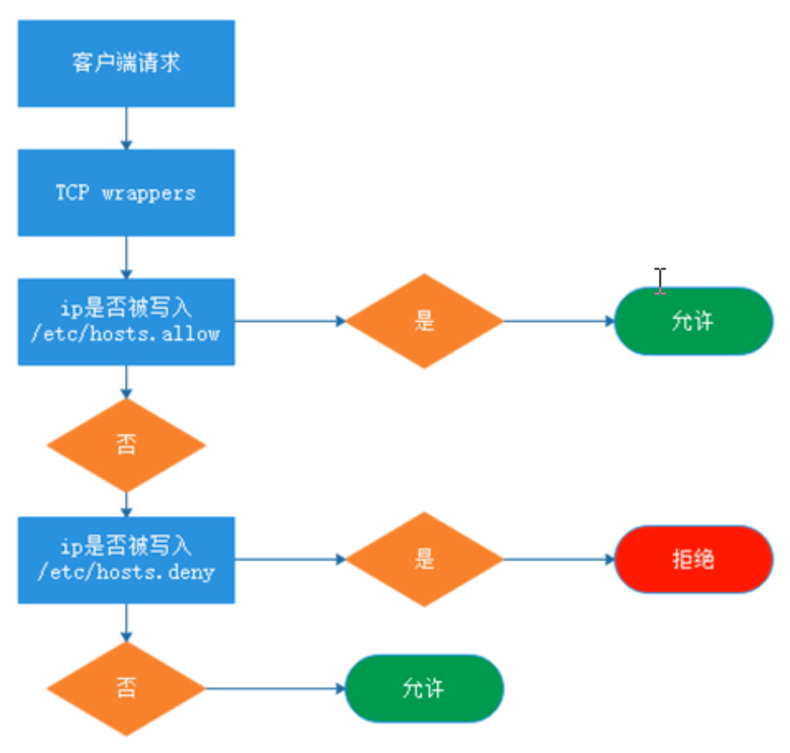
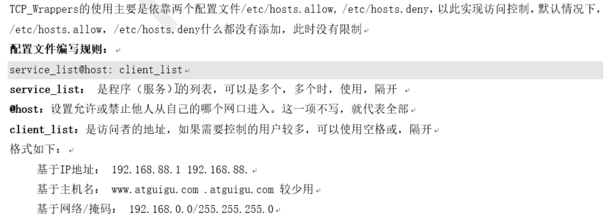

### Linux 网络基础
1. 知识回顾
2. 常见网络配置
  - IP 地址配置
  - 主机名配置
  - 网关配置
  - DNS 配置
3. 网络常用命令
  - 网络信息查看命令
  - 网络节点测试命令
  - 网络联通性测试命令
  - 地址解析命令
  - 网络探测扫描命令
4. 远程管理工具
5. ssh 安全远程管理
  - 什么是 ssh
  - ssh 的登陆验证模式
  - 配置 ssh 服务
    - 环境准备
    - 用户密码验证
    - 密钥对验证
    - 禁止使用密码登录
    - 禁止使用 root 远程登录
    - 修改默认端口、限制 ssh 监听 IP
  - ssh 服务相关命令
6. TCP Wrappers(简单访问控制)
  - TCP Wrappers 简介
  - TCP Wrappers 工作原理
  - TCP Wrappers 的使用

### 什么是 ssh
1. ssh 是 Secure Shell 的缩写，是一个建立在应用层上的安全远程管理协议。
2. ssh是目前较为可靠的传输协议，专为远程登录会话和其他网络服务提供安全性。
3. 利用 ssh 协议可以有效防止远程管理过程中的信息泄漏问题。
4. ssh 可以用于大多数 UNIX 和类 UNIX 操作系统中，能够实现字符界面的远程登录管理，它默认使用 22 端口，采用密文的形式在网络中传输数据，相对于通过铭文传输的 Telnet 协议，具有更高的安全性。

### ssh 的登录验证模式(密码验证)
1. ssh 提供类基于账户密码(口令)和密钥对两种登录验证方式，这两者都是通过密文传输数据的
  - 客户端 -> 连接请求 -> 服务端
  - 客户端 <- 发送公钥 <- 服务端
  - 客户端 -> 用公钥将密码信息加密，发送 -> 服务端
  - 客户端 <- 用密钥解密并验证信息，信息合法则建立连接通讯 <- 服务端
2. 账户密码登录认证过程中传输的是用户的账户和密码，密码具有足够的复杂度才能具有更高的安全性
3. Linux 主机之间的远程管理工具是 ssh 命令，所以我们直接使用 ssh 进行远程登录
  - 格式：`ssh 用户名@IP地址` `ssh root@192.168.88.20`
4. windows 远程登录 Linux 主机 

### ssh 的登录验证模式(密钥对验证)
- 客户端 -> 发送连接请求，并将公钥发送 -> 服务端
- 客户端 <- 验证本地公钥和发送过来的公钥。如果两钥相同，生成一段 challenge 并公钥加密，回送 <- 服务端
- 客户端 -> 用私钥解密，再 challenge 返回给服务器 -> 服务端
- 客户端 <- 验证两端 challenge，相同则建立连接 <- 服务端
1. 首先需要在 Client 上创建一对密钥，并且需要把公钥放在需要访问的 Server 上
2. 当 Client 需要连接 Server 时，Client 端的软件就会向 Server 端发出登录请求，请求使用密钥对中的公钥进行安全验证
3. Server 收到请求之后，会在该用户的家目录下查询公钥文件，拿 Client 发送过来的公钥和自己家目录下的公钥进行比较
4. 如果两个公钥一致，Server 就用公钥加密“challenge(质疑)”，并把它发送给 Client 软件。Client 收到加密内容之后，使用本地的私钥进行解密，再把解密结果发送给 Server 端，Server 端验证成功后，允许登录
5. 注意：若第3个步骤对比结果失败，则 Server 端会通知 Client 端此公钥未在本机注册，无法验证登录


### 环境准备
1. 准备好两台 Linux 操作系统的主机，配置好相关网络参数，实现可以正常通信，并将**主机名修改为不同的名字**`hostname <name>`
2. 临时关闭防护功能
  - `iptables -F`清空防火墙规则
  - `setenforce 0`临时关闭 SELinux
3. 永久关闭防护功能
  - `chkconfig iptables off`设置防火墙开机不自启动
  - `sed -i '7s/enforcing/disabled/' /etc/selinux/config`
  - 注意：以上两条命令执行后，需要重启服务器才能生效，切记`reboot`

### Linux 命令
1. 查看防火墙规则`iptables -L`
2. 临时将防火墙规则清空掉`iptables -F`
3. 查看 ESLinux 当前状态`getenforce`
4. 修改 ESLinux 的值为 Permissive`setrnforce 0`
5. 查看防火墙的各个状态值含义 `chkconfig --list iptables`
6. 关闭防火墙开机自启动`chkconfig iptables off`

### Linux 主机之间的密钥对登录验证
1. 客户端生成密钥对文件`ssh-keygen -t rsa -b 2048`
  - `-t` 指定加密类型(rsa/dsa等)
  - `-b` 指定密钥对加密长度
  - 询问1：执行过程中会询问保存位置，一般默认保存在当前用户家目录下的.ssh/目录下
  - 询问2：是否对密钥文件进行加密
    - 加密：若加密，则在调用密钥文件时需要先验证密钥的密码，密码正确才能使用密钥文件
    - 不加密：若不加密，则密钥文件可以直接被调用，整个登录验证过程无需输入任何密码，即为免密登录
2. 将公钥文件上传至服务器`ssh-copy-id 用户名@服务器IP地址`该用户名要和用来登录服务器的用户名一致
3. 客户端尝试登录服务器`ssh 用户名@服务器IP地址`密钥对验证优先级大于账户密码验证

> 服务器可以保存多个客户端的公钥，放在同一个文件中，但是需要另启一行写入
```
vim ~/.ssh/authorized_keys
:set nu # 显示文件的行数
```

### Windows 使用密钥对登录 Linux
1. 使用 Xshell 自带的密钥对生成向导生成密钥对

2. 将公钥导入 Linux 主机的**指定用户**下的**指定公钥配置文件**内，后面用哪个用户登录就放在谁家里，这里我们先用 root 用户做实验，在 root 家目录下，找到 .ssh 目录，然后在里面创建 authorized_keys 文件，并且将公钥写入进去
3. 使用 windows 尝试登录**指定用户**

### 禁止使用密码登录
1. 当我们学会了使用密钥对进行验证后，建议生产环境下将账户密码登录功能关掉
2. 配置文件：`/etc/ssh/sshd_config`进入文件后通过`/Password`进行搜索
3. 选项：
  - `PasswordAuthentication no`
4. 修改配置文件后需要进行重启`service sshd restart`,退出`exit`，重新登录
5. 注意：ssh 的配置文件中，并不是注释掉的就不是生效的，有些是默认生效，需要修改时一定要取消注释再修改

### 禁止使用 root 远程登录
1. root 在系统中是一个可以为所欲为的角色，我们可以在平时的操作中使用普通用户操作，在有需要修改一些系统设置的时候再从普通用户切换到 root 用户，这样可以最大限度的避免因为误操作而对系统造成破坏，同时也可以避免黑客在暴力破解后直接使用 root 用户登录系统，一般在远程登录管理上我们会禁止使用 root 用户登录
2. 配置文件：`/etc/ssh/sshd_config`
3. 选项：`PermitRootLogin no`
```
useradd zhangsan
passwd zhangsan
******
vim /etc/ssh/sshd_config
/PermitRootLogin # 搜索
PermitRootLogin no
!ser # 重启服务
```

### 修改默认端口、限制 ssh 监听 IP
1. 修改默认端口：ssh 作为一个用来远程管理服务器的工具，需要特别的安全，默认情况下使用 TCP 的 22 端口，若不进行修改，很容易被利用遭到攻击，所以我们一般都会修改端口，尽量修改一个高位端口（范围1-65535）
2. 配置文件：`/etc/ssh/sshd_config`
3. 选项：
```
Port 59527
ssh -p 端口 用户名@服务器IP
```
4. 限制 ssh 监听 IP：有些服务器则安全级别更高一些，不允许使用外网直接登录，只有通过局域网才能登录，我们可以在机房里设置其中一台能够被外网远程连接，其他的主机都通过这个机器进行远程连接即可
5. 配置文件：`/etc/ssh/sshd_config`
6. 选项：`ListenAddress 192.168.88.22`
```
# 想要一个主机有多个IP地址，加网卡或者是将一个网卡设置两个IP地址
ifconfig eth0:0 192.168.88.22

service sshd restart
exit
ssh 192.168.88.20
# Could not connect to '192.168.88.20' (port 22): Connection failed.
ssh 192.168.88.22
```

### ssh 服务相关命令
1. scp：安全的远程文件复制命令
  - scp 是 secure copy 的简写，用于在 Linux 下进行远程拷贝文件的命令，类似于命令有 cp，scp 传输是加密的，所以可能会稍微影响一点速度。另外，scp 还是非常不占资源，不会提高多少系统负荷
  - 格式：`scp 本地文件 用户名@服务器IP:目录`
  - `scp /root/atguigu.txt root@192.168.88.20:/tmp`
  - `-P 端口`若端口不是默认22，则需要使用此格式指定端口
2. sftp：安全的文件传输协议
  - sftp 是 Secure FileTransferProtocol 的缩写，安全文件传送协议。sftp 与 ftp 有着几乎一样的语法和功能。由于这种传输方式使用了加密/解密技术，所以 sftp 比 ftp 更安全一些，但是传输效率比普通的 ftp 要低很多
  - 格式：`sftp 用户名@服务器IP`
  - `-oPort=端口`若端口不是默认22，则需要使用此格式指定端口
  ```
  sftp root@192.168.88.20
  sftp> help # 查看在交互模式下支持哪些命令
  sftp> pwd/lpwd # pwd：是查看服务器所在的路径；lpwd：是查看客户端所在路径
  sftp> ls/lls # 查看当前目录下文件列表 
  sftp> put：将客户机中的指定文件上传到服务器端
  sftp> get：将服务器端的指定文件下载到客户机的当前所在目录
  sftp> rm：删除掉服务端的指定文件
  sftp> quit：退出 sftp 的交互模式，断开和服务器之间的连接
  ```

### TCP Wrappers 简介
1. TCP_Wrappers 是一个工作在第四层(传输层)的安全工具，对有状态连接(TCP)的特定服务进行安全检测并实现访问控制，界定方式是调用 libwrap.so 库文件的程序就可以受 TCP_Wrappers 的安全控制。它的主要功能就是控制谁可以访问，常见的程序有 rpcbind、vsftpd、sshd、telnet。
2. 判断方式：
  - 查看对应服务命令所在位置`which sshd`
  - 查看指定命令执行时是否调用 libwrap.so 文件`ldd /usr/sbin/sshd | grep libwrap.so`
  
### CP Wrappers 工作原理
1. 以 ssh 为例，每当有 ssh 的连接请求时，先读取系统管理员所设置的访问控制文件，符合要求，则会把这次连接原封不动的转给 ssh 进程，由 ssh 完成后续工作；如果这次连接发起的 ip 不符合访问控制文件中的设置，则会中断连接请求，拒绝提供 ssh 服务

2. 有限查看 hosts.allow，匹配即停止
3. 允许个别，拒绝所有：hosts.allow 文件添加允许的策略，hosts.deny 文件添加 all
4. 拒绝个别，允许所有：hosts.allow 文件为空，hosts.deny 文件添加单个拒绝的策略

### CP Wrappers 使用

格式的后半段：内置 ACL：ALL(所有主机)、LOCAL(本地主机)

### 实验案例
1. 拒绝单个 IP 使用 ssh 远程连接
```
hosts.allow: 空着
hosts.deny: sshd:192.168.88.20
```
2. 拒绝某一网段使用 ssh 远程连接
```
hosts.allow: 空着
hosts.deny: sshd:192.168.88.
```
3. 仅允许某一 Ip 使用 ssh 远程连接
```
hosts.allow: sshd:192.168.88.20
hosts.deny: sshd:ALL
``` 