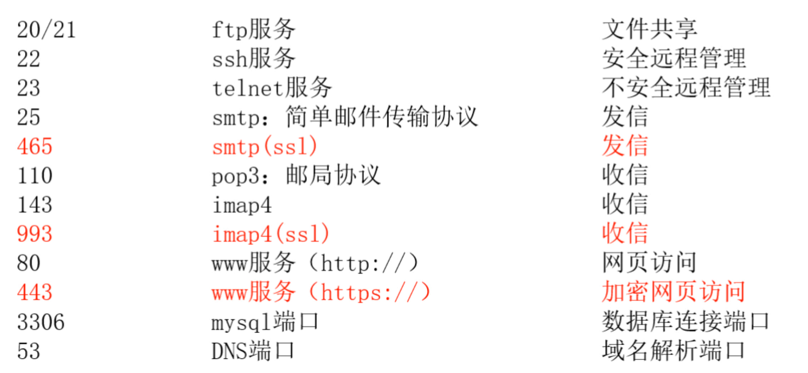

### 网络地址和物理地址
1. 网络地址：互联网协议地址（IP地址）为互联网上每一个网络或主机分配一个逻辑地址，IP 地址工作在网络层，IP的分类：IPV4 IPV6
2. 物理地址：物理地址（MAC地址）为每个设备设置一个固定的硬件地址
  - MAC 地址工作在链路层
  - MAC 地址：00-23-5A-15-99-42

### TCP/IP 五层常见协议
1. 应用层协议：FTP、HTTP、SMTP、Telnet、DNS 等
2. 传输层协议：TCP、UDP 等
3. 网络层协议：IP、ICMP、ARP 等
4. 数据链路层协议：PPP 协议等
5. 物理层：不常用

### 常见网络端口
1. 端口配置文件：`/etc/service`


### 路由：
1. 不同网段数据转发
2. 路由选择

### 网关
1. 不同网段数据转发
2. 路由选择
3. 默认路由：处理不了的包都交给它
4. NAT 转换：内网IP请求外网时，将内网IP再包装成一个外网 IP 和别人进行通信

### 网关和路由配置
1. `route -n` 查看系统中的路由表信息
2. 临时：网关
  - 添加：`route add default gw ip`
  - 删除：`route del default qw ip`
3. 永久：网关`/etc/sysconfig/netword-scripts/ifcfg-eth0`
```
# 需要设置为网关的设备地址
GATEWAY=192.168.88.2
```