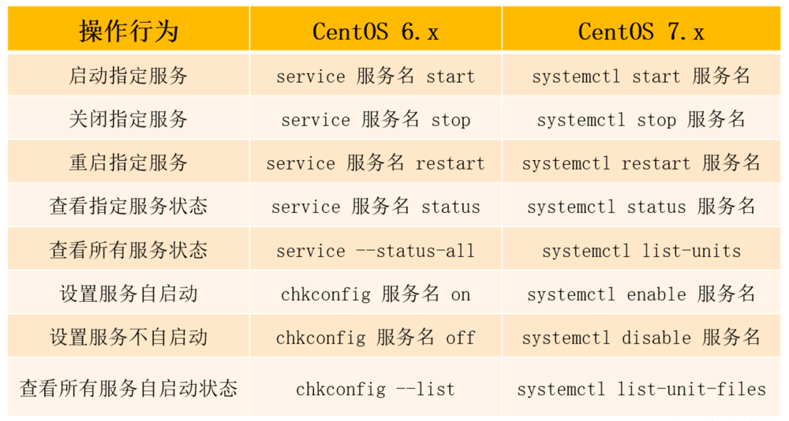
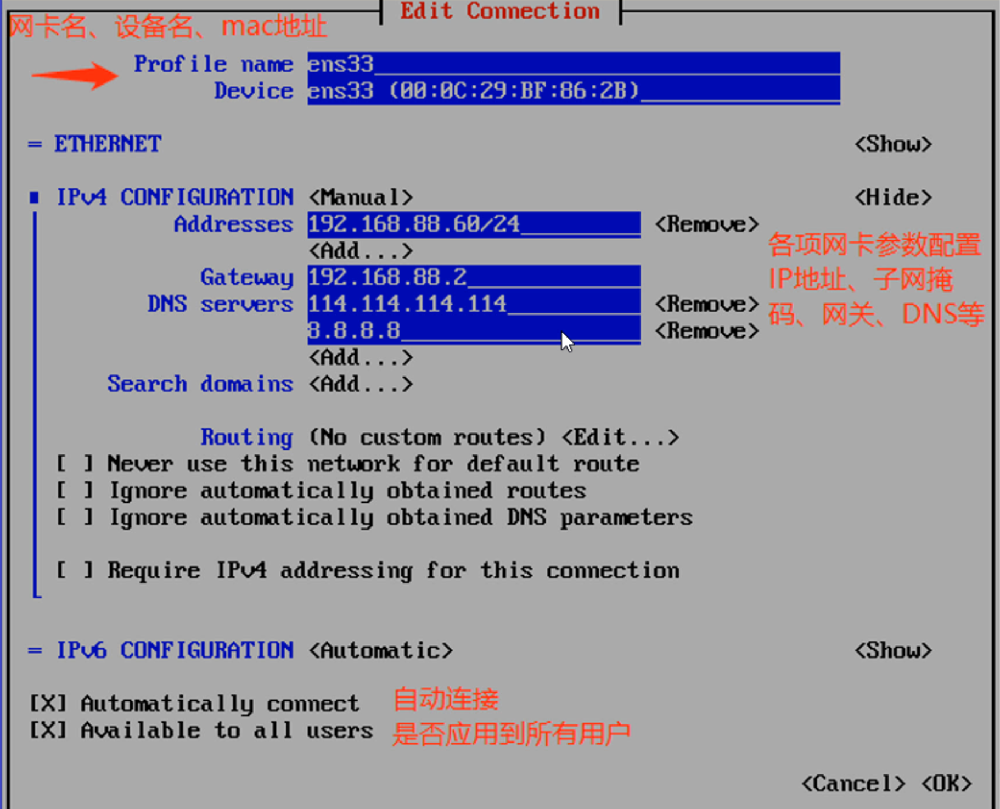

### 网络服务基础
1. CentOS 6.x/7.x 对比
2. 常见网络协议个端口
3. Linux 下网关路由配置
4. Linux 下网络管理命令

### CentOS 6.x/7.x 对比
1. CentOS 6.x：EXT4，EXT4 的单个文件系统容量达到 1EB，单个文件大小则达到 16TB
2. CentOS 7.x：XFS，XFS 默认支持 8EB 减 1 字节的单个文件系统，最大可支持的文件大小为 9EB，最大文件系统尺寸为 18EB
3. CentOS 6.x
  - 防火墙：iptables
  - 内核版本：2.6.x-x
  - 默认数据库：MySQL
  - 时间同步：ntpq -p
  - 修改时区：/etc/sysconfig/clock
  - 修改语言：/etc/sysconfig/i18n
4. CentOS 7.x
  - 防火墙：firewalld
  - 内核版本：3.10.x-x
  - 默认数据库：MariaDB
  - 时间同步：chronyc sources
  - 修改时区：timedatectl set-timezone Asia/Shanghai
  - 修改语言：localectl set-locale LANG-zh_CN.UTF-8
5. 主机名
  - CentOS 6.x 的配置文件为 /etc/sysconfig/network(永久设置)
  - CentOS 7.x 的配置文件为 /etc/hostname(永久设置)
  - CentOS 7.x 还可以使用命令永久设置 hostnamectl set-hostname atguigu.com

### centos6和7对比-网络服务管理


### centos6和7对比-网络设置
1. 网卡名：6网卡名是：eth0，7网卡名是：ens33
2. 网络配置命令：6:ifconfig/setup，7：ip/nmtui

3. 网络服务：6：默认使用 network 服务，7：默认使用 NetworkManager 服务(network 作为备用)

### 网卡配置文件
1. 配置文件目录：`/etc/sysconfig/network-scripts/ifcfg-ens33`
2. 配置管理命令：`ifconfig/ip address show`
3. 配置文件内容：
```
DEVICE=ens33            # 设备名称
NAME=ens33              # 网卡名称
BOOTPROTO=static        # 连接方式(dhcp/static)
ONBOOT=yes              # 是否开机加载
IPADDR=192.168.12.250   # IP 地址
NETMASK=255.255.255.0   # 子网掩码(PREFIX=24)
GATEWAY=192.168.12.1    # 网关
DNS1=8.8.8.8            # DNS
```
4. 注意：网卡配置文件内，选项要大写，小写不报错，但不生效，参数可小写

### CentOS7 修改网卡名
1. 修改网卡配置文件名（建议将原配置文件备份）`cp -a ifcfg-ens33 ifcfg-eth0`
2. 修改网卡配置文件内容
```
NAME=eth0
DEVICE=eth0
```
3. 修改 grub 配置文件
```
vi /etc/default/grub
GRUB_CMDLINE_LINUX="crashkernel=auto rhgb quiet net.ifnames=0 biosdevname=0 "
# 在指定位置新增 net.ifnames=0 biosdevname=0，关闭一致性命名规则
```
4. 更新 grub 配置文件，并加载新的参数`grub2-mkconfig -o /boot/grub2/grub.cfg`
5. 重启操作系统`reboot`

### Centos7 命令
1. 查看 IP 地址`ip address show` `ifconfig`
2. 查看网络服务状态 `systemctl status NetworkManager`