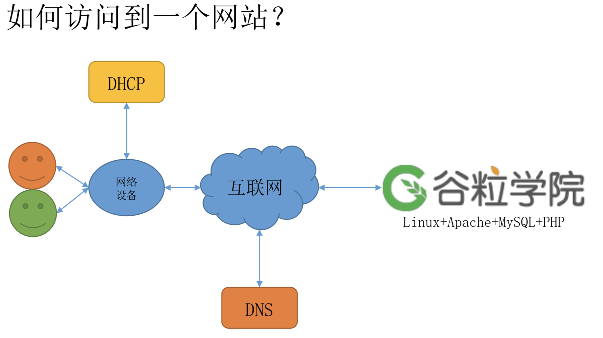
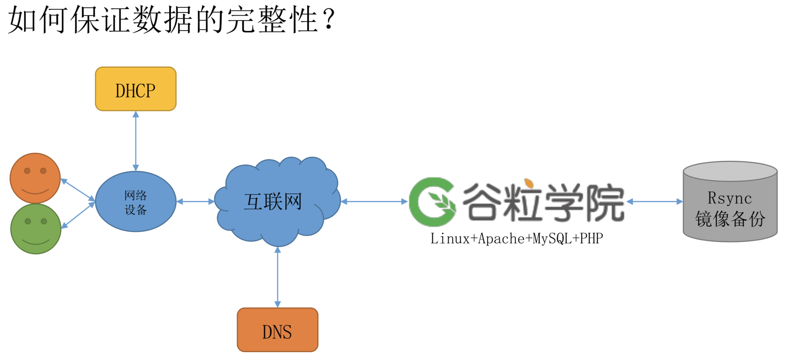
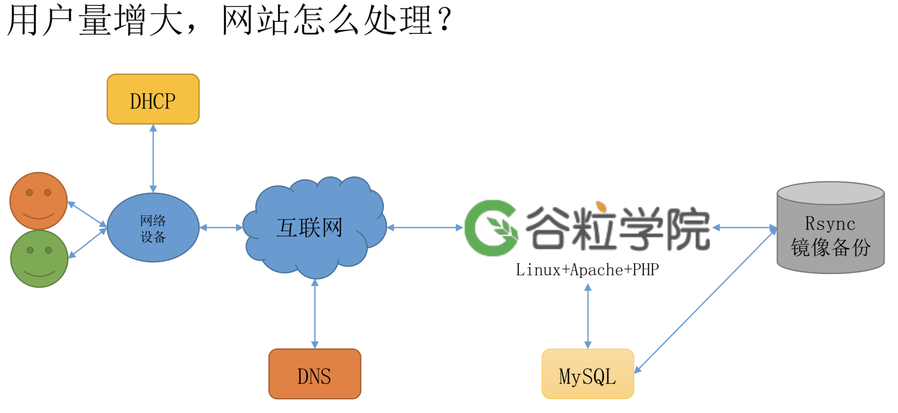
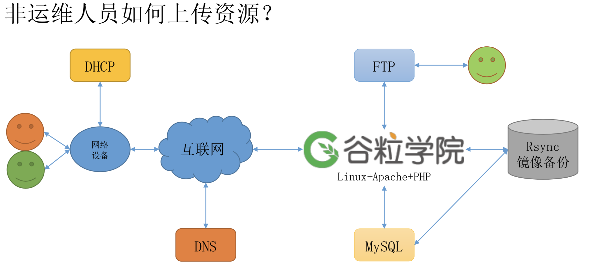
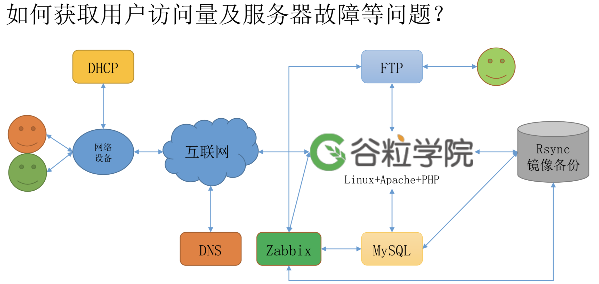

### 什么叫做网络服务
1. 网络服务：是指一些在网络上运行的、面向服务的软件模块
2. 网络服务的标准：可以使用各种协议通过网络进行远程访问的软件模块(常见协议 http/ftp/telnet/smtp 等)

### 为什么学网络服务
### 学习哪些网络服务

1. 域名解析服务(DNS)
2. 动态主机配置服务(DHCP)
3. 文件传输服务(FTP/samba)
4. 网络文件系统服务(NFS)
5. 万纬网服务(Apache/Nginx/Tomcat)
6. 邮件服务(Mail)
7. 日志服务(ELK)
8. 数据备份服务(Rsync)
9. 数据库服务(MySQL/Redis)
10. ......

### 如何学习网络服务
1. 原理性强、操作性强、熟练性强
2. 要求：
  - 总结自己对于每个服务原理的理解，可以使用文字，图像等
  - 需要整理一份详细的实验搭建手册，做到尽可能详细
  - 每个服务的实验至少做两遍