### 安全防御
1. 何为防火墙
2. 防火墙的分类
3. Iptables 原理
4. 防火墙顺序
5. Iptables 语法规则

### 何为防火墙 - 防火墙？
1. 工作在主机边缘处或者网络边缘处对数据报文进行检测，并且能够根据事先定义好的规则，对数据报文进行相应处理的模块

### 防火墙的分类 - 防火墙分类
1. 构造
  - 硬件：深信服、网御、华为
  - 软件：windows 防火墙、iptables
2. 工作机制
  - 包过滤防火墙：SIP(源地址)、DIP(目标地址)、SPORT(源端口)，DPORT(目标端口)
  - 应用层防火墙：URL HOSTNAME
3. 模块
  - 应用态：iptables
  - 内核态：netfilter

### Iptables 原理 - 五链
1. INPUT：处理入站数据包
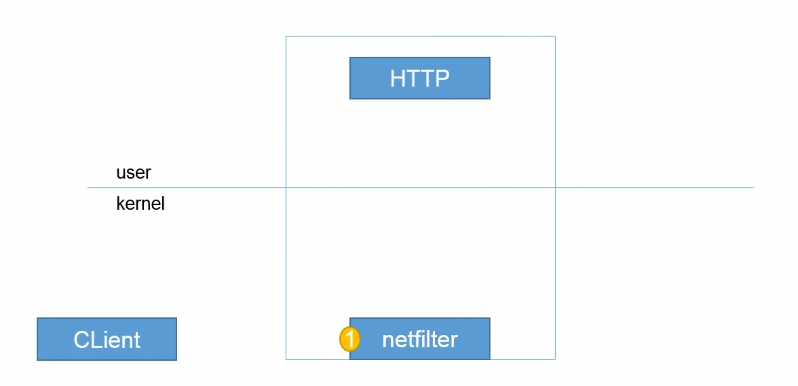
2. OUTPUT：处理出站数据包

3. FORWORD：处理转发数据包

4. PREROUTING：在进行**路由**选择**后**处理数据包
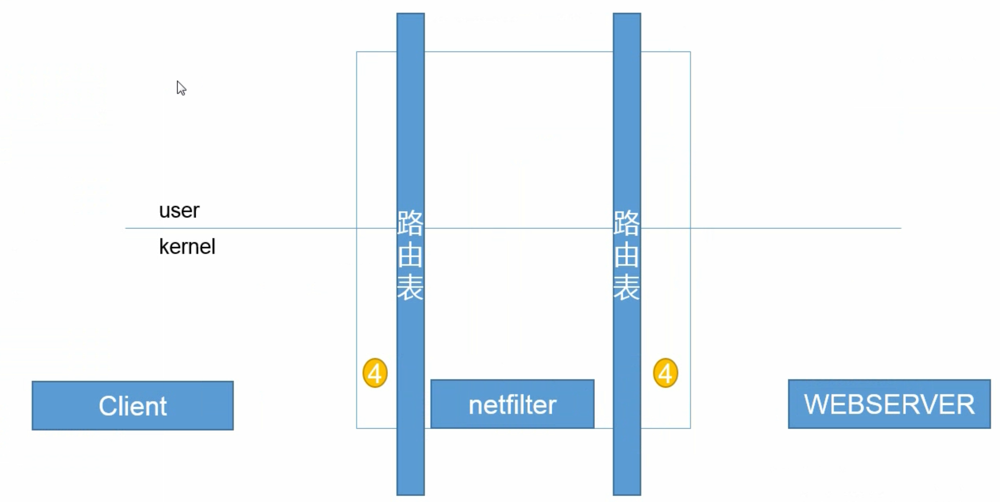
5. POSTROUTING：在进行**路由**选择**前**处理数据包
 

### Iptables 原理 - 四表
1. raw 表：确定是否对该数据包进行状态跟踪
2. mangle 表：为数据包设置标记
3. nat 表：修改数据包中的源、目标 IP 地址或端口
4. filter 表：确定是否放行该数据包(过滤)
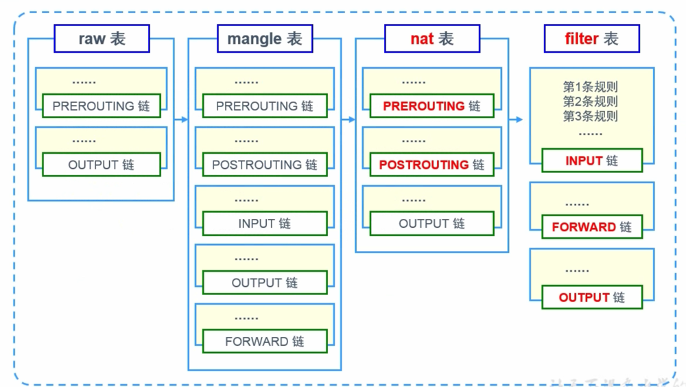

### 防火墙顺序 - 表顺序
raw - mangle - nat - filter

### 防火墙顺序 - 链顺序
1. 入站：PREROUTING INPUT
2. 出站：OUTPUT POSTROUTING
3. 转发：PREROUTING FORWARD POSTROUTING

### 防火墙顺序 - 规则顺序
1. 按顺序依次检查，匹配即停止(LOG 策略例外)
2. 若找不到向匹配规则，则按照该链的默认策略处理

### 防火墙顺序 - 数据匹配流程图
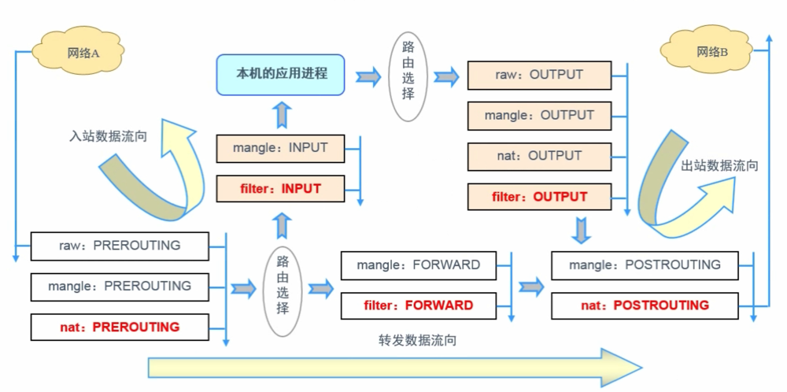

### Iptables 语法规则 - 书写规则
1. 语法构成
```
iptables [-t 表名] 选项 [链名] [条件] [-j 控制类型]
```
2. 几个注意事项
  - 不指定表明时，默认指 filter 表
  - 不指定链名时，默认指表内的所有链
  - 除非设置链的默认策略，否则必须指定匹配条件
  - **选项、链名、控制类型使用大写字母，其余均为小写**

### Iptables 语法规则 - 常见动作类型
1. ACCEPT：允许通过
2. DROP：直接丢弃，不给出任何回应
3. REJECT：拒绝通过，必要时会给出提示
4. LOG：记录日志信息，然后传给下一条规则继续匹配
5. SNAT：修改数据包源地址
6. DNAT：修改数据包目的地址
7. REDIRECT：重定向

### Iptables 语法规则 - 添加新的规则
1. `-A`：在链的末尾追加一条规则
2. `-I`：在链的开头(或指定序号)插入一条规则
```
# 当有 tcp 的入站请求的时候放行
#iptables -t filter -A INPUT -p tcp -j ACCEPT
#iptables -I INPUT -p udp -j ACCEPT
#iptables -I INPUT 2 -p icmp -j ACCEPT
```

### Iptables 语法规则 - 查看规则列表
1. `-L`：列出所有的规则条目
2. `-n`：以数字形式显示地址、端口等信息
3. `-v`：以更详细的方式显示规则信息
4. `--line-numbers`：查看规则时，显示规则的序号
```
#iptables -L INPUT --line-numbers
Chain INPUT (policy ACCEPT)
num  target    prot opt source     destination
1    ACCEPT    udp  --  anywhere   anywhere
2    ACCEPT    cimp --  anywhere   anywhere
```

### Iptables 语法规则 - 删除、清空规则
1. `-D`：删除链内指定序号(或内容)的一条规则
2. `-F`：清空所有的规则
```
#iptables -D INPUT 3
#iptables -n -L INPUT
CHAIN INPUT (policy ACCEPT)
target    prot opt source        destination
ACCEPT    udp  --  0.0.0.0/0     0.0.0.0/0
ACCEPT    icmp --  0.0.0.0/0     0.0.0.0/0
ACCEPT    tcp  --  0.0.0.0/0     0.0.0.0/0
```

### Iptables 语法规则 - 设置默认策略
1. `-P`：为指定的链设置默认规则
```
# iptables -t filter -P FORWARD DROP
# iptables -P OUTOUT ACCEPT
```

### 放行tcp的22和80端口，其他的全部拒绝
```
iptables -t filter -A INPUT -p tcp --dport 22 -j ACCEPT
iptables -t filter -A INPUT -p tcp --dport 80 -j ACCEPT
iptables -P INPUT DROP
```

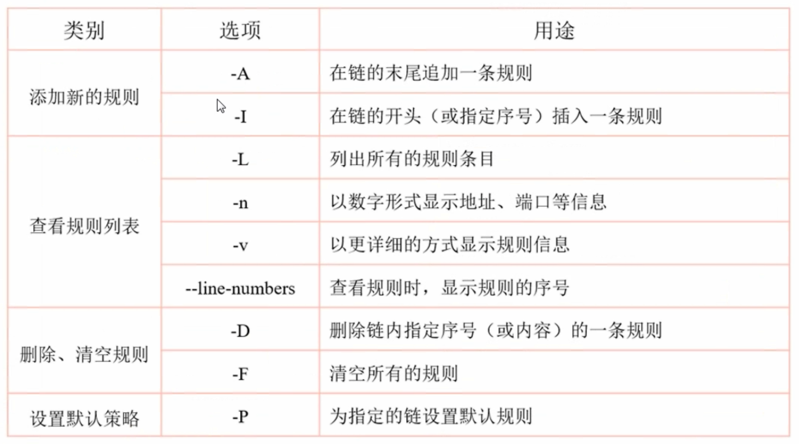

### Iptables 语法规则 - 匹配类型
1. 通用匹配
  - 可直接使用，不依赖于其他条件或扩展
  - 包括网络协议、IP 地址、网络接口等条件
  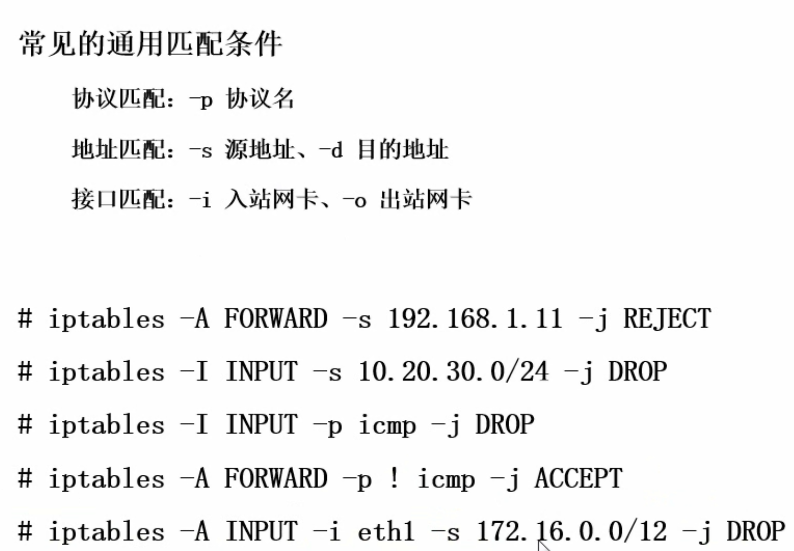
2. 隐含匹配
  - 要求以特定的协议匹配作为前提
  - 包括端口、TCP标记、ICMP 类型等条件
  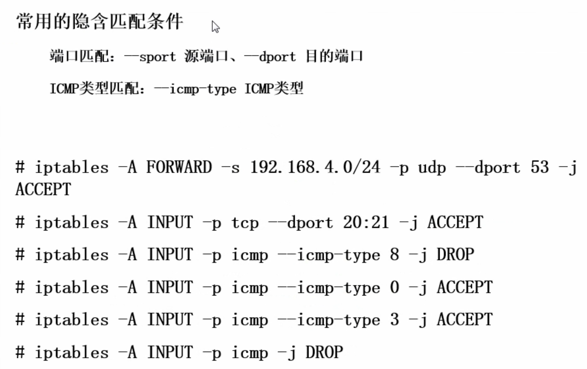
3. 显示匹配
  - 要求以“-m 扩展模块”的形式明确指出类型
  - 包括多端口、MAC 地址、IP 范围、数据包状态等条件
  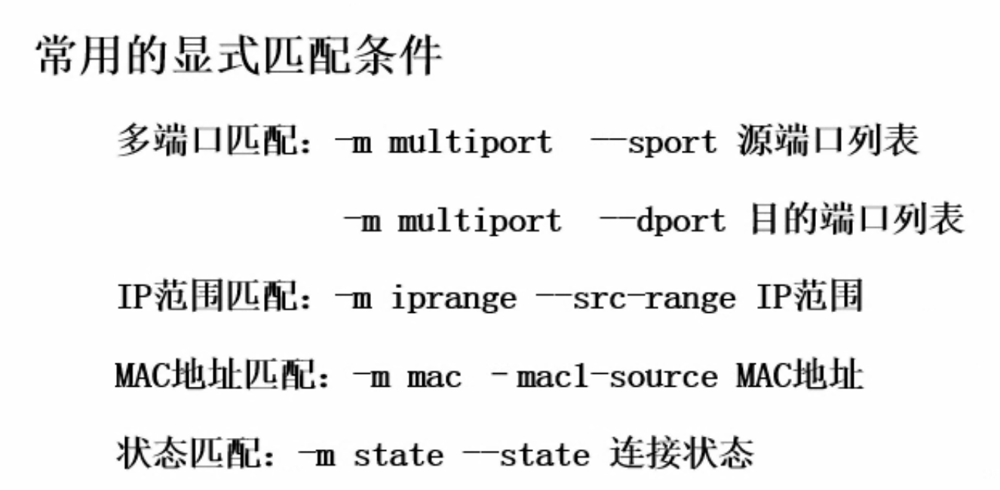
  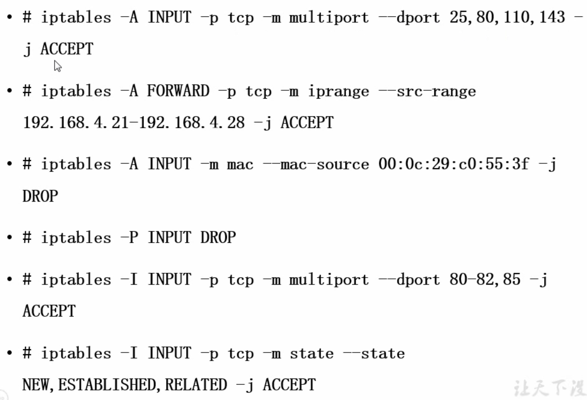

### SNAT
1. SNAT 策略的典型应用环境
  - 局域网主机共享单个公网 IP 地址接入 Internet
2. SNAT 策略的原理
  - 原地址转换，Source Network Address Translation
  - 修改数据包的源地址
3. SNAT环境
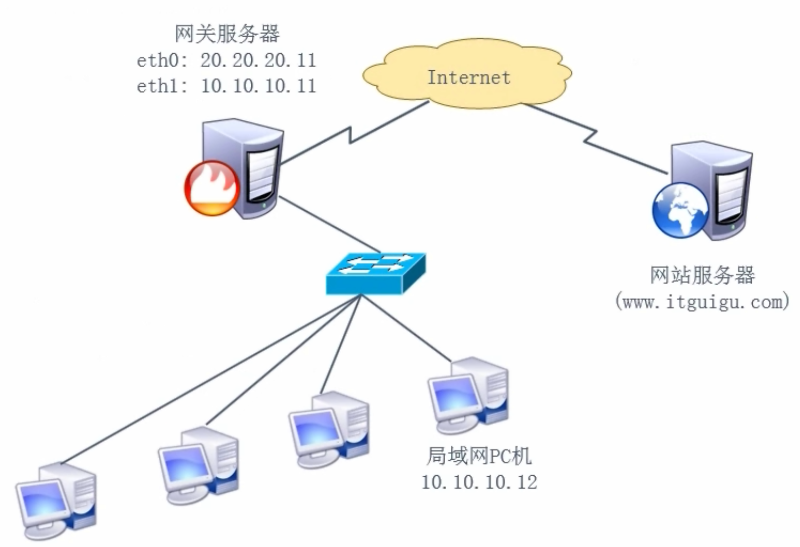
4. 未启用SNAT
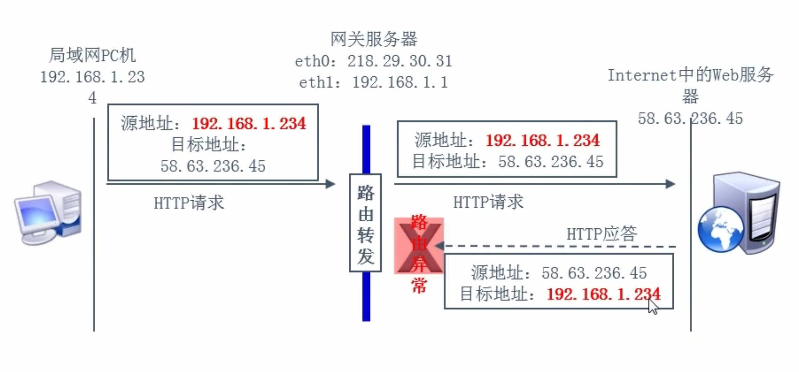
5. 启用SNAT
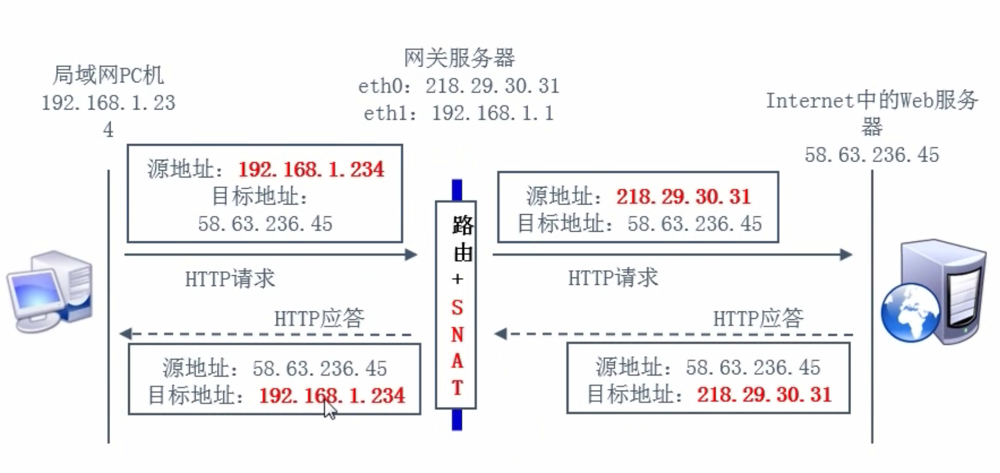
6. 前提条件
  - 局域网各主机正确设置 IP 地址/子网掩码
  - 局域网各主机正确设置默认网关地址
  - Linux 网关支持 IP 路由转发
7. 实现方法：编写 SNAT 转换规则
```
# iptables -t nat -A POSTROUTING -s 192.168.1.0/24 -o eht0 -j SNAT --to-source 218.29.30.31
```

```
# 10.10.10.11
# 在内网机器上添加路由 10.10.10.12 路由服务器
echo "GATEWAY=10.10.10.12" >> /etc/sysconfig/network-scripts/ifcfg-eth0
# 重启下网络
service network restart
# 查看是否生效
route -n

# 10.10.10.12 有两块网卡
# 修改网卡配置
vim /etc/sysconfig/network-scripts/ifcfg-eth1
ONBOOT=yes
service network restart
ping baidu.com

# 10.10.10.11 开启图形化
init 5

# 10.10.10.12 开启路由转发
vim /etc/sysctl.conf
net.ipv4.ip_forward = 1
sysctl -p # 刷新路由表
service iptables start # 开启 iptables
chkconfig iptables on # 开机自启动
iptables -F # 清空默认规则
ifconfig # 查看网络地址
iptables -t nat -A POSTROUTING -s 10.10.10.0/24 -o eth1 -j SNAT --to-source 192.168.239.129 # eth1：出口网卡 192.168.239.129：公网ip地址 10.10.10.0/24：内网地址
iptables -t nat -L
# 需要设置为永久生效
service iptables save
# 查看配置表
vim /etc/sysconfig/iptables

# 10.10.10.11 配置DNS
vim /etc/sysconfig/network-scripts/ifcfg-eth0
DNS1=114.114.114.114
DNS2=8.8.8.8
# 重启网卡
service network restart
# 可以上网了
```

### SNAT - MASQUERADE —— 地址伪装
1. 适用于外网 IP 地址，非固定的情况
2. 对于 ADSL 拨号连接，接口通常为 ppp0、ppp1
3. 将 SNAT 规则改为 MASQUERADE 即可
```
# iptables -t nat -A POSTROUTING -s 10.10.10.0/24 -o eth1 -j MASQUERADE
```

### DANT
1. DANT 策略的典型应用环境
  - 在 Internet 中发布位于企业局域网内的服务器
2. DNAT 策略的原理
  - 目标地址转换，Destination Network Address Translation
  - 修改数据包的目标地址
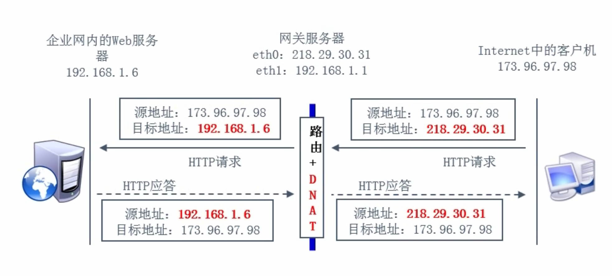
3. 前提条件
  - 局域网的 web 服务器能够访问 internet
  - 网关的外网 IP 地址有正确的 DNS 解析记录
  - Linux 网关支持 IP 路由转发
4. 实现方法
  - 编写 DNAT 转换规则
  ```
  # iptables -t nat -A PREROUTING -i eth0 -d 218.29.30.31 -p tcp --dport 80 -j DNAT --to-destination 192.168.1.6
  ```
```
# 10.10.10.11 内网的web服务器
service httpd start
chkconfig httpd on
echo "123" >> /var/www/html/index.html
curl localhost
echo "GATEWAY=10.10.10.12" >> /etc/sysconfig/network-scripts/ifcfg-eth0
service network restart
route -n

# 10.10.10.12 公网路由器（2快网卡）20.20.20.12 模拟的是一个公网IP 
vim /etc/sysctl.conf
net.ipv4.ip_forward = 1
sysctl -p
service iptables start
chkconfig iptables on
iptables -L
iptables -F
iptables -t nat -A PREROUTING -i eth1 -d 20.20.20.12 -p tcp --dport 80 -j DNAT --to-destination 10.10.10.11
iptables -t nat -L
service iptables save
# 将网卡启动起来
vim /etc/sysconfig/network-scripts/ifcfg-eth0
IPADDR=10.10.10.12
vim /etc/sysconfig/network-scripts/ifcfg-eth1
ONBOOT=yes
BOOTPROTO=static
IPADDR=20.20.20.12
NETMASK=255.255.255.0
service network restart

# 20.20.20.13 公网用户
vim /etc/sysconfig/network-scripts/ifcfg-eth0
IPADDR=20.20.20.13
service network restart
curl 20.20.20.12
```

### 防火墙脚本
1. 到处（备份）规则：iptables-save 工具
  ```
  iptables-save > 1.iptables
  ```
  - 可结合重定向输出保存到指定文件
2. 导入（还原）规则：iptables-restore 工具
  - 可结合重定向输入指定规则涞源
3. iptables 服务
  - 脚本位置：/etc/init.d/iptables
  - 规则文件位置：/etc/sysconfig/iptables

### CentOS 7 改为 iptables
```
systemctl stop firewalld
systemctl disable firewalld
rpm -e --nodeps firewalld
yum -y install iptables-services
systemctl start iptables
systemctl enable iptables
```