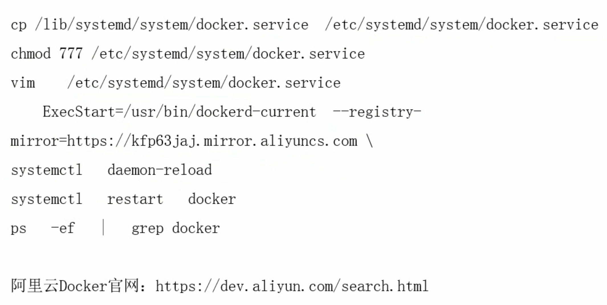
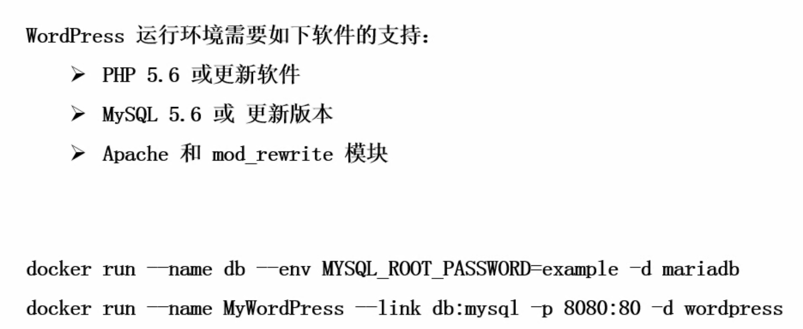

### 目录
1. Docker 安装
2. Docker 加速配置
3. Docker 化应用体验

### Install for Linux
1. Script
```
yum update
$ curl -sSL https://get.docker.com/ | sh
systemctl start docker
systemctl enable docker
docker run hello-world
```
2. Yum
```
yum update
car > /etc/yum.repos.d/docker.repo <<-EOF
[dockerrepo]
name=Docker Repository
baseurl=https://yum.dockerproject.org/repo/main/centos/7
enabled=1
gpgcheck=1
gpgkey=https://yum.dockerproject.org/gpg EOF
yum install docker
```
3. Rpm
```
https://download.docker.com/linux/centos/7/x86_64/stable/Packages/
docker-ce-17.03.0.ce-1.el7.centos.x86_64.rpm
docker-ce-selinux-17.03.0.ce-1.el7.centos.noarch.rpm 
```

### 初始环境检查
```
systemctl stop firewalld
systemctl disable firewalld
getenforce
systemctl start iptables
yum -y install iptables-services
systemctl start iptables
systemctl enable iptables
iptables -F
service iptables save
yum update -y
reboot
rz -E # 将下载的软件包拉进来
mkdir docker
mv docker* docker
ls
cd docker/
yum -y install *
systemctl start docker
systemctl enable docker
systemctl status docker
docker run hello-world
```

### 镜像加速


### wordpress
