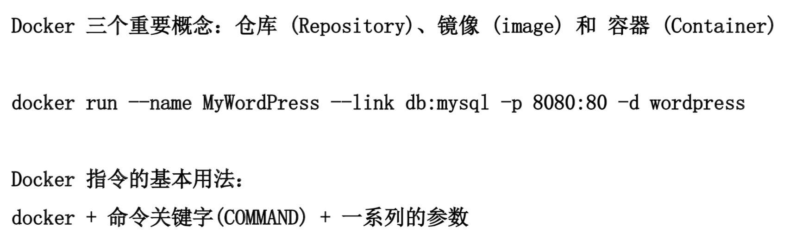
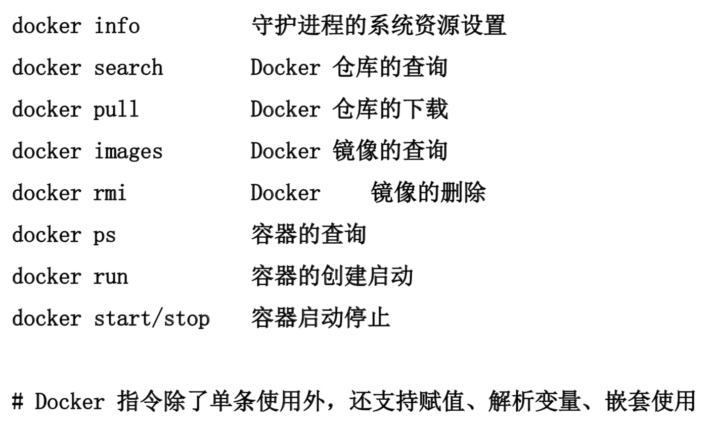
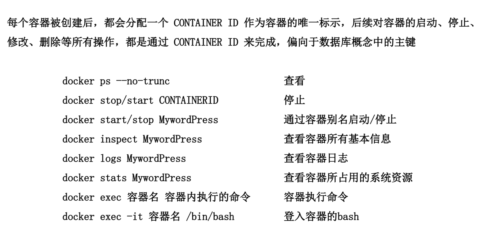
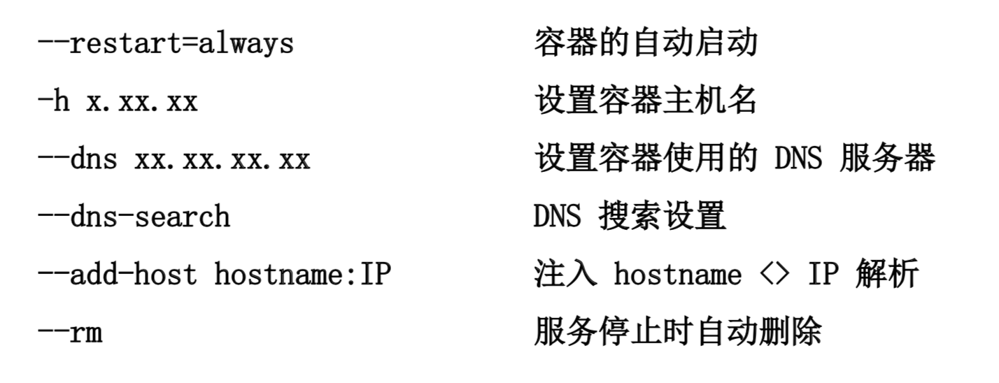
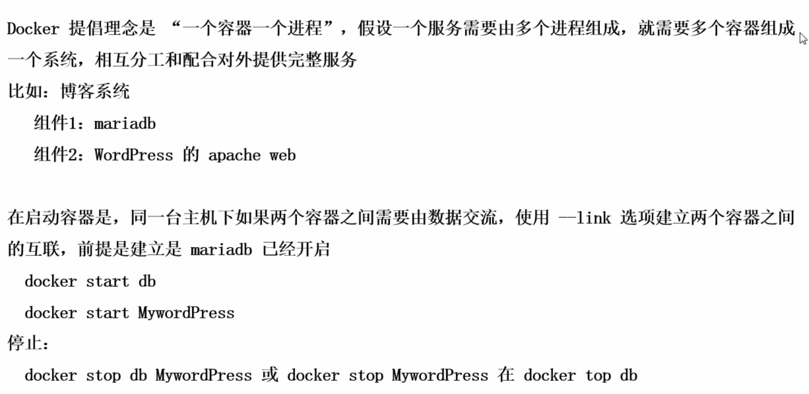
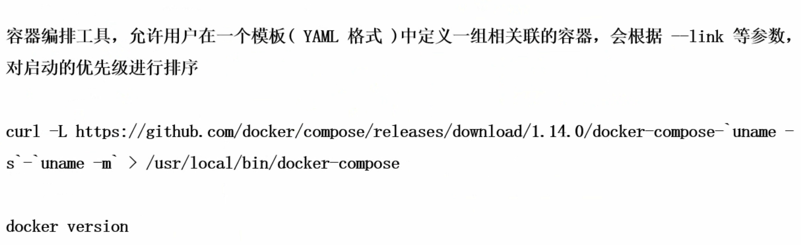
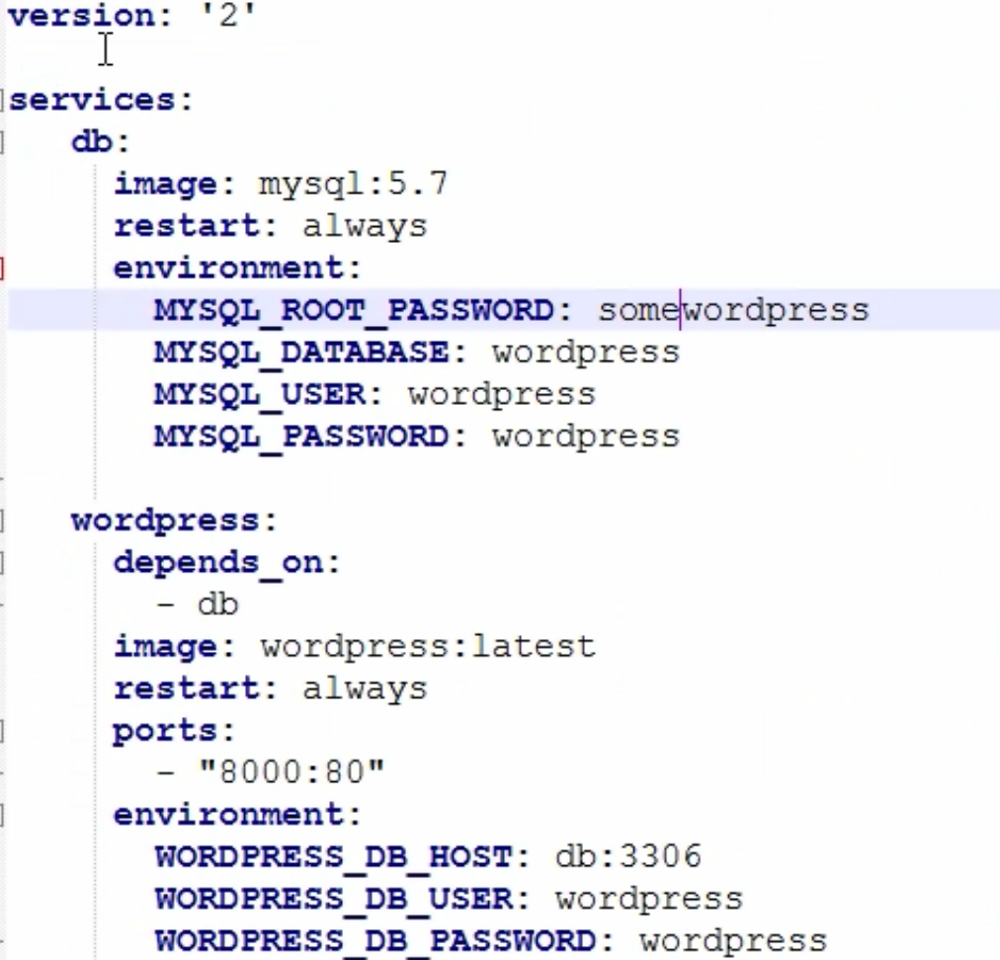

### docker基础概念


### docker基础命令


### 单一容器管理


### run延伸


### 多容器管理


### Docker-compose

```
docker-compose /usr/local/bin/
chmod a+x /usr/local/bin/docker-compose
docker-compose --version
```

### docker-compose用法


### docker-compose的yaml配置举例
