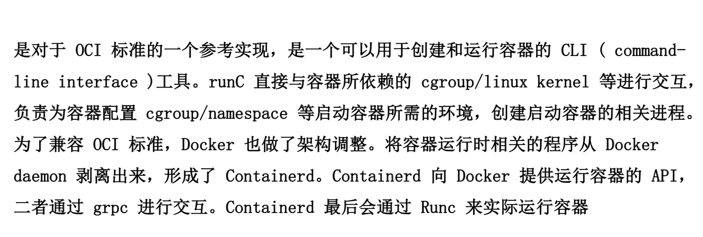
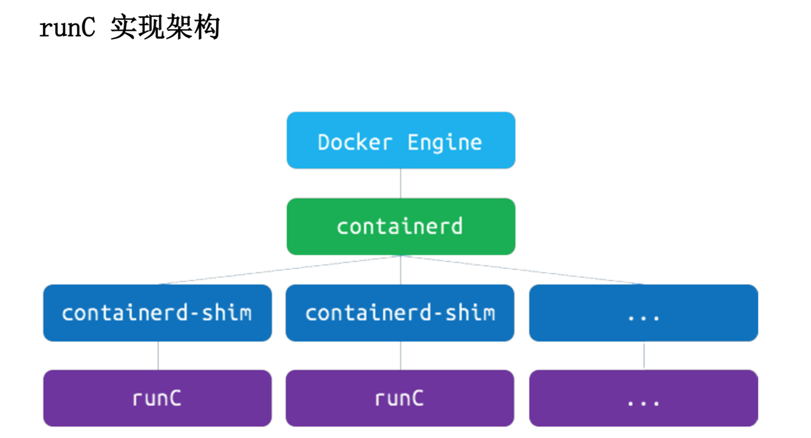
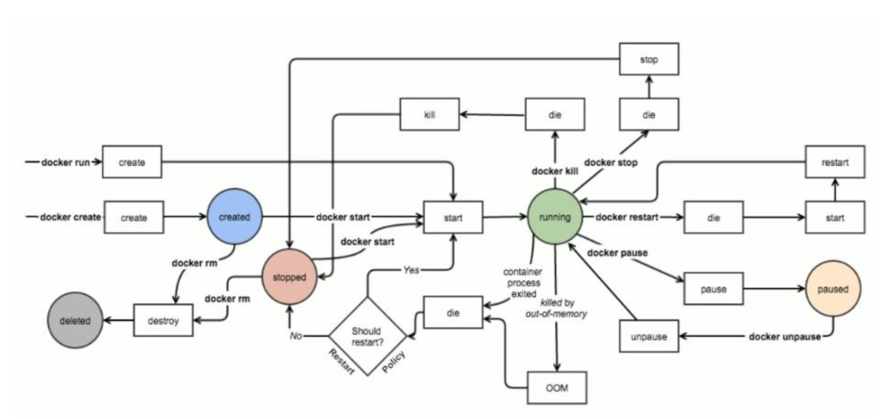

### 远程访问
1. 修改 /etc/docker/daemon.json 文件
```
"hosts": ["tcp://0.0.0.0:2375", "unix://var/run/docker.sock"]

example:
  docker -H Ip:Port Command
```

### OCI
1. Open Container Initative
  - 由 Linux 基金会主导于 2015 年 6 月创立
  - 旨在围绕容器格式和运行时定制一个开放的工业化标准
2. Contains two specifications
  - this Runtime Specification(runtime-spec)
  - the Image Specification(runtime-spec)

### RUNC


### runc实现架构


### docker一些常见命令
