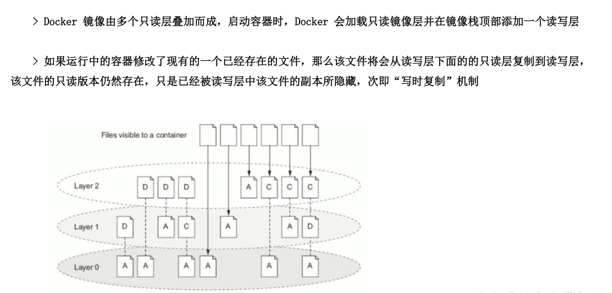
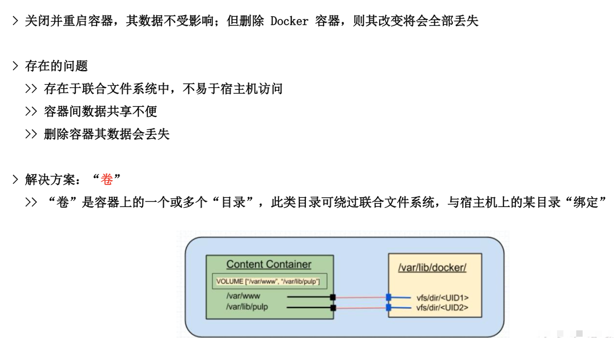
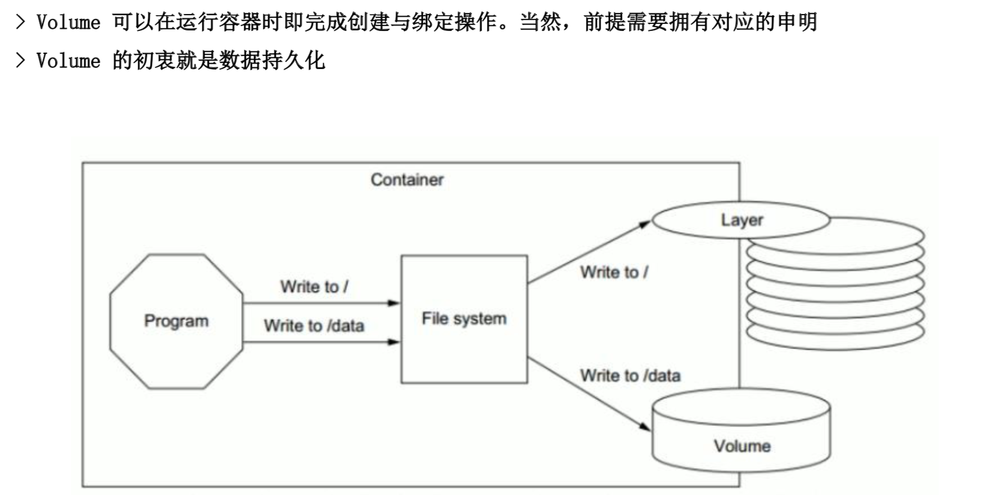
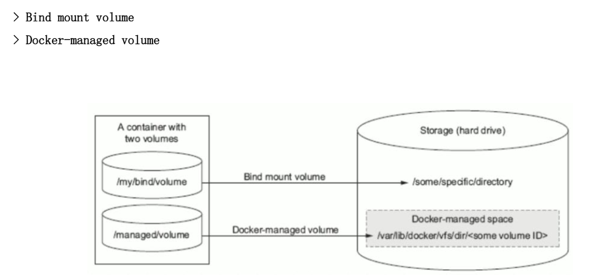
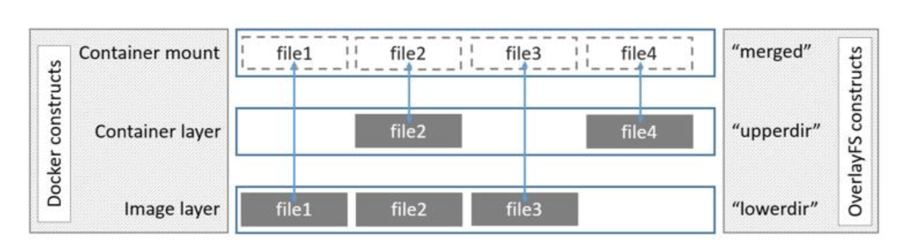
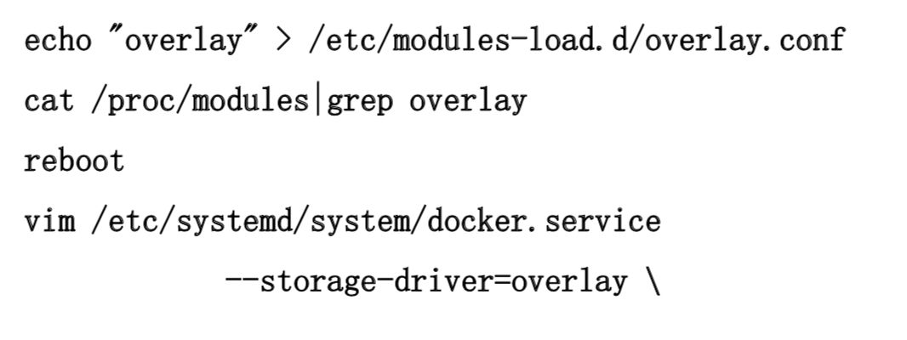

### Docker 数据存储
1. 数据卷特性
2. 容器中的数据卷
3. 存储驱动

### 数据卷特性


### 数据卷的意义



### 数据卷类型


### 在容器中使用数据卷
```
docker rm -f $(docker ps -a -q)
docker images
docker run --name word -d wordpress
docker run --name tomcat -d tomcat:v1.0
docker ps -a
docker inspect tomcat
cd /var/lib/docker/volumes/
docker rm -f $(docker ps -a -q)
rm -rf *
docker run --name word -d wordpress
docker run --name tomcat -d tomcat:v1.0
docker exec -it word /bin/bash
ls
touch {1..100}.txt
ls
exit
docker rm -f word
ls
docker images
cd ~
vim Dockerfile

FROM centos:6.8
RUN touch /tmp/1.txt
RUN mkdir /data
CMD tail -f /tmp/1.txt

docker build -t test:v1.0 .
docker run --name test1 -d test:v1.0
docker ps -a
docker exec -it test1 /bin/bash
cd /data/
ls
touch 1
ls
exit
cd /var/lib/docker/volumes/
ls
# 这个创建的镜像并没有数据卷

vim Dockerfile

FROM centos:6.8
RUN touch /tmp/1.txt
RUN mkdir /data
VOLUME /data # 增加这句
CMD tail -f /tmp/1.txt

docker build -t test:v2.0 .
docker run --name test2 -d test:v2.0
cd /var/lib/docker/volumes/
ls
cd c88*/
docker exec -it test2 /bin/bash
cd /data/
ls
touch {1..66}.txt

# 删除容器的时候也删除容器卷
docker rm -f -v test2

# 绑定容器卷
docker run --name test11 -v /data:/data -d test:v1.0

# 自绑定卷先生效 /data:/data
docker run --name test2 -v /data:/data -d test:v2.0

# 两个容器卷之间绑定数据，借助宿主机
docker rm -f $(docker ps -a -q)
docker run --name test1 -v /data:/data -d test:v1.0
docker run --name test2 -v /data:/data -d test:v1.0

# 两个容器卷之间绑定数据，不借助宿主机 
docker rm -f $(docker ps -a -q)
cd /var/lib/docker/volumes/
docker run --name test2 -d test:v2.0
docker run --name test22 --volumes-from test2 -d test:v2.0
```

### 存储驱动
1. Docker 存储驱动(storage driver)是Docker的核心组件，它是 Docker 实现分成镜像的基础
  - device mapper（DM）：性能和稳定性存在问题，不推荐生产环境使用
  - btrfs：社区实现来 btrfs driver，稳定性和性能存在问题
  - overlayfs：内核3.18 overlayfs 进入主线，性能和稳定性优异，第一选择
2. docker overlayfs driver

```
cd /var
mkdir overlay
cd overlay
mkdir low work upper merged
mount -t overlay overlay -olowerdir=./low,upperdir=./upper,workdir=./work ./merged
mount # 显示挂载成功
cd low/
vim 1.txt
aaaaaaaaaa
cd ../upper
vim 2.txt
bbbbbbbbbb
yum -y install tree
tree .
# 发现 merged 两个文件都有
cd merged/
vim 1.txt
aaaaaaaaaa
bbbbbbbbbb
cat low/1.txt # 还是原来的 aaaaaaaaaa
cat upper/ # 发现两个文件都有
```

### 修改为 overlayfs 存储驱动
