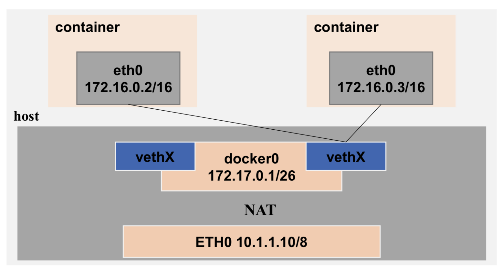
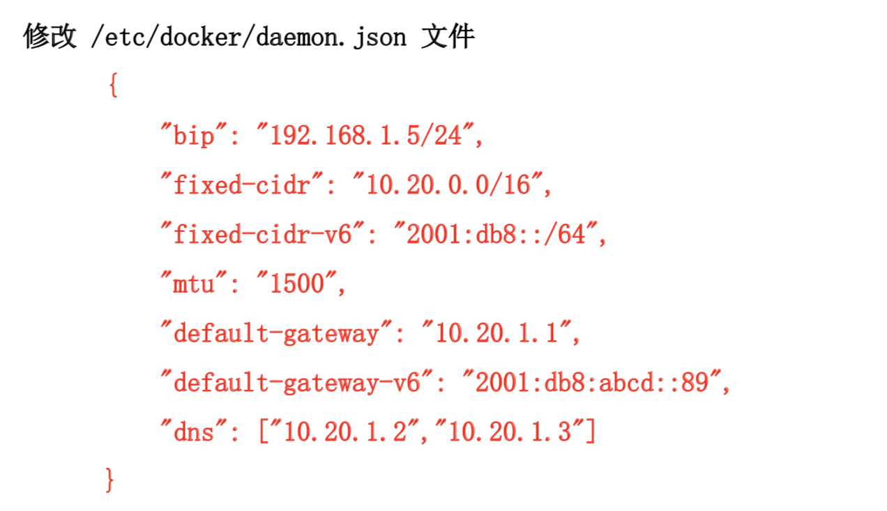
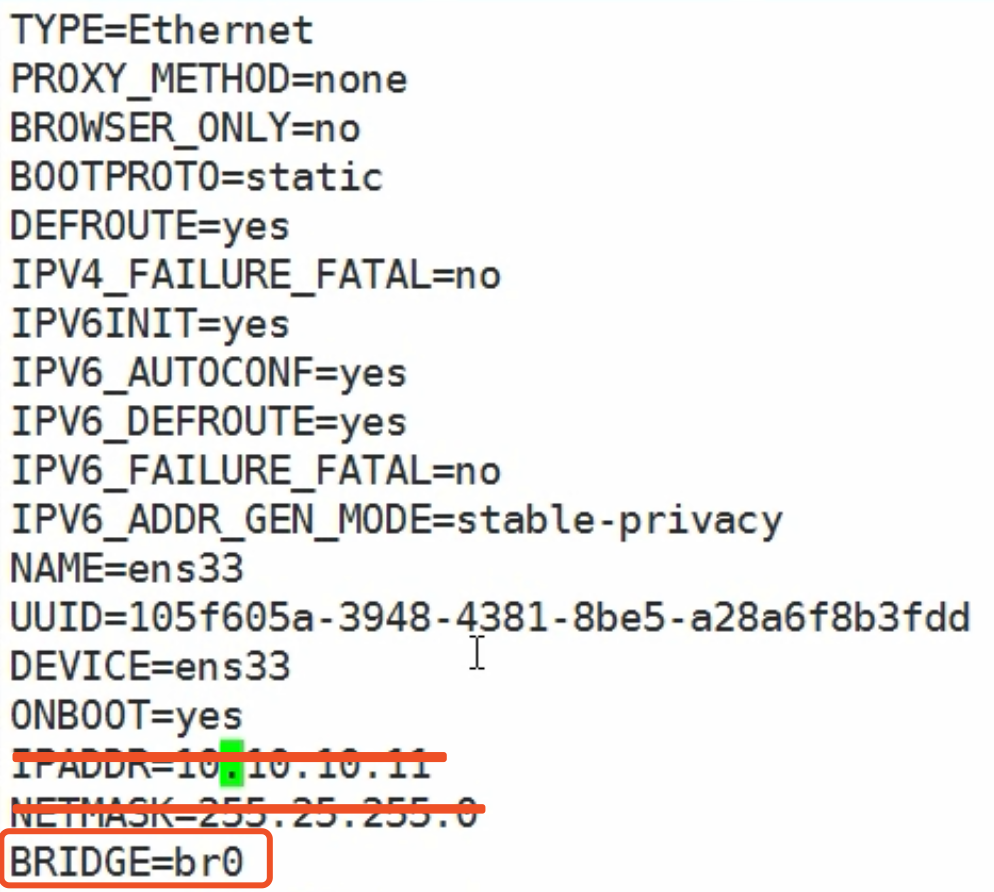

### Docker 网络管理
1. Docker 网络通讯
2. Docker 网络模式修改
3. 常用隔离方式

### Docker 网络通讯
1. 容器与容器之间通讯：在通常情况下，Docker 使用网桥（Bridge）与 NAT 的通信模式

2. 容器访问外部网络
```
iptables -t nat -A POSTROUTING -s 172.17.0.0/16 -o docker0 -j MASQUERADE
```
3. 外部网络访问容器
```
docker run -d -p 80:80 apache
iptables -t nat -A POSTROUTING -m addrtype --dst-type LOCAL -j DOCKER
iptables -t nat -A DOCKER ! -i docker0 -p tcp -m tcp --dport 80 -j DNAT --to-destination 172.12.0.2:80
```

### Docker 网络模式修改
1. Docker 进程网络修改
  - `-b,--bridge=""`：指定 Docker 使用的网桥设备，默认情况下 Docker 回自动创建和使用 docker0 网桥设备，通过此参数可以使用已经存在的设备
  - `--bip`：指定 Docker0 的 IP 和掩码，使用标准的 CIDR 形式，如 10.10.10.11/24
  - `--dns`：配置容器的 DNS，在启动 Docker 进程是添加，所有容器全部生效
2. Docker 容器网络修改
  - `--dns`：用于指定启动的容器的 DNS
  - `--net`：用于指定容器的网络通讯方式，有以下四个值
    - `bridge`：Docker 默认方式，网桥模式
    - `none`：容器没有网络栈
    ```
    docker run --name tomcat1 --net=none -d tomcat:v1.0
    docker exec -it tomcat1 /bin/bash
    ifconfig
    ```
    - `container`：使用其他容器的网络栈，Docker 容器会加入其他容器的 network namespace
    - `host`：表示容器使用 Host 的网络，没有自己独立的网络栈。容器可以完全访问 Host 的网络，不安全
    ```
    docker run --name tomcat11 --net=host -d tomcat:v1.0
    curl localhost:8080 # 并没有加上参数 -p ，但是可以进行端口暴露
    ```
3. 暴露端口

4. 自定义 Docker0 网桥的网络地址


### 网络隔离、独立IP配置
```
docker run --name tomcat1 -d tomcat:v1.0
docker run --name tomcat2 -d tomcat:v1.0
docker exec -it tomcat1 /bin/bash
ifconfig
ping 172.12.0.2
# 重新开一个窗口
docker exec -it tomcat2 /bin/bash
ifconfig
```

### 容器内两个项目互相隔离
```
# 查看当前可用的网络类型
docker network ls

docker network create -d 类型 网络空间名称
类型分为：overlay network
        bridge network

docker network create -d bridge lamp
docker network create -d bridge lnmp
docker network ls
ifconfig
docker run --name tomcat11 --network=lamp -d tomcat:v1.0
docker run --name tomcat111 --network=lnmp -d tomcat:v1.0
docker exec -it tomcat11 /bin/bash
ifconfig
# 已经不在之前的网段了
exit
docker exec -it tomcat111 /bin/bash
ifconfig
# 在 10.10.10.11 上 ping
ping 172.21.0.2 # ping 不通 和外网还是可以通讯的，隔离的只是容器和容器之间
```

### 让两个容器之间进行通信
```
docker rm -f $(docker ps -a -q)
# 需要一个真正的网桥，这个网桥具有和外界通讯的能力
cd /etc/sysconfig/network-scripts/
cp -a ifcfg-ens33 ifcfg-br0
vim ifcfg-ens33
```

```
vim ifcfg-br0

DEVICE=br0
TYPE=Bridge
ONBOOT=yes
BOOTPROTO=static
IPADDR=10.10.10.11
NETMASK=255.255.255.0

service network restart
ifconfig

yum install -y git
git clone https://github.com/jpetazzo/pipework
cp pipework/pipework /usr/local/bin/
chmod a+x /usr/local/bin/pipework
docker run --name tomcat --net=none -d tomcat:v1.0
pipework br0 tomcat 10.10.10.16/24

# 当前本地cmd
ping 10.10.10.16
curl 10.10.10.16:8080
```
