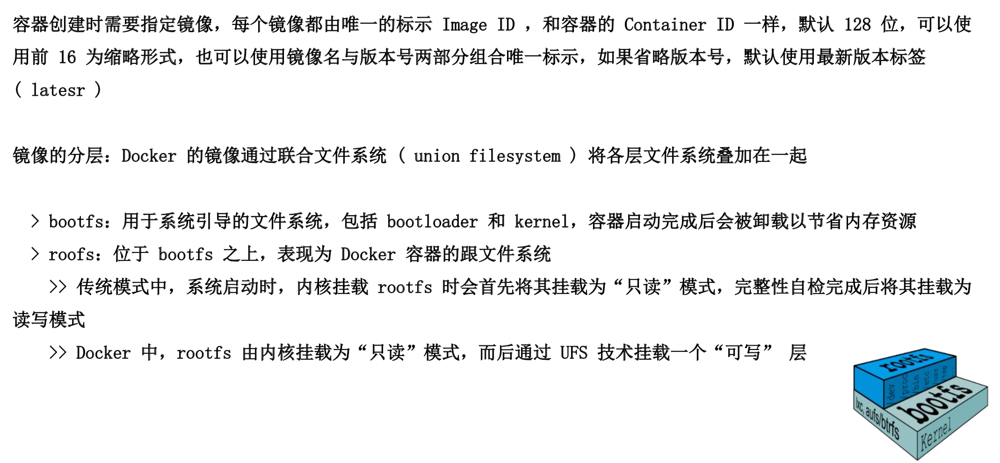
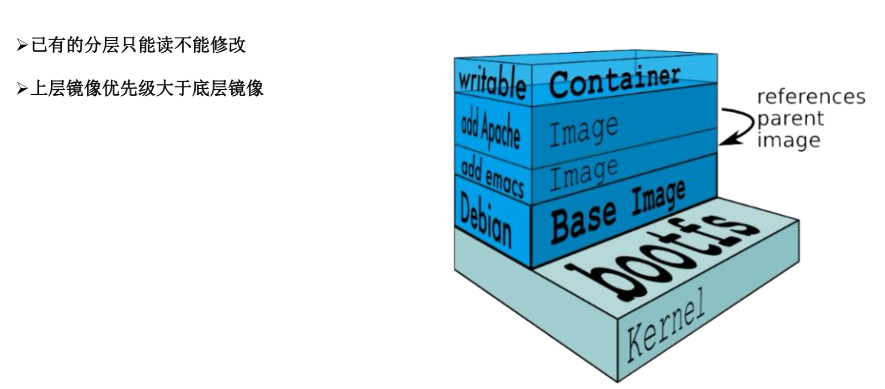

### 镜像特性



### 镜像的诞生
1. 容器 > 镜像：`docker commit CID xx.xx.xx` **工作在前台的守护进程至少一个**
```
docker pull hub.c.163.com/public/centos:6.7-tools
docker run --name mysql -d hub.c.163.com/public/centos:6.7-tools
docker ps -a
docker exec -it mysql /bin/bash

yum -y install mysql mysql-server
service mysqld start
chkconfig mysqld on

mysqladmin -utoor password 123
mysql -uroot -p

create database shanguiggu;
show databases;

exit

docker commit  mysql mysql:5.1
docker images
docker run --name mysql-my -d 768b332
docker ps -a
docker exec -it cef94d6 /bin/bash

service mysqld start
mysql -uroot -p
show databases;
```
2. Dockerfile
  - Dockerfile 是一种被 Docker 程序解释的脚本，Dockerfile 由一条条的指令组成，每条指令对应 Linux 下面的一条命令。Docker 程序将这些 Dockerfile 指令翻译真正的 Linux 命令。Dockerfile 有自己书写格式和支持的命令，Docker 程序解决这些命令间的依赖关系，类似与 Makefile。Docker 程序将读取 Dockerfile，根据指令生产定制的 image
  - 生成命令：`docker build -t zy/jdk-tomcat .`
  - 最大不能超过 128 层

### 构建一个 tomcat 的基础镜像
```
mkdir tomcat
cd tomcat/
ls

# apache-tomcat-7.0.42.tar.gz
# Dockerfile
# jdk-7u25-linux-x64.tar.gz

# Dockerfile
FROM hub.c.163.com/public/centos:6.7
MAINTAINER zy@itxdl.cn

ADD ./apache-tomcat-7.0.42.tar.gz /root
ADD ./jdk-7u25-linux-x64.tar.gz /root

ENV JAVA_HOME /root/jdk1.7.0_25
ENV PATH $JAVA_HOME/bin:$PSTH

EXPOSE 8080

ENTRYPOINT /root/apache-tomcat-7.0.42/bin/startup.sh && tailf /root/apache-tomcat-7.0.42/logs/catalina.out

docker build -t tomcat:v1.0 .
docker images
docker run --name tomcat -p 80:8080 -d tomcat:v1.0
```

### 镜像的导出以及导入
1. 导出：`docker save -o xx.xx.xx xx.xx.xx tar`
2. 导入：`docker load -i xx.xx.xx tar`

### Docker 仓库构建
1. 进入VMware，关闭虚拟机
2. 选择【编辑虚拟机】设置
3. 将内存设置的低一点，还有处理器也设置低一点，要保证可以启动两台机器
4. 选择【快照】【管理】【克隆】 【克隆自虚拟机中的当前状态】【创建链接克隆】【克隆在本地磁盘中】
5. 克隆完成之后就会出现在下面的列表中，将快照直接拖动到和上一个机器相同的位置
6. 记录一个快照，将两台机器开启
7. 启动成功后对第二台机器的网卡改动下
```
vim /etc/sysconfig/network-scripts/ifcfg-ens33
# IPADDR=10.10.10.12
systemctl restart network
ifconfig
```
8. 11机器也重新启动下网络`systemctl restart network`
9. docker 私有仓库构建
```
# 11 机器
docker run -d -v /opt/registry:/var/lib/registry -p 5000:5000 --restart=always registry
vim /etc/docker/daemon.json
{
    "insecure-registries": ["10.10.10.11:5000"]
}
systemctl restart docker
docker ps -a # registry
docker images 
# 对自定义的tomcat镜像调整tag
docker tag tomcat:v1.0 10.10.10.11:5000/tamcat:v1.0
docker images
docker push 10.10.10.11:5000/tomcat:v1.0
# 查看已有镜像
curl -XGET http://10.10.10.11:5000/v2/_catalog
```
10. 客户机设置
```
# 12 机器
vim /etc/sysconfig/docker
{
    "insecure-registries": ["10.10.10.11:5000"]
}
systemctl restart docker
docker pull 10.10.10.11:5000/tomcat:v1.0
docker images
docker run --name tomcat -p 80:8080 -d 10.10.10.11:5000/tomcat:v1.0
curl 10.10.10.12
```

## Harbor 企业级 Docker 私有仓库

### 安装底层需求
1. Python 应该是2.7或更高版本
2. Docker 引擎应为 1.10 或更高版本
3. Docker Compose 需要为 1.6.0 或更高版本

### 创建 https 证书以及配置相关目录权限
```
# 将11机器还原
# 确定底层需求是否满足
python
docker-compose --version
docker info

# 将从[官网](https://github.com/goharbor/harbor/releases)下载的 harbor-offline-installer-v1.2.0.tgz 拷贝到 11 机器
tar -zxvf harbor-offline-installer-v1.2.0.tgz
mv harbor /usr/local/

# 生成证书
openssl genrsa -des3 -out server.key 2048
# 输入密码
# 创建证书请求
openssl req -new -key server.key -out server.csr
# 按照提示输入对应的内容
# 将密钥备份
cp server.key server.key.org
# 证书启动的时候不包含密钥，退密钥
openssl rsa -in server.key.org -out server.key
# 创建证书
openssl x509 -req -days 365 -in server.csr -signkey server.key -out server.crt

mkdir -p /data/cert
mv server.* /data/cert
cd /data/cert/
ls

# install.sh 安装脚本回读取 harbor.cfg 内容
cd /usr/local/harbor/
vim harbor.cfg

hostname = hub.shangguigu.com
ui_url_protocol = https
harbor_admin_password = WangYang! # harbor 密码

./install.sh
docker ps -a
# 将一些没有用的删除掉

# 在主机中 hosts 文件中做映射
10.10.10.11 hub.shangguigu.com

# 浏览器上放问 https://hub.shangguigu.com admin WangYang!
# 在 B/S 端进行用户管理，创建一个初始用户
# 可以在新创建的用户登录模式下，创建一个私有项目

# 指定镜像仓库地址是安全的，可以被认证
vim /etc/docker/daemon.json
{
    "insecure-registries": ["hub.shangguigu.com"]
}

vim /etc/hosts
10.10.10.11 hub.shangguigu.com

systemctl restart docker
docker ps -a
docker images

# 想要将 tomcat 推送到自己的私有仓库
docker tag tomcat:v1.0 hub.shangguigu.com/xitong/tomcat:v1.0
docker push hub.shangguigu.com/xitong/tomcat:v1.0
# denied: requested access to the resource is denied
# 原因是 xitong 仓库是私有的，不允许直接 push
# docker login # 是指向官网的，需要加上域名
docker login hub.shangguigu.com # 输入用户名和密码
# 想项目推送到远程
docker push hub.shangguigu.com/xitong/tomcat:v1.0

# 12 机器，可以进行下载
docker rmi -f $(docker images -q)
# 进行认证，https 证书没有真正的被认证
vim /etc/docker/daemon.json
{
    "insecure-registries": ["hub.shangguigu.com"]
}
# hosts 文件中对域名的解析
vim /etc/hosts
10.10.10.11 hub.shangguigu.com
systemctl restart docker
docker ps -a
docker pull hub.shangguigu.com/xitong/tomcat:v1.0 # 还是回报错，需要进行密码登录
docker login hub.shangguigu.com
docker pull hub.shangguigu.com/xitong/tomcat:v1.0
docker images
docker run --name tomcat -p 80:8080 -d 630d70a
# 在网页中打开
10.10.10.12
```