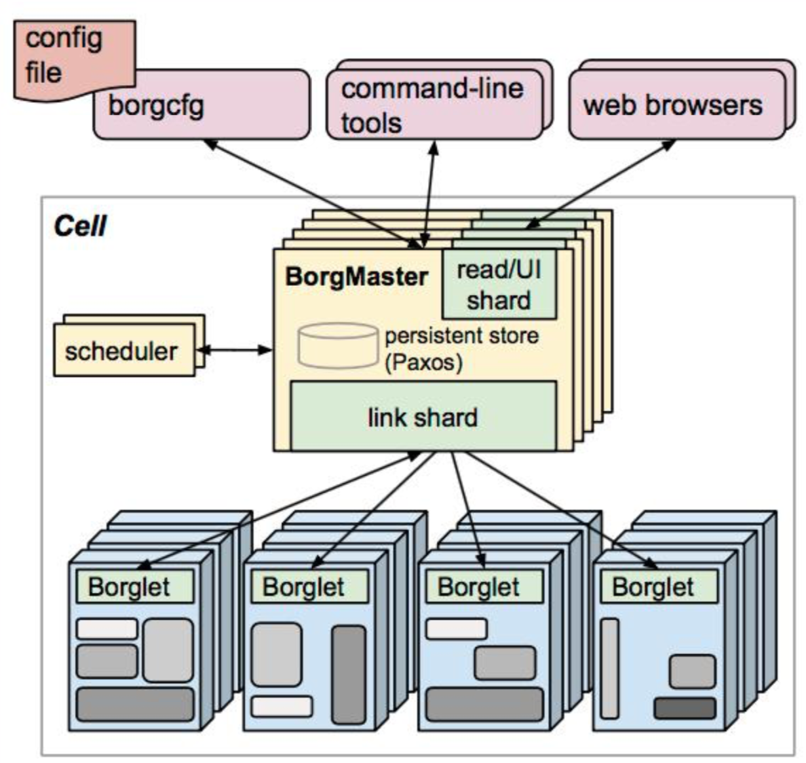
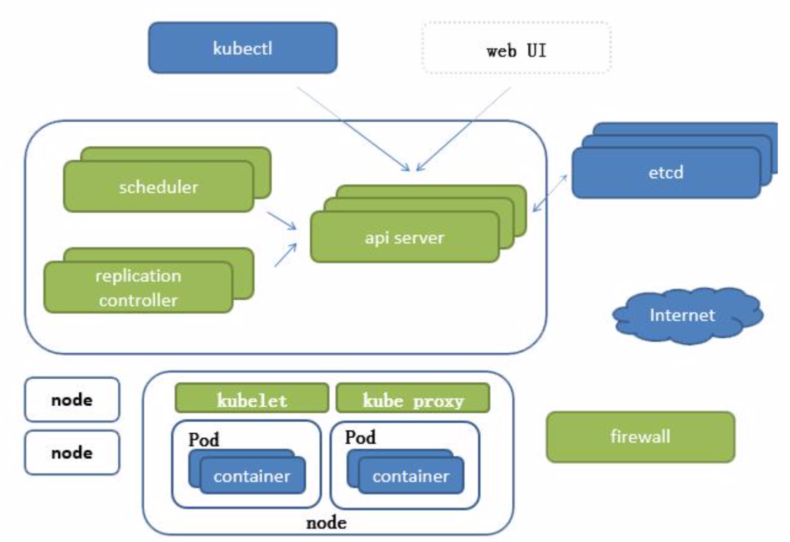
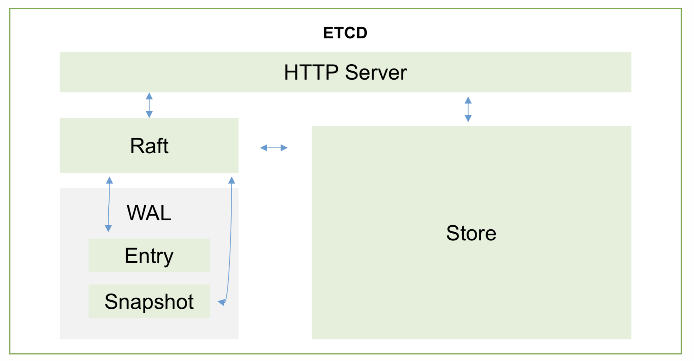

### borg系统架构图

### K8S架构

1. APISERVER：所有服务访问统一入口
2. ControllerManager：维持副本期望数目
3. Scheduler：负责接受任务，选择合适的节点进行分配任务
4. ETCD：键值对数据库，存储K8S集群所有的重要信息（持久化）
5. Kubelet：直接跟容器引擎交互实现容器的生命周期管理
6. Kube-proxy：负责写入规则至 IPTABLES、IPVS 实现服务映射访问
7. COREDNS：可以为集群中的 SVC 创建一个域名 IP的对应关系解析
8. DASHBOARD：给 K8S 集群提供一个 B/S结构访问体系
9. INGRESS CONTROLLER：官方只能实现四层代理，INGRESS 可以实现七层代理
10. FEDERATION：提供一个可以跨集群中心多 K8S 统一管理功能
11. PROMETHEUS：提供 K8S 集群的监控能力
12. ELK：提供 K8S 集群日志统一分析介入平台

### ETCD
1. etcd 的官网将它定位成一个可信赖的分布式键值对存储服务，它能够为整个分布式集群存储一些关键数据，协助分布式集群的正常运转
2. 推荐在 Kubernetes 集群中使用 Etcd v3，v2版本在Kubernetes v1.11 中弃用
