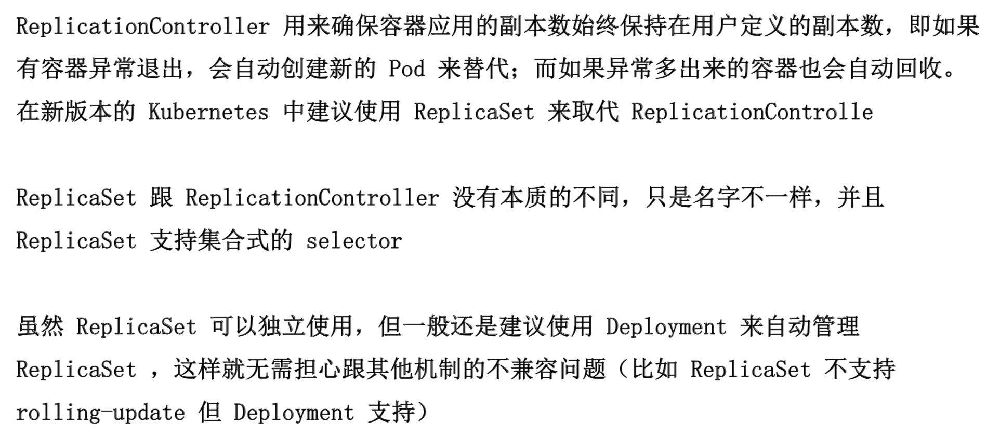
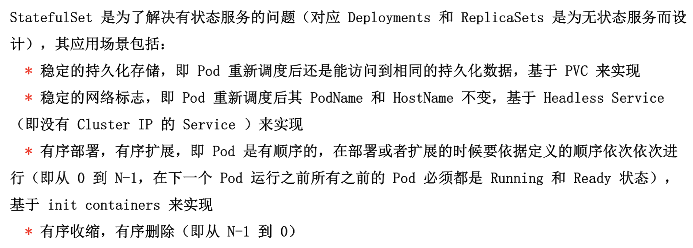
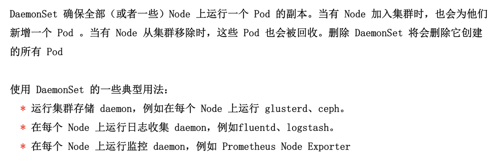
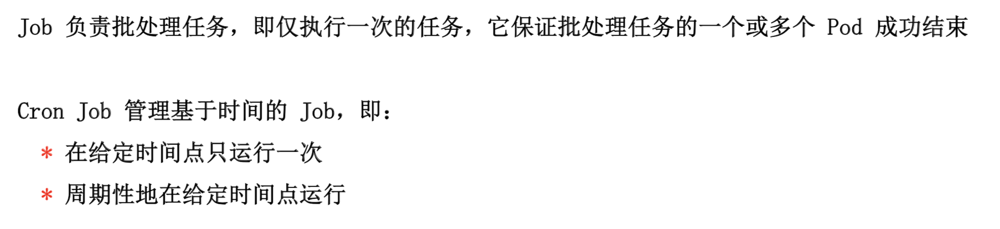
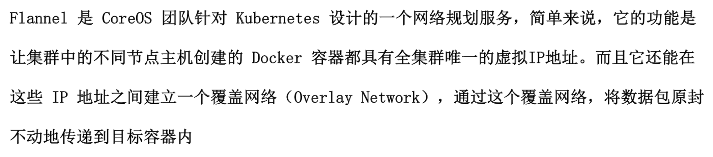
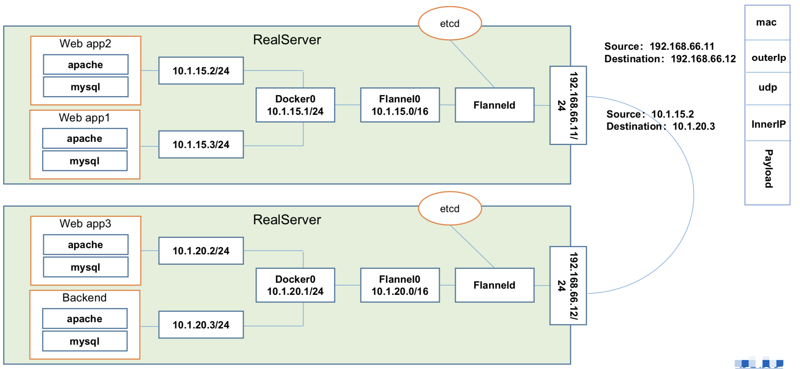
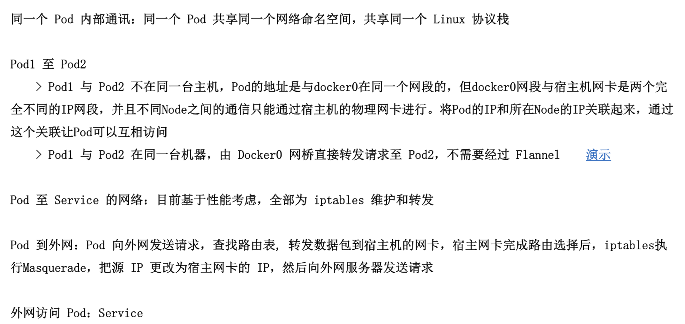
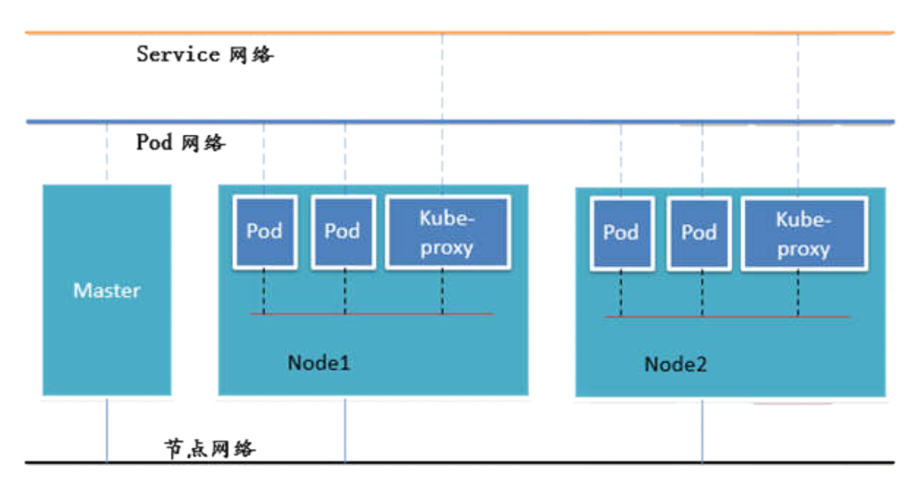

### Pod 类型
1. 自主式 Pod
2. 控制器管理的 Pod

### Pod 控制器类型
1. ReplicationController & ReplicaSet & Deployment
  
  - Deployment(ReplicaSet)
  .png)
  - HPA(HorizontalPodAutoScale)
  .png)
2. StatefullSet

3. DaemonSet

4. Job,Cronjob

### 网络通讯模式
1. Kubernetes 的网络模型嘉定了所有 Pod 都在一个可以直接连通的扁平的网络空间中，这在GCE（Google Compute Engine）里面是现成的网络模型，Kubernetes 假定这个网络已经存在。而在私有云里搭建 Kubernetes 集群，就不能假定这个网络已经存在了。我们需要自己实现这个网络假设，将不同节点上的 Docker 容器之间的互相访问先大同，然后运行 Kubernetes
2. 同一个 Pod 内的多个容器之间：lo
3. 各个 Pod 之间的通讯：Overley Network
4. Pod 与 Service 之间的通讯：各节点的 Iptables 规则

### 网络解决方案 Kubernetes + Flannel

ETCD 之 Flannel 提供说明：
  - 存储管理 Flannel 可分配的 IP 地址段资源
  - 监控 ETCD 中每个 Pod 的实际地址，并在内存中建立维护 Pod 节点路由表

### 不同情况下网络通信方式

### 组件通讯示意图

### 命令式变成和声明式编程
1. 命令式编程：它侧重于如何实现程序，就像我们刚接触编程的时候那样，我们需要把程序的实现过程按照逻辑结果一步步写下来
2. 声明式编程：它侧重于定义想要申明，然后告诉计算机/引擎，让他帮你去实现