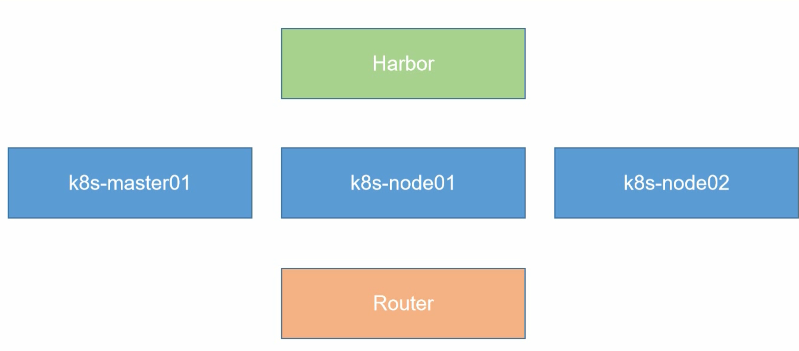
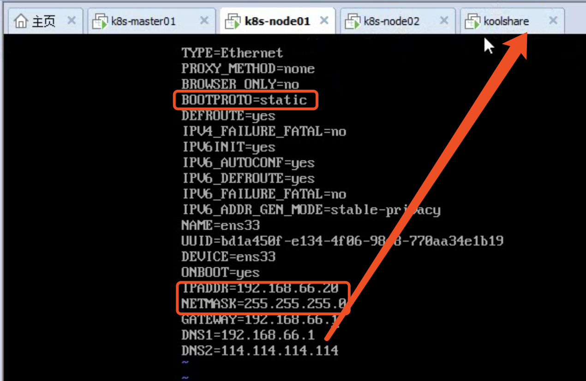
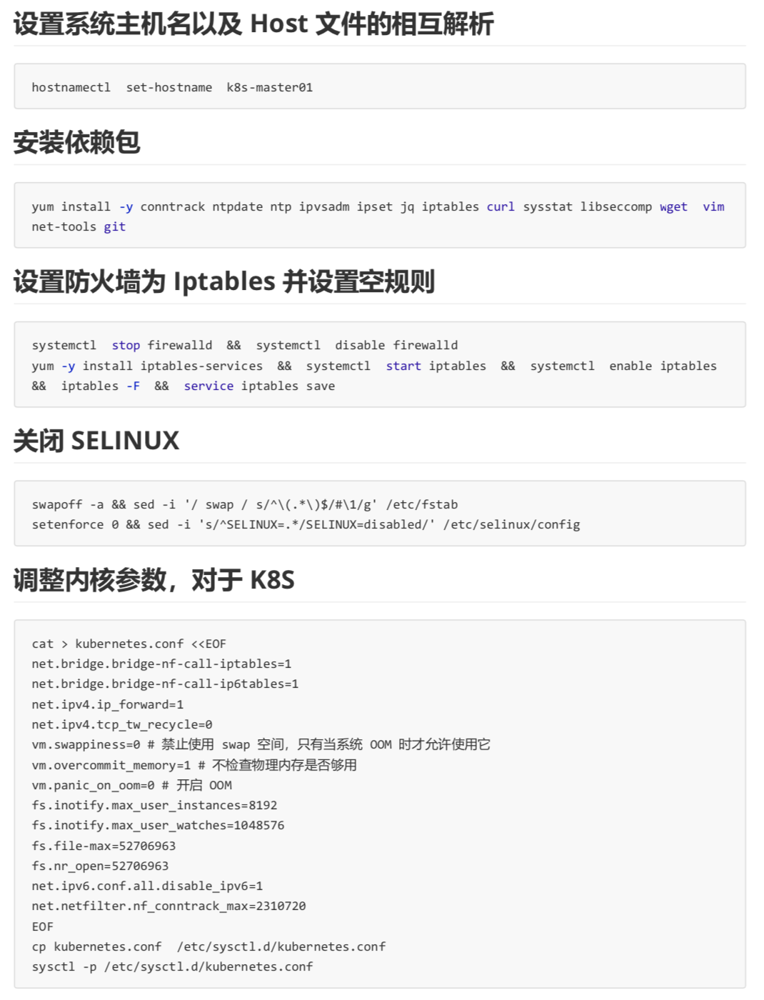
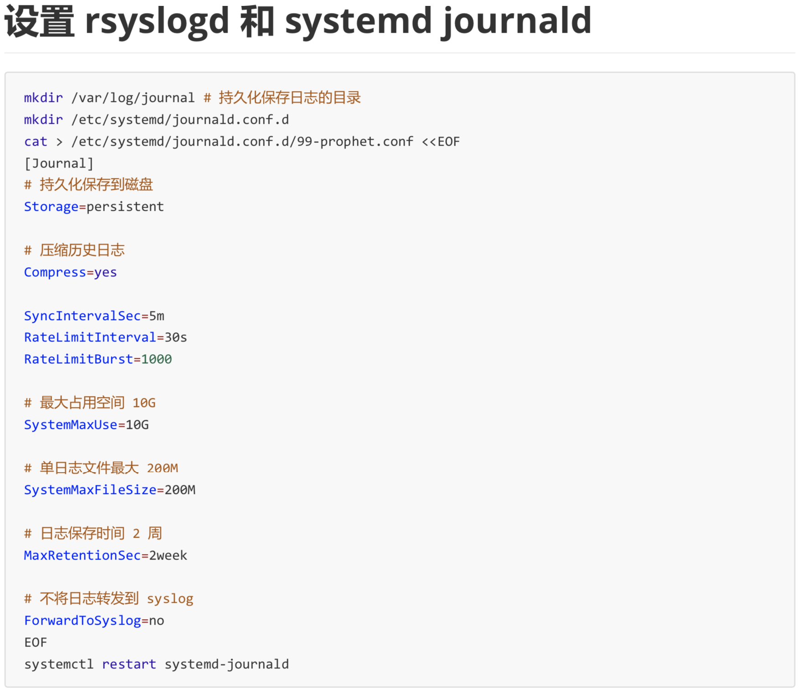
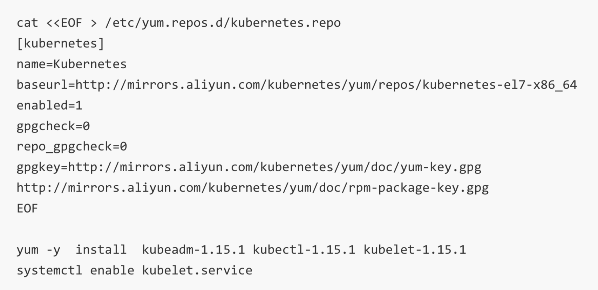
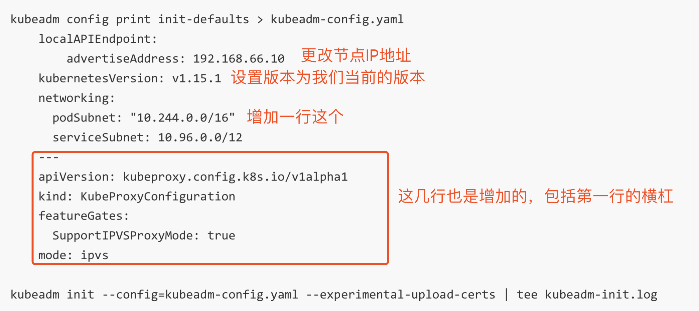

### 前期准备阶段

1. K8S-master
```
指定磁盘容量-设置磁盘大小为100GB
选择将虚拟磁盘存储为单个文件
```
2. K8S-node01/K8S-node02
```
存放在和上面一起的目录下
处理器数量 -> 2
每个处理器的内核数量 -> 2 
内存选择 4GB
使用仅主机模式网络
LSI Loginc(L)
虚拟磁盘类型 -> SCSI(S)
指定磁盘容量-设置磁盘大小为100GB
选择将虚拟磁盘存储为单个文件
```
3. Harbor
```
处理器数量 -> 2
每个处理器的内核数量 -> 1
内存选择 2GB
```
4. koolshare
```
客户机操作系统 -> Microsoft Windows
版本 -> Windows 10 x64
固件类型 -> BIOS
处理器数量 -> 2
每个处理器的内核数量 -> 1
内存选择 4GB
使用仅主机模式网络
虚拟磁盘类型 -> IDE(I)
指定磁盘容量-设置磁盘大小为20GB
```

### koolshare
1. 编辑虚拟机设置
2. CD/DVD -> 浏览 -> 选择老毛桃的镜像文件LaoMaoTao.iso -> 确定 -> 开启
3. 【1】启动 Win10 X64 PE(2G 以上内存)
4. 在koolshare虚拟机右键 -> 设置 -> CD/DVD -> 浏览 -> 20190419_184043.iso(软路由文件)
5. 打开此电脑 -> DVD光驱 -> IMG写盘工具.exe -> 管理员运行 -> 浏览软路由的文件地址
6. 在koolshare虚拟机右键 -> 设置 -> CD/DVD -> 设备状态去掉【已连接】【启动时连接】-> 关机
7. 关机之后将资源调小一点 -> 1G内存 -> 一核处理器 -> 添加一个网络适配器 -> NAT模式
8. 开启虚拟机，需要对本机进行网络设置 -> 更改连接属性，需要进行配置，但是不知道那块至仅主机模式的网卡
9. 虚拟机 -》 编辑 -》 虚拟网络编辑器 -》 更改设置 -》 Vmnet1是仅主机模式 -》 关闭使用本地 DHCP 服务将 IP地址分配给虚拟机
10. 在本机的 VMnet1 选择 属性 -》 Internet 协议版本4 -》 使用下面的 IP 地址 -》 IP地址 -》 192.168.1.1 -》 子网掩码 255.255.255.0
11. 高级 -》 添加 -》IP地址 -》 192.168.1.240
12. 浏览器上通过访问 192.168.1.1进入管理界面
13. koolshare 软路由的默认密码是 koolshare
14. 网络 -》 接口 -》 只留下一个LAN（内网）和一个WAN（外网）-》 先编辑LAN -》 物理设置 -》 关闭桥接接口 -》 IPv4地址改为192.168.66.1
15. WAN 需要使用 eth1 -》在浏览器上访问192.168.66.1进入koolshare的界面
16. 通过在网络 -》 诊断中ping一下百度试试可否连上外网
17. 如果想访问国外网站 -》 酷软 -》离线安装 -》选择koolss_2.2.2.tar.gzs -》上传并安装 -》点击一安装的koolss -》进行开启 -》将购买的VPN信息填写到SSR中

### 安装centos7系统
```
# k8s_master -> 10    k8s_node01 -> 20      k8s_node02 -> 21
# 前面过程和https://github.com/Jijmin/blog/blob/master/Linux/%E8%99%9A%E6%8B%9F%E6%9C%BA%E5%AE%89%E8%A3%85.md类似
vi /etc/sysconfig/network-scripts/ifcfg-ens33
```

1. 使用 xshell 连接3台机器

## 进行一些步骤的安装10机器
### 设置系统主机名以及 Host 文件的相互解析
```
hostnamectl set-hostname k8s-master01
```
### 让主机名和IP进行相互解析
```
vi /etc/hosts

192.168.66.10 k8s-master01
192.168.66.20 k8s-node01
192.168.66.21 k8s-node02
```

### 将 hosts 文件拷贝到 node01 机器上
```
scp /etc/hosts root@k8s-node01:/etc/hosts
scp /etc/hosts root@k8s-node02:/etc/hosts
```

### 安装依赖包
```
yum install -y conntrack ntpdate ntp ipvsadm ipset jq iptables curl sysstat libseccomp wget vim net-tools git
```

### 设置防火墙为 Iptables 并设置空规则
```
systemctl stop firewalld && systemctl disable firewalld
yum -y install iptables-services && systemctl start iptables && systemctl
enable iptables && iptables -F && service iptables save
```

### 关闭 SELINUX
```
swapoff -a && sed -i '/ swap / s/^\(.*\)$/#\1/g' /etc/fstab
setenforce 0 && sed -i 's/^SELINUX=.*/SELINUX=disabled/' /etc/selinux/config
```

### 调整内核参数，对于 K8S，见下面图片


### 如果没有设置系统时区，按照下面的方式进行设置
```
timedatectl set-timezone Asia/Shanghai # 设置系统时区为 中国/上海
timedatectl set-local-rtc 0 # 将当前的 UTC 时间写入硬件时钟
systemctl restart rsyslog
systemctl restart crond
```

### 关闭系统不需要服务
```
systemctl stop postfix && systemctl disable postfix
```

### 设置 rsyslogd 和 systemd journald(下图所示)


### 升级系统内核为 4.44
```
# CentOS7.x系统自带的 3.10.x内核存在一些 Bugs，导致运行的Docker、Kubernetes不稳定
rpm -Uvh http://www.elrepo.org/elrepo-release-7.0-3.el7.elrepo.noarch.rpm
# 安装完成后检查 /boot/grub2/grub.cfg 中对应内核 menuentry 中是否包含 initrd16 配置，如果没有，再安装一次！
yum --enablerepo=elrepo-kernel install -y kernel-lt
# 设置开机从新内核启动
grub2-set-default "CentOS Linux (4.4.182-1.el7.elrepo.x86_64) 7 (Core)"
reboot
uname -r
```

### kube-proxy 开启 ipvs 的前置条件
```
modprobe br_netfilter
cat > /etc/sysconfig/modules/ipvs.modules << EOF
#!/bin/bash
modprobe -- ip_vs
modprobe -- ip_vs_rr
modprobe -- ip_vs_wrr
modprobe -- ip_vs_sh
modprobe -- nf_conntrack_ipv4
EOF
chmod 755 /etc/sysconfig/modules/ipvs.modules && bash /etc/sysconfig/modules/ipvs.modules && lsmod | grep -e ip_vs -e nf_conntrack_ipv4
```

### 安装 Docker 软件
```
yum install -y yum-utils device-mapper-persistent-data lvm2
yum-config-manager \
  --add-repo \
  http://mirrors.aliyun.com/docker-ce/linux/centos/docker-ce.repo
yum update -y && yum install -y docker-ce
reboot
uname -r # 回到了历史版本
grub2-set-default "CentOS Linux (4.4.182-1.el7.elrepo.x86_64) 7 (Core)" && reboot
uname -r
systemctl start docker
systemctl enable docker
# 创建 /etc/docker 目录
mkdir /etc/docker
# 配置 daemon
cat > /etc/docker/daemon.json << EOF
{
  "exec-opts": ["native.cgroupdriver=systemd"],
  "log-driver": "json-file",
  "log-opts": {
    "max-size": "100m"
  }
}
EOF
mkdir -p /etc/systemd/system/docker.service.d
# 重启docker服务
systemctl daemon-reload && systemctl restart docker && systemctl enable docker
```

### 安装 Kubeadm(主从配置)


### kubeadm的已经镜像文件，导入
1. 将压缩文件`kubeadm-basic.images.tar.gz`拉入我们的虚拟机 master01 中
2. 解压`tar -zxvf kubeadm-basic.images.tar.gz`
3. 写一个脚本导入下
```
cd ~
vim load-images.sh

#!/bin/bash
ls /root/kubeadm-basic.images > /tmp/image-list.txt
cd /root/kubeadm-basic.images
for i in $(cat /tmp.image-list.txt)
do
    docker load -i $i
done
rm -rf /tmp/image-list.txt

chmod a+x load-images.sh
./load-images.sh

scp -r kubeadm-basic.images load-images.sh root@k8s-node01:/root/
scp -r kubeadm-basic.images load-images.sh root@k8s-node02:/root/
# 同样也执行下 load-images.sh
```

### 初始化主节点

```
vim kubeadm-init.log # 打开日志
cd /etc/kubernetes/pki # 所有的密钥证书都在这个目录下
mkdir -p $HOME/.kube
sudo cp -i /etc/kubernetes/admin/conf $HOME/.kube/config
sudo chown $(id -u):$(id -g) $HOME/.kube/config

kubectl get node
```

### 准备部署Flannel
```
cd ~
mkdir install-k8s
mv kubeadm-init.log kubeadm-config.yaml install-k8s/
cd install-k8s/
mkdir core
mv * core/
mkdir plugin
cd plugin/
mkdir flannel
cd flannel/
wget https://raw.githubusercontent/coreos/flannel/master/Documentation/kube-flannel.yml
kubectl create -f kube-flannel.yml
kubectl get pod -n kube-system
kubectl get node # 已经是Ready状态了
# 将子节点加入进来，在上面的日志文件中有。在 20 和 21 机器上添加
kubeadm join 192.168.66.10.6443 --token abcdef.0123456789abcdef \
  --discovery-token-ca-cert-hash sha256:xxxxxxxxxxxx
kubectl get pod -n kube-system -o wide # 查看详细信息 
kubectl get pod -n kube-system -w # 监听状态更改输出
# 等都配置好了，就可以使用 kubectl get node
```

### 后续的一些操作
```
cd ~
mv install-k8s/ /usr/local/
rm -rf *
```

### 进行一些步骤的安装20机器
```
hostnamectl set-hostname k8s-node01

# 安装依赖包
# 设置防火墙为 Iptables 并设置空规则
# 调整内核参数，对于 K8S，见下面图片
# 关闭系统不需要服务
# 设置 rsyslogd 和 systemd journald
# 升级系统内核为 4.44
# kube-proxy 开启 ipvs 的前置条件
# 安装 Docker 软件
# 安装 Kubeadm(主从配置)
```

### 进行一些步骤的安装21机器
```
hostnamectl set-hostname k8s-node02

# 安装依赖包
# 设置防火墙为 Iptables 并设置空规则
# 调整内核参数，对于 K8S，见下面图片
# 关闭系统不需要服务
# 设置 rsyslogd 和 systemd journald
# 升级系统内核为 4.44
# kube-proxy 开启 ipvs 的前置条件
# 安装 Docker 软件
# 安装 Kubeadm(主从配置)
```

### Harbor 环境部署，100 机器
1. 安装方式和我们之前的 K8S 是一样的
```
vim /etc/docker/daemon.json
{
  "exec-opts": ["native.cgroupdriver=systemd"],
  "log-driver": "json-file",
  "log-opts": {
    "max-size": "100m"
  },
  "insecure-registries":["https://hub.atguigu.com"] # 表明这个证书是安全的
}
```
2. 其他的几个节点在使用的时候也需要增加上面的配置，重启docker`systemctl restart docker`
3. 将 docker-compose 文件放到 100 机器上，如果没有rz命令，需要安装一下`yum -y install lrzsz`
```
mv docker-compose /usr/local/bin
chmod a+x /usr/local/bin/docker-compose
```
4. 然后将 harbor 的安装包放到 100 机器上去`harbor-offline-installer-v1.2.0.tgz`
```
tar -zxvf harbor-offline-installer-v1.2.0.tgz
cd ~
mv harbor /usr/local/
cd /usr/local/harbor/
ls
vim harbor.cfg

hostname = hub.atguigu.com
ui_url_protocol = https
```
5. 创建存储证书的目录
```
mkdir -p /data/cert
cd !$
# 生成证书
openssl genrsa -des3 -out server.key 2048
# 输入密码
# 创建证书请求
openssl req -new -key server.key -out server.csr
# 按照提示输入对应的内容
# 将密钥备份
cp server.key server.key.org
# 证书启动的时候不包含密钥，退密钥
openssl rsa -in server.key.org -out server.key
# 创建证书
openssl x509 -req -days 365 -in server.csr -signkey server.key -out server.crt
# 赋予权限
chmod a+x *
cd /usr/local/harbor # 等同于 cd -
./install.sh
```
6. 将IP映射添加到每个机器中
```
echo "192.168.66.100 hub.atguigu.com" >> /etc/hosts 
```
7. 在 windows 机器中 hosts 文件也添加这个
8. 就可以在浏览器中访问 `hub.atguigu.com`

### docker 使用 Harbor
```
docker login https://hub.atguigu.com
docker pull wangyanglinux/myapp:v1 # 下载一个镜像
docker tag wangyanglinux/myapp:v1 hub.atguigu.com/library/myapp:v1
docker push hub.atguigu.com/library/myapp:v1
docker images
docker rmi -f hub.atguigu.com/library/myapp:v1
docker rmi -f wangyanglinux/myapp:v1
```

### 测试 K8S 仓库是否可用，是否可以和 harbor 连接起来
```
# [root@k8s-master01 ~]
kubectl run nginx-deployment --image=hub.atguigu.com/library/myapp:v1 --port=80 --replicas=1
kubectl get deployment
kubectl get rs
kubectl get pod # Running
kubectl get pod -o wide # 查看容器的详细信息，发现是在 node02 节点上运行的
curl <IP> # 如果想要访问的话，使用上面查询出来的IP，是一个私有IP

# node02 节点
docker ps -a | grep nginx

# 刷新浏览器页面，发现已经是下载次数增加了

### kubectl 好处
kubectl get pod
kubectl delete pod nginx-deployment-85756b779-shc4l
kubectl get pod # 有一个新的起来了
# 扩容
kubectl scale --replicas=3 deployment/nginx-deployment
kubectl get pod -o wide
```

### 想要访问子节点
```
kubectl expose --help
kubectl get svc
kubectl get deployment
hubectl expose deployment nginx-deployment --port=30000 --target-port=80
kubectl get svc
curl 10.97.154.59:30000/hostname.html # 是一个轮询的机制
ipvsadm -Ln | grep 10.97.154.59
ipvsadm -Ln
kubectl get pod -o wide

# 外部想去访问
kubectl get svc # TYPE ClusterIP，需要调整下
kubectl edit svc nginx-deployment

type: NodePort

kubectl get svc
netstat -anpt | grep :31859
# 浏览器上直接输入 192.168.66.10:31859，所有的节点都暴露了
```