### K8S 资源清单
1. K8S 中的资源
2. 资源清单
3. 常用字段解释说明
4. 容器生命周期

### 什么是资源？
1. K8S中所有的内容都抽象为资源，资源实例化之后，叫做对象

### 集群资源分类
1. 名称空间级别
2. 集群级别
3. 元数据型

### 名称空间级别
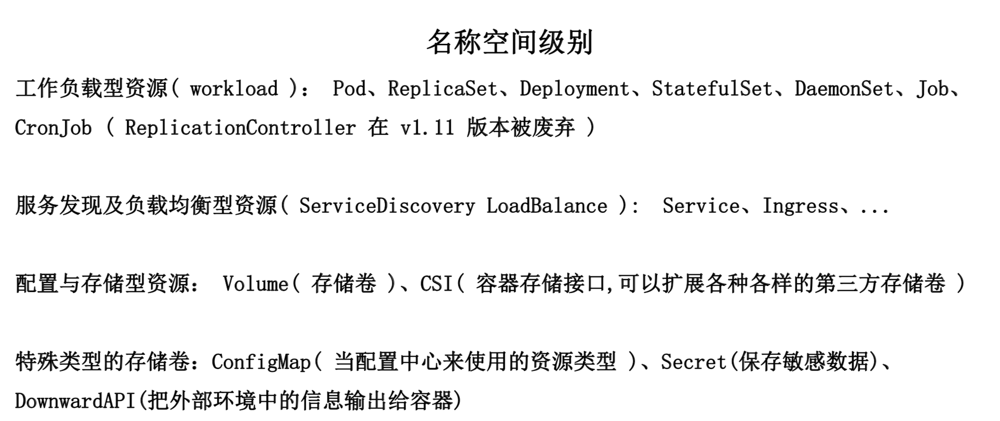

### 集群级资源
1. Namespace
2. Node
3. Role
4. ClusterRole
5. RoleBinding
6. ClusterRoleBinding

### 元数据型资源
1. HPA
2. PodTemplate
3. LimitRange 

### yaml语法
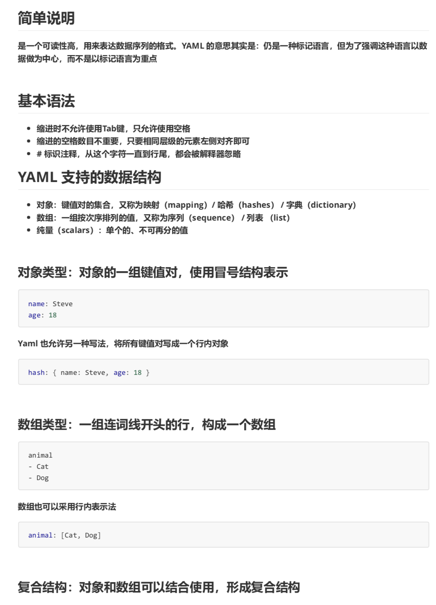
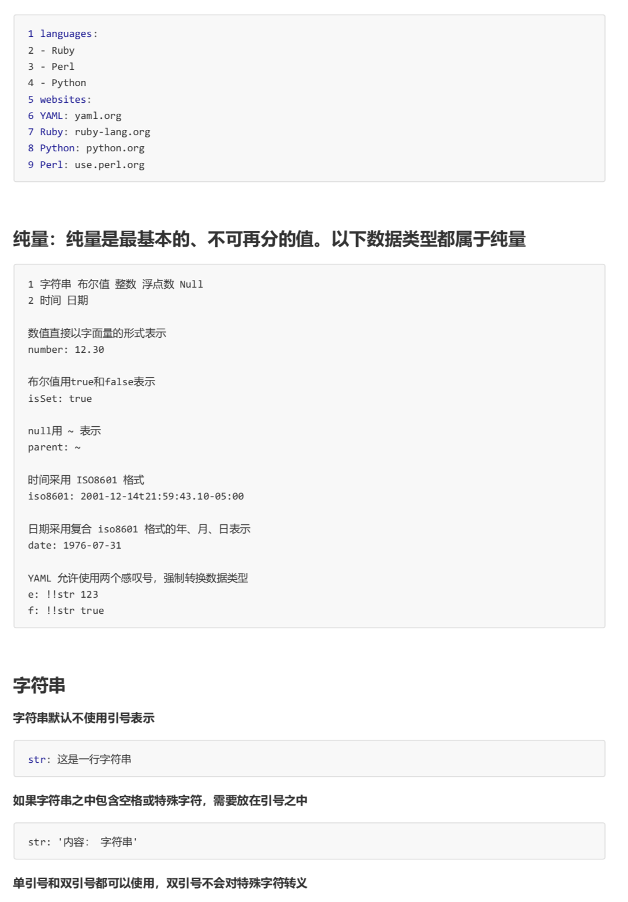
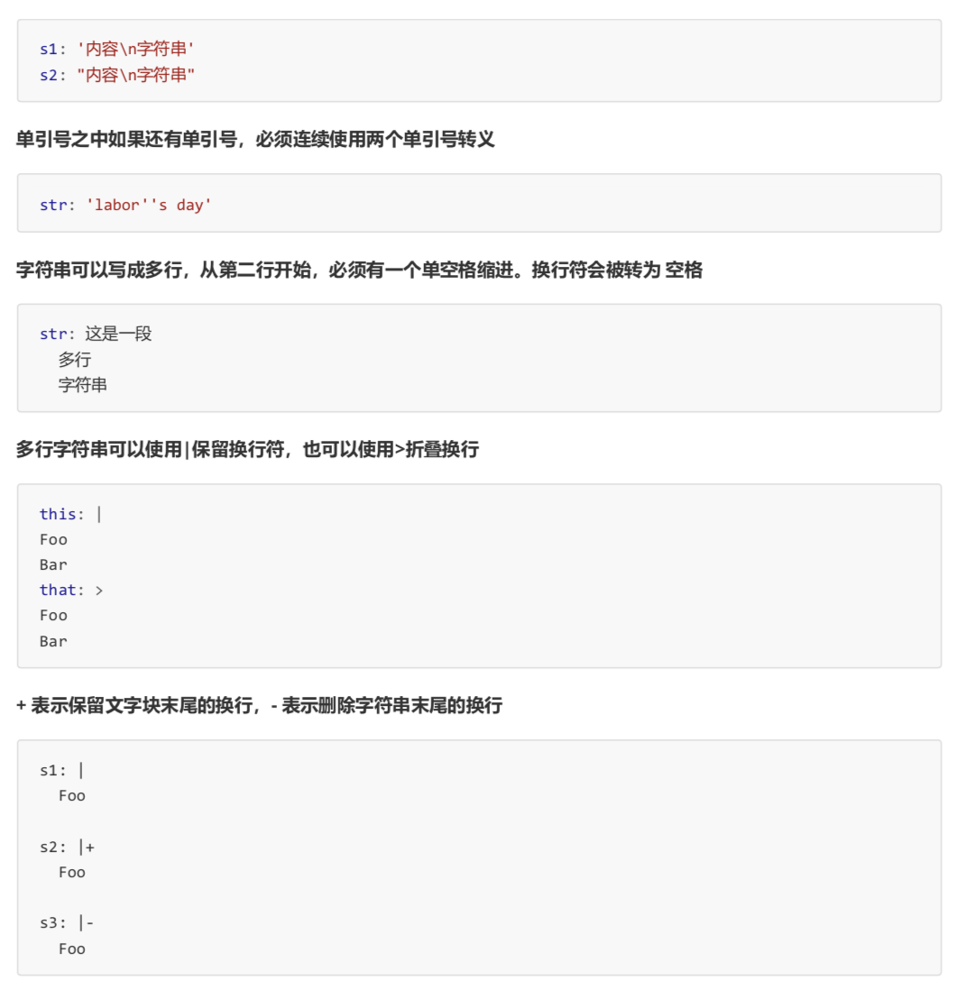

### 必须存在的属性
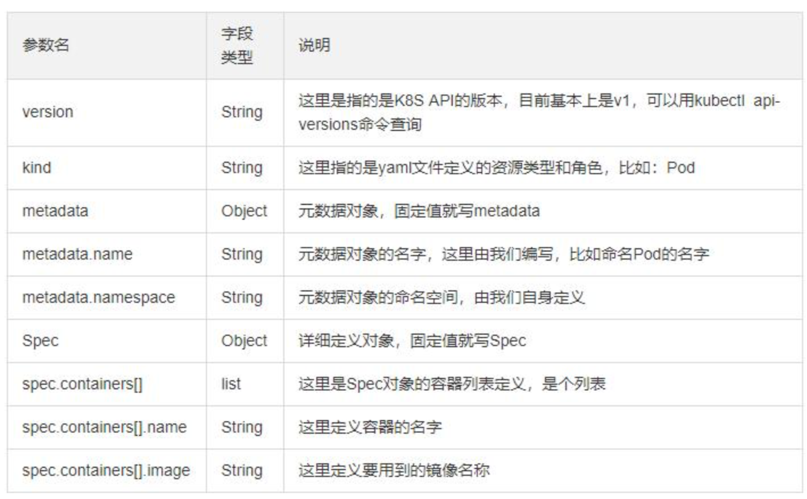

### 主要对象
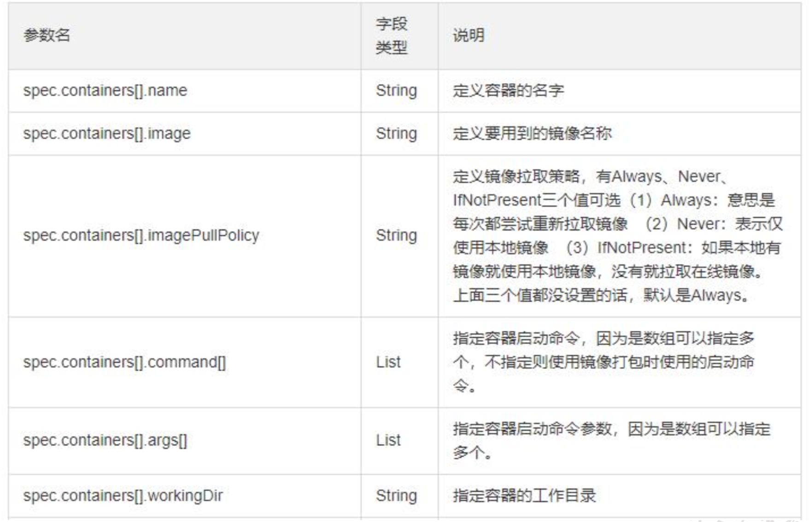
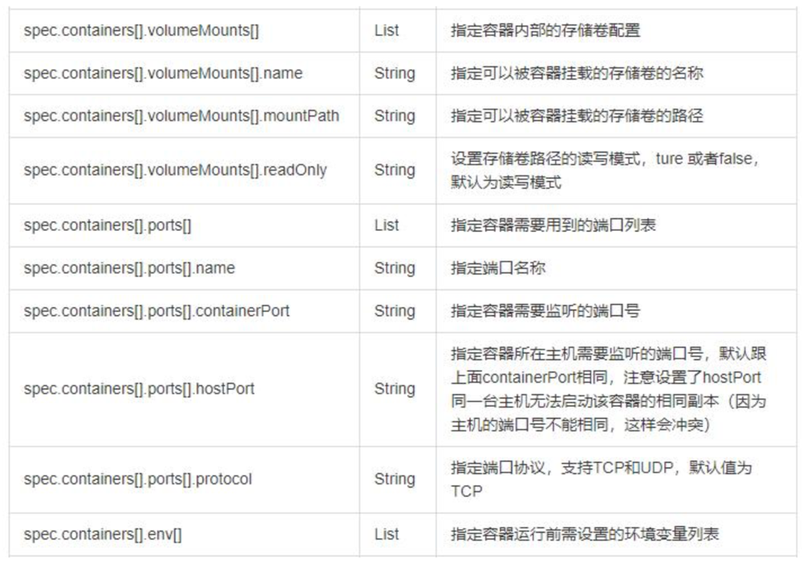


### 额外的参数项
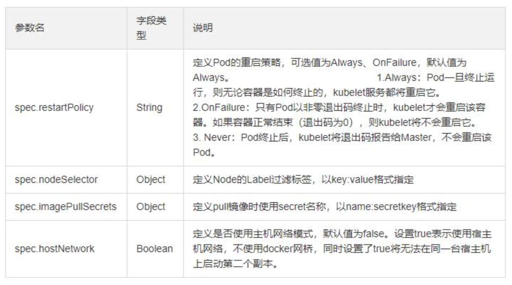

### 想查看详细的信息
```shell
kubectl explain pod.spec # ...
```

### 写一个最简单的 Pod 模版
1. `vim pod.yaml`
```yaml
apiVersion: v1
kind: Pod
metadata:
  name: myapp-pod
  labels:
    app: myapp
spec:
  containers:
  - name: app
    image: hub.atguigu.com/library/myapp:v1
  - name: test
    image: hub.atguigu.com/library/myapp:v1
```
2. `kubectl apply -f pod.yaml`
3. 通过`kubectl get pod`，发现里面会存在Error，因为上面的app和test共用了同一个80端口，会导致端口被占用
4. 查看错误详情`kubectl describe pod myapp-pod` `kubectl log myapp-pod -c test`
5. 重新修改下 pod.yaml，删除掉后面的 test
6. 将之前创建的删除掉`kubectl delete pod myapp-pod`
```shell
kubectl get pod
kubectl create -f pod.yaml
kubectl get pod -o wide
```

### 容器生命周期


### Init C
1. init容器 
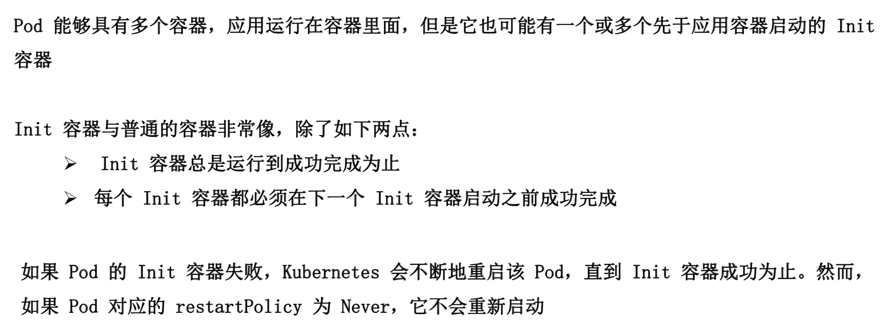
2. 作用
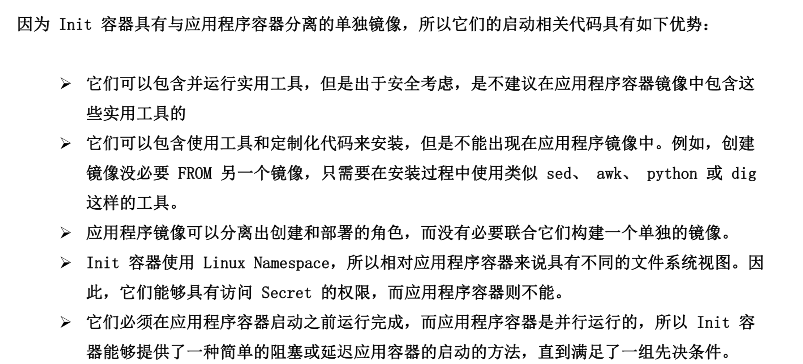

```shell
# node01 node02
docker pull busybox

# master01
vim ini-pod.yaml
```
```yaml
apiVersion: v1
kind: Pod
metadata:
  name: myapp-pod
  labels:
    app: myapp
spec:
  containers:
  - name: myapp-container
    image: busybox
    command: ['sh', '-c', 'echo The app is running! && sleep 3600']
  initContainers:
  - name: init-myservice
    image: busybox
    command: ['sh', '-c', 'until nslookup myservice; do echo waiting for myservice; sleep 2; done;']
  - name: init-mydb
    image: busybox
    command: ['sh', '-c', 'until nslookup mydb; do echo waiting for mydb; sleep 2; done;']
```
```shell
kubectl create -f ini-pod.yaml
# AlreadyExists
kubectl get pod
kubectl delete deployment --all # 删除所有的 deployment
kubectl get pod
kubectl delete pod --all
kubectl get pod
kubectl get svc
kubectl delete svc nginx-deployment

kubectl create -f ini-pod.yaml
kubectl get pod # 一个都没成功
kubectl describe pod myapp-pod
kubectl log myapp-pod -c init-myservice

vim myservice.yaml
```
```yaml
kind: Service
apiVersion: v1
metadata:
  name: myservice
spec:
  ports:
    - protocol: TCP
      port: 80
      targetPort: 9376
```
```shell
kubectl create -f myservice.yaml
kubectl get pod
kubectl get svc # myservice
kubectl get pod -n kube-system # coredns-5c98db65d4-dmw8d coredns... 上面的myservice 创建成功后会写入到这个dns中，pod中的钩子会被监测到，until nslookup myservice成功，则会启动成功

vim mydb.yaml
```
```yaml
kind: Service
apiVersion: v1
metadata:
  name: mydb
spec:
  ports:
    - protocol: TCP
      port: 80
      targetPort: 9377
```
```shell
kubectl create -f mydb.yaml
kubectl get pod
kubectl get pod -w
```

### init C 特殊说明
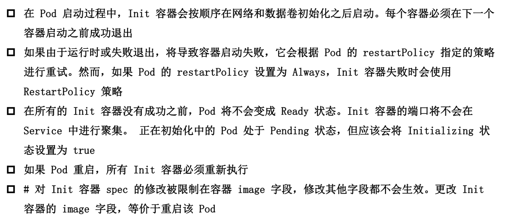
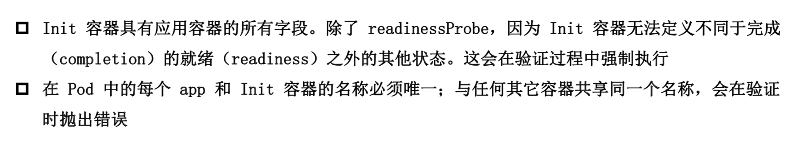

### 容器探针
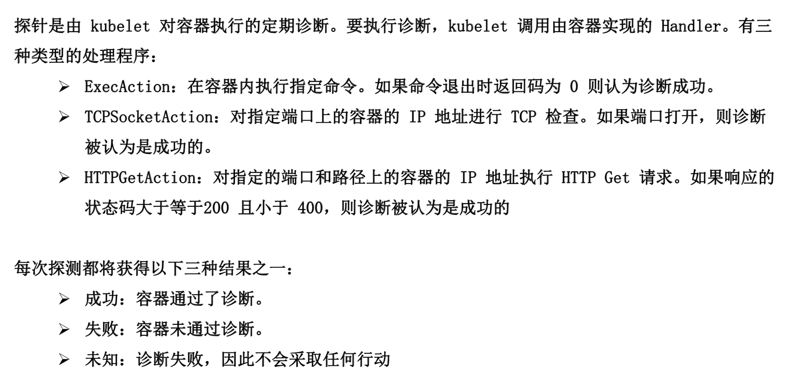

### 探测方式
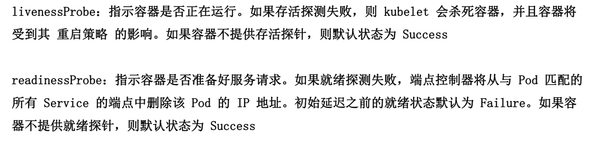

### Pod hook
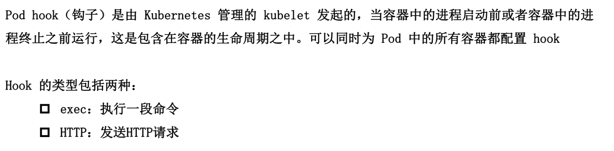

### 重启策略
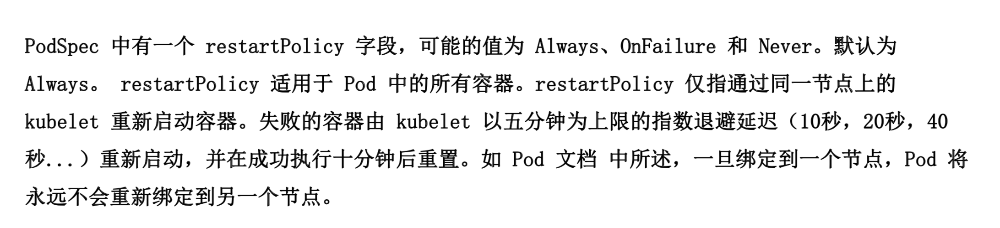

### 监测探针 - 就绪监测
1. readinessProbe-httpget `vim read.yaml`
```yaml
apiVersion: v1
kind: Pod
metadata:
  name: readiness-httpget-pod
  namespace: default
spec:
  containers:
  - name: readiness-httpget-container
    image: hub.atguigu.com/library/myapp:v1
    imagePullPolicy: IfNotPresent
    readinessProbe:
      httpGet:  
        port: 80
        path: /index1/html
      initialDelaySeconds: 1
      periodSeconds: 3
```
```shell
kubectl create -f read.yaml
kubectl get pod # 发现是 Running 但是没有 READY
kubectl describe pod readiness-httpget-pod # Readiness probe failed: HTTP probe failed with statuscode: 404

# 进入到 pod 中
kubectl exec readiness-httpget-pod -it -- /bin/sh
cd /usr/share/nginx/html
ls
echo "123" >> index1.html
exit

kubectl get pod
```

### 监测探针 - 存活监测
1. livenessProbe-exec `vim live-exec.yaml`
```yaml
apiVersion: v1
kind: Pod
metadata:
  name: liveness-exec-pod
  namespace: default
spec:
  containers:
  - name: liveness-exec-container
    image: busybox
    imagePullPolicy: IfNotPresent
    command: ["/bin/sh", "-c", "touch /tmp/live; sleep 60; rm -rf /tmp/live; sleep 3600"]
    livenessProbe:
      exec:
        command: ["test", "-e", "/tmp/live"]
      initialDelaySeconds: 1
      periodSeconds: 3
```
```shell
kubectl get pod
kubectl delete pod --all
kubectl get svc
kubectl delete svc mydb myservice
kubectl create -f live-exec.yaml
kubectl get pod # 现在是运行着的
kubectl get pod -w
kubectl delete pod --all
```
2. livenessProb-httpget `vim live-http.yaml`
```yaml
apiVersion: v1
kind: Pod
metadata:
  name: liveness-httpget-pod
  namespace: default
spec:
  containers:
  - name: liveness-httpget-container
    image: hub.atguigu.com/library/myapp:v1
    imagePullPolicy: IfNotPresent
    ports:
    - name: http
      containerPort: 80
    livenessProbe:
      httpGet:
        port: http
        path: /index.html
      initialDelaySeconds: 1
      periodSeconds: 3
      timeoutSeconds: 10
```
```shell
kubectl create -f live-http.yaml
kubectl get pod
kubectl get pod -o wide
curl 10.244.2.1/index.html # 可以访问到
kubectl exec liveness-httpget-pod -it -- /bin/sh
rm -rf /usr/share/nginx/html/index.html
exit
curl 10.244.2.1/index.html # 404
kubectl get pod -w # RESTART + 1
```
3. livenessProbe-tcp `vim live-tcp.yaml`
```yaml
apiVersion: v1
kind: Pod
metadata:
  name: probe-tcp
spec:
  containers:
  - name: nginx
    image: hub.atguigu.com/library/myapp:v1
    livenessProbe:
      tcpSocket:
        port: 8080
      initialDelaySeconds: 5
      periodSeconds: 3
      timeoutSeconds: 10
```
```shell
kubectl delete pod --all
kubectl create -f live-tcp.yaml
kubectl get pod
kubectl get pod -w
```

### 就绪监测和存活监测可以合并在一起
1. 直接复制一个存活监测
2. 然后在里面增加上 `readinessProbe`

### 启动、退出动作
1. `vim post.yaml`
```yaml
apiVersion: v1
kind: Pod
metadata:
  name: lifecycle-demo
spec:
  containers:
  - name: lifecycle-demo-container
    image: hub.atguigu.com/library/myapp:v1
    lifecycle:
      postStart:
        exec:
          command: ["/bin/sh", "-c", "echo Hello from the postStart handler > /usr/share/message"]
      postStop:
        exec:
          command: ["/bin/sh", "-c", "echo Hello from the postStop handler > /usr/share/message"]
```

### pod phase
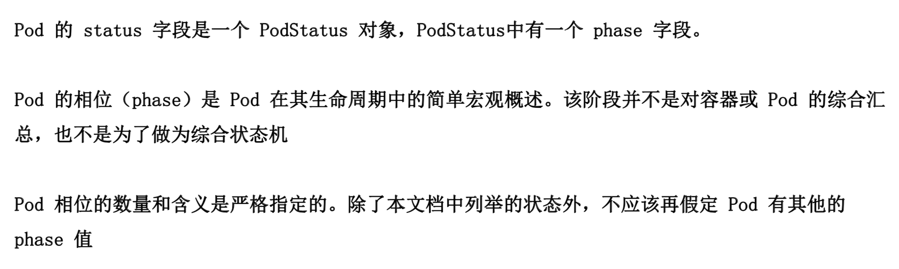