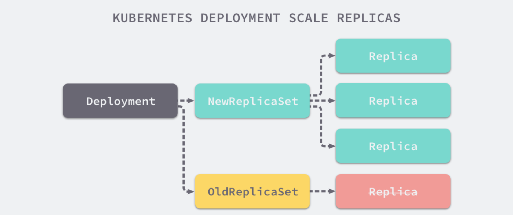
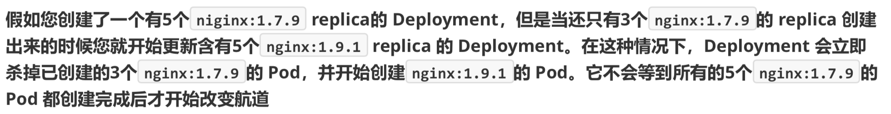
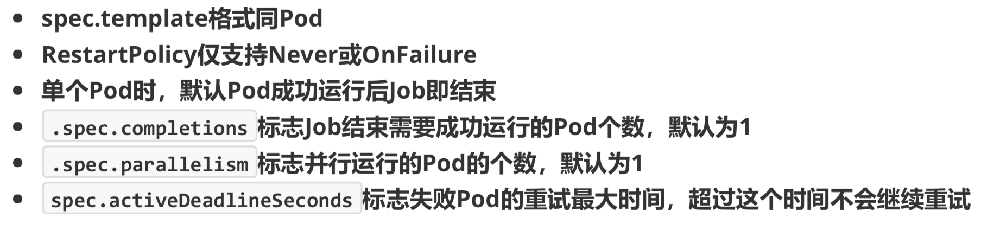

### 命令式变成和声明式编程
1. 命令式编程：它侧重于如何实现程序，就像我们刚接触编程的时候那样，我们需要把程序的实现过程按照逻辑结果一步步写下来
2. 声明式编程：它侧重于定义想要申明，然后告诉计算机/引擎，让他帮你去实现
3. 声明式编程(Deployment) apply(优) create
4. 命令式编程(rs) create(优) apply

### 什么是控制器
Kubernetes 中内建了很多 controller（控制器），这些相当于一个状态机，用来控制 Pod 的具体状态和行为

### 控制器类型
1. ReplicationController 和 ReplicaSet
2. Deployment
3. DaemonSet
4. StateFulSet
5. Job/CronJob
6. Horizontal Pod Autoscaling

### ReplicationController 和 ReplicaSet
1. ReplicationController(RC)用来确保容器应用的副本数始终保持在用户定义的副本数，即如果有容器异常退出，会自动创建新的 Pod 来替代；而如果异常多出来的容器也会自动回收；
2. 在新版本的 Kubernetes 中建议使用 ReplicaSet 来取代 ReplicationController。ReplicaSet 跟 ReplicationController 没有本质的不同，只是名字不一样，并且 ReplicaSet 支持集合是式的 selector；

### Deployment
1. Deployment 为 Pod 和 ReplicaSet 提供了一个声明式定义(declarative)方法，用来替代以前的 ReplicationController 来方便的管理应用。典型的应用场景包括：
  - 定义 Deployment 来创建 Pod 和 ReplicaSet
  - 滚动升级和回滚应用
  - 扩容和缩容
  - 暂停和继续 Deployment

### DaemonSet
1. DaemonSet 确保全部（或者一些）Node 上运行一个 Pod 的副本。当有 Node 加入集群时，也会为他们新增一个 Pod。当有 Node 从集群移除时，这些 Pod 也会被回收。删除 DaemonSet 将会删除它创建的所有 Pod
2. 使用 DaemonSet 的一些典型用法：
  - 运行集群存储 deamon，例如在每个 Node 上运行 `glusterd`、`ceph`
  - 在每个 Node 上运行日志收集 daemon，例如 `fluentd`、`logstash`
  - 在每个 Node 上运行监控 daemon，例如 [Prometheus Node Exporter](https://github.com/prometheus/node_exporter)、`collectd`、`Datadog` 代理、`New Relic` 代理，或 `Ganglia gmond`

### Job
1. Job 负责批处理任务，即仅执行一次的任务，它保证批处理任务的一个或多个 Pod 成功结束

### CronJob
1. CronJob 管理基于时间的 Job，即：
  - 在给定时间点只运行一次
  - 周期性地在给定时间点运行
2. 使用前提条件：当前使用的 Kunernetes 集群，版本 >= 1.8（对 CronJob）。对于先前版本的集群，版本 < 1.8，启动 API Server 时，通过传递选项 `--runtime-config=batch/v2alpha1=true`可以开启 batch/v2alpha1 API
3. 典型的用法如下所示：
  - 在给定的时间点调度 Job 运行
  - 创建周期性运行的 Job，例如：数据库备份、发送邮件

### StatefulSet
1. StatefulSet 作为 Controller 为 Pod 提供唯一的标识。它可以保证部署和 scale 的顺序
2. StatefulSet 是为来解决有状态服务的问题(对应 Deployments 和 ReplicaSets 是为无状态服务而设计的)，其应用场景包括：
  - 稳定的持久化存储，即 Pod 重新调度后还是能访问到形同的持久化数据，基于 PVC 来实现
  - 稳定的网络标志，即 Pod 重新调度后其 PodName 和 HostName 不变，基于 Headless Service（即没有 Cluster IP的 Service）来实现
  - 有序部署，有序扩展，即 Pod 是有顺序的，在部署或者扩展的时候要一句定义的顺序依次进行（即从 0 到 N-1，在下一个 Pod 运行之前所有之前的 Pod 必须都是 Running 和 Ready 状态），基于 init Containers 来实现
  - 有序收缩，有序删除（即从 N-1 到 0）

### Horizontal Pod Autoscaling
1. 应用的资源使用率通常都有高峰和低谷的时候，如何削峰填谷，提高集群的整体资源利用率，让 service 中的 Pod 个数自动调整呢？这就赖于 HPA 了，顾名思义，使 Pod 水平自动缩放

### ReplicaSet yaml
```yaml
apiVersion: extensions/v1beta1
kind: ReplicaSet
metadata:
  name: frontend
spec:
  replicas: 3
  selector:
    matchLabels:
      tier: frontend
  template:
    metadata:
      labels:
        tire: frontend
    spec:
      containers:
      - name: myapp
        image: hub.atguigu.com/library/myapp:v1
        env:
        - name: GET_HOST_FROM
          value: dns
        ports:
        - containerPort: 80
```
```shell
kubectl create -f rs.yarml
kubectl get pod
kubectl delete pod --all
kubectl get pod # 新创建的 pod: frontend-xxxx
kubectl get pod --show-labels # 查看标签 LABELS: tier=frontend
kubectl label pod frontend-m8hpc tier=frontend1 --overwrite=True # 更改标签
kubectl get pod --show-labels # 发现出现了4个Pod，上面的副本书是根据标签来进行判断的，更改来一个，就不满足这frontend有3个副本，所以会重新创建一个来补充
kubectl delete rs --all
kubectl get pod --show-labels # 发现其他几个都正常退出来，但是tier=frontend1不受控制
kubectl delete pod --all
```

### RS 与 Deployment 的关联


### Deployment 部署一个简单的 nginx 应用
```yaml
apiVersion: extensions/v1beta1
kind: Deployment
metadata:
  name: nginx-deployment
spec:
  replicas: 3
  template:
    metadata:
      labels:
        app: nginx
    spec:
      containers:
      - name: nginx
        image: hub.atguigu.com/library/myapp:v1
        ports:
        - containerPort: 80
```
```shell
kubectl apply -f deployment.yaml --record # --record 参数可以记录命令，我们可以很方便的查看每次 version 的变化
kubectl get deployment
kubectl get rs
kubectl get pod
kubectl get pod -o wide
```

### 扩容
```shell
kubectl scale deployment nginx-deployment --replicas 10
```

### 如果集群支持 horizontal pod autoscaling 的化，还可以为 Deployment 设置自动扩展
```shell
kubectl autoscale deployment nginx-deployment --min=10 --max=15 --cpu-percent=80
```

### 更新镜像
```shell
# 需要修改的是 nginx，更改为 wangyanglinux/myapp:v2
kubectl set image deployment/nginx-deployment nginx=wangyanglinux/myapp:v2
# 镜像的修改会触发 rs 的更改
kubectl get rs
kubectl get pod -o wide
```

### 回滚
```shell
kubectl rollout undo deployment/nginx-deployment
```

### 更新 Deployment
1. 假如我们现在想让 nginx pod 使用`nginx:1.9.1`的镜像来代替原来的`nginx:1.7.9`的镜像
```shell
kubectl set image deployment/nginx-deployment nginx=nginx:1.9.1 
deployment "nginx-deployment" image updated
```
2. 可以使用`edit`命令来编辑`Deployment`
```shell
kubectl edit deployment/nginx-deployment
deployment "nginx-deployment" edited
```
3. 查看 rollout 的状态
```shell
kubectl rollout status deployment/nginx-deployment
Waiting for rollout to finish: 2 out of 3 new replicas have been updated...
deployment "nginx-deployment" successfully rolled out
```
4. 查看历史 RS
```
kubectl get rs
```

### Deployment 更新策略
1. Deployment 可以保证在升级时只有一定数量的 Pod 是 down 的。默认的，它会确保至少有比期望的 Pod 数量少一个是 up 状态（最多一个不可用）
2. Deployment 同时也可以确保只创建出超过期望数量的一定数量的 Pod。默认的，它会确保最多比期望的 Pod 数量多一个的 Pod 是 up的（最多1个surge）
3. 未来的 Kuberentes 版本中，将从 1-1 变成 25%-25%
```
kubectl describe deployments
```

### Rollover (多个 rollout 并行)


### 回退 Deployment
```
kubectl set image deployment/nginx-deployment nginx=nginx:1.91
kubectl rollout status deployments nginx-deployment
kubectl get pods
kubectl rollout history deployment/nginx-deployment
kubectl rollout undo deployment/nginx-deployment
kubectl rollout undo deployment/nginx-deployment --to-revision=2 # 可以使用 --revision 参数指定某个历史版本
kubectl rollout pause deployment/nginx-deployment # 暂停 deployment 的更新
# 您可以用 kubectl rollout status 命令查看 Deployment 是否完成。如果 rollout 成功完成，kutectl rollout status 将返回一个 0 值的 Exit Code
kubectl rollout status deploy/nginx
```

### 清理 Policy
1. 您可以通过设置 `.spec.revisonHistoryLimit`项目来指定 deployment 最多保留多少 revision 历史记录。默认的会保留所欲的 revision；如果将该项设置为0，Deployment就不允许回退了

### DaemonSet
```yaml
apiVersion: apps/v1
kind: DaemonSet
metadata:
  name: daemonset-example
  labels:
    app: daemonset
spec:
  selector:
    matchLabels:
      name: daemonset-example
  template:
    metadata:
      labels:
        name: daemonset-example
    spec:
      containers:
      - name: daemonset-example
        image: wangyanglinux/myapp:v3
```
```shell
kubectl create -f daemonset.yaml
kubectl get pod
kubectl get pod -o wide
kubectl delete pod daemonset-example-5zvts
kubectl get pod -o wide
```

### Job
```yaml
apiVersion: batch/v1
kind: Job
metadata:
  name: pi
spec:
  template:
    metadata:
      name: pi
    spec:
      containers:
      - name: pi
        image: perl
        command: ["perl", "-Mbignum=bpi", "-wle", "print bpi(2000)"]
      restartPolicy: Never
```
```shell
kubectl create -f job.yaml
kubectl get pod
kubectl describe pod pi-f2fb5 # 查看到哪一步了
kubectl get job # 查看完成的数目
# 镜像太大了，通过国外的一个服务器下载了perl镜像，导入到我们的master01机器上
tar -zxvf perl.tar.gz
docker load -i perl.tar
scp perl.tar root@k8s-node01:/root/
scp perl.tar root@k8s-node02:/root/
docker load -i perl.tar
kubectl get pod -o wide # pi-f2fb5 ImagePullBackOff
kubectl delete pod pi-f2fb5
kubectl get pod -o wide
kubectl get job # 完成了
kubectl log pi-7mbjq
```

### Jon Spec


### CronJob Spec


### CronJob
```yaml
apiVersion: batch/v1beta1
kind: CronJob
metadata:
  name: hello
spec:
  schedule: "*/1 * * * *"
  jobTemplate:
    spec:
      template:
        sprc:
          containers:
          - name: hello
            image: busybox
            args:
            - /bin/sh
            - -c
            - date; echo Hello from the Kibernetes cluter
          restartPolicy: OnFailure
```
```shell
kubectl apply -f cronjob.yaml
kubectl get cronjob
kubectl get jobs
pods=$(kubectl get pods --selector=job-name=hello-1202039034 --output=jsonpath={.items..metafata.name})
kubectl logs $pods

kubectl get job -w

# 注意，删除 cronjob 的时候不会自动删除 job，这些 job 可以用 kubectl delete job 来删除
kubectl delete cronjob --all
```

### CronJob 本身的一些限制
1. 创建 Job 操作应该是幂等的