### Service 的概念
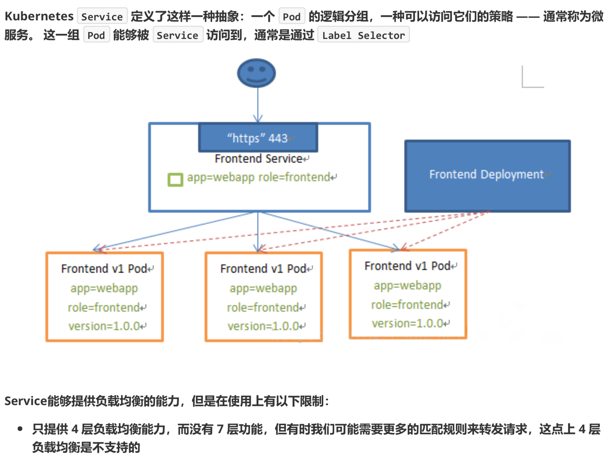

### Service 的类型
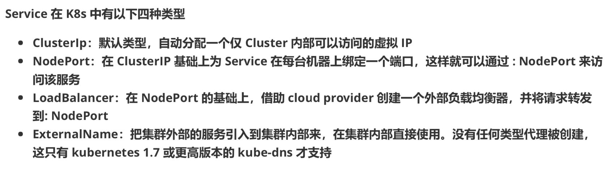
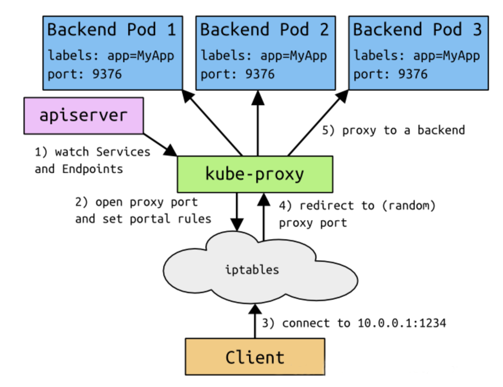

### VIP 和 Service 代理
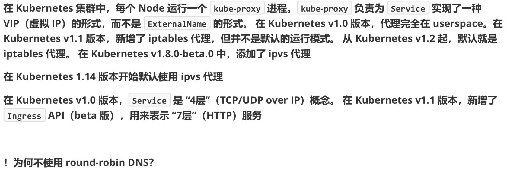

### 代理模式的分类
1. userspace 代理模式

2. Iptables 代理模式
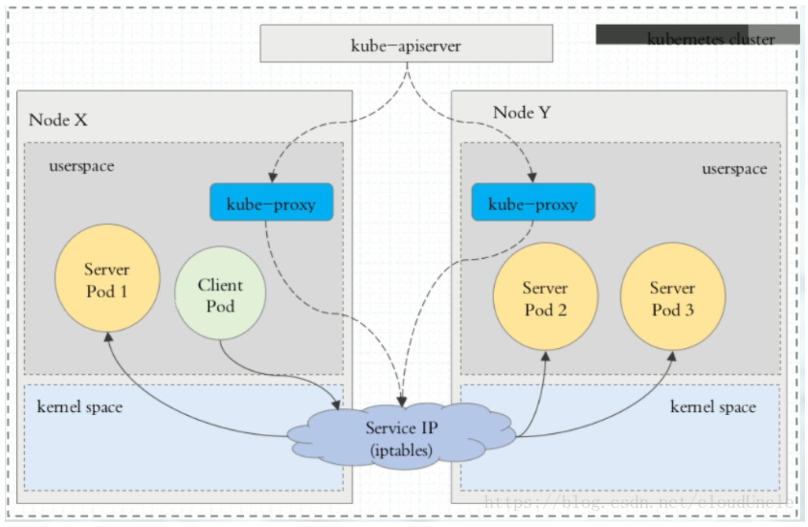
3. ipvs 代理模式

```shell
ipvsadm -Ln # 查看当前连接情况
kubectl get pod
```

### ClusterIP
1. clusterIP主要在每个 node 节点使用 iptables，将发向 clusterIP 对应端口的数据，转发到 kube-proxy 中。然后 kube-proxy 自己内部实现有负载均衡的方法，并可以查询到这个 service 下对应 pod 的地址和端口，进而把数据转发给对应的 pod 的地址和端口
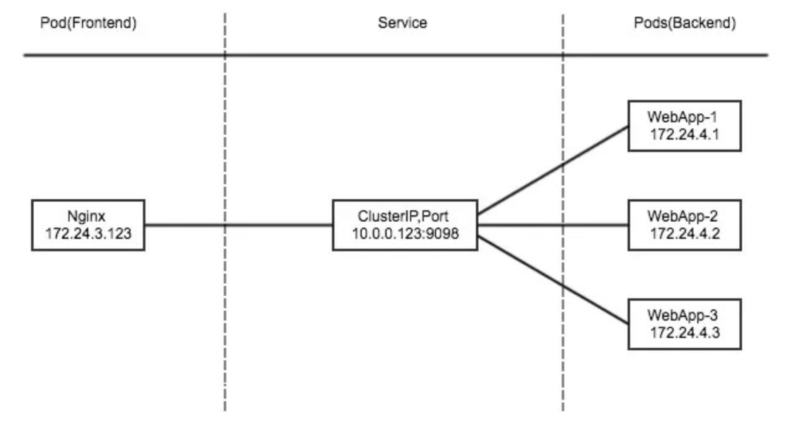
2. 为了实现图上的功能，主要需要以下几个组件的协同工作：
  - apiserver 用户通过 kubectl 命令向 apiserver 发送创建 service 的命令，apiserver 接受到请求后将数据存储到 etcd 中
  - kube-proxy kubernetes 的每个节点中都有一个叫做 kube-proxy 的进程，这个进程负责感知 service，pod 的变化，并将变化的信息写入本地的 iptables 规则中
  - iptables 使用 NAT 等技术将 virtualIP 的流量转至 endpoint 中
3. 创建`vim myapp-deploy.yaml`文件
```yaml
apiVersion: apps/v1
kind: Deployment
metadata:
  name: myapp-deploy
  namespace: default
spec:
  replicas: 3
  selector:
    matchLabels:
      app: myapp
      release: stabel
  template:
    metadata:
      labels:
        app: myapp
        release: stabel
        env: test
    spec:
      containers:
      - name: myapp
        image: wangyanglinux/myapp:v2
        imagePullPolicy: IfNotPresent
        ports:
        - name: http
          containerPort: 80
```
```shell
kubectl apply -f svc-deployment.yaml
kubectl get pod
kubectl get pod -o wide # 每次通过这种形式查看私有IP会比较麻烦，而且pod死掉后又会是新的IP地址，需要有个 SVC 进行管理
```
4. 创建 Service 信息`vim myapp-service.yaml`
```yaml
apiVersion: v1
kind: Service
metadata:
  name: myapp
  namespace: default
spec:
  type: ClusterIP
  selector:
    app: myapp
    release: stabel
  ports:
  - name: http
    port: 80
    targetPort: 80
```
```shell
kubectl apply -f myapp-service.yaml
kubectl get svc
ipvsadm -Ln
kubectl get pod -o wide
```

### Headless Service
1. 有时不需要或不想要负载均衡，以及单独的 Service IP。遇到这种情况，可以通过指定 Cluster IP(spec.clusterIP) 的值为 “None” 来创建 headless Service。这类 Service 并不会分配 Cluster IP，kube-proxy 不会处理他们，并且平台也不会为它们进行负载均衡和路由`vim myapp-svc-headless.yaml`
```yaml
apiVersion: v1
kind: Service
metadata:
  name: myapp-headless
  namespace: default
spec:
  selector:
    app: myapp
  cluterIP: "None"
  ports:
  - port: 80
    targetPort: 80
```
```shell
yum -y install bind-utils
# 获取下当前 dns 的地址信息
kubectl get pod -n kube-system -o wide
dig -t A myapp-headless.default.svc.cluster.local. @10.96.0.10
```

### NodePort
1. nodePort 的原理在于在 node 上开了一个端口，将向该端口的流量导入 kube-proxy，然后由 kube-proxy 进行一步到给对应的 pod`vim myapp-service.yaml`
```yaml
apiVersion: v1
kind: Service
metadata:
  name: myapp
  namespace: default
spec:
  type: NodePort
  selector:
    app: myapp
    release: stabel
  ports:
  - name: http
    port: 80
    targetPort: 80
```
```shell
kubectl apply -f nodeport.yaml
kubectl get svc 
curl <IP:端口> # 每个节点开启这个端口 master01 node01 node02
netstat -anpt | grep :30715
```
2. 查询流程
```
iptables -t nat -nvL KUBE-NODEPORTS
```

### LoadBalancer
1. loadBalancer 和 nodePort 其实是同一种方式。区别在于 loadBalancer 比 nodePort 多了一步，就是可以调用 cloud provider 来创建 LB 来向节点导流
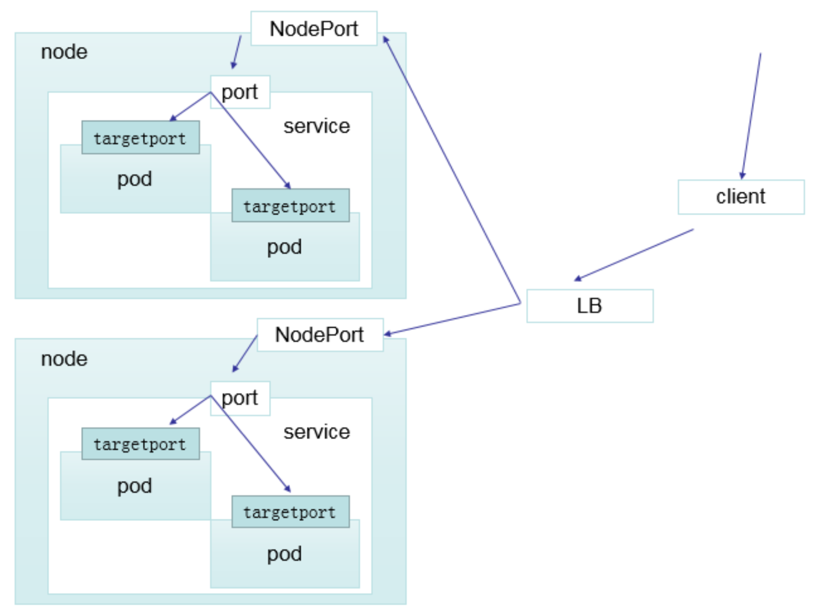

### ExternalName
1. 这种类型的 Service 通过返回 CNAME 和它的值，可以将服务映射到 externalName 字段的内容（例如：hub.atguigu.com）。Externalname Service 是 Service 的特例，它没有 selector,也没有定义任何的端口和 Endpoint。相反的，对于运行在集群外部的服务，它通过返回该服务外部服务的别名这种方式来提供服务
```yaml
apiVersion: v1
kind: Service
metadata:
  name: my-service-1
  namespace: default
spec:
  type: ExternalName
  externalName: hub.atguigu.com
```
2. 当查询主机 my-service.default.svc.cluster.local(SVC_NAME.NAMESPACE.svc.cluster.local)时，集群的 DNS 服务将返回一个值 my.database.example.com 的 CNAME 记录。访问这个服务的工作方式和其他的相同，唯一不同的是重定向发生在 DNS 层，而且不会进行代理或转发
```shell
kubectl create -f ex.yaml
kubectl get svc
dig -t A my-service-1.default.svc.cluster.local. @10.244.0.7
```

### Ingress
1. Ingress-Nginx github 地址：https://github.com/kubernetes/ingress-nginx
2. Ingress-Nginx 官方网站：https://kubernetes.github.io/ingress-nginx/
3. Ingress 访问方式
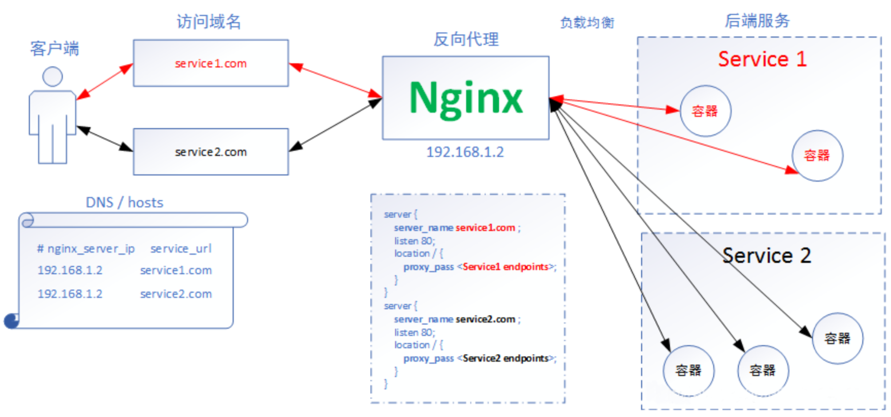
4. Ingress 原理
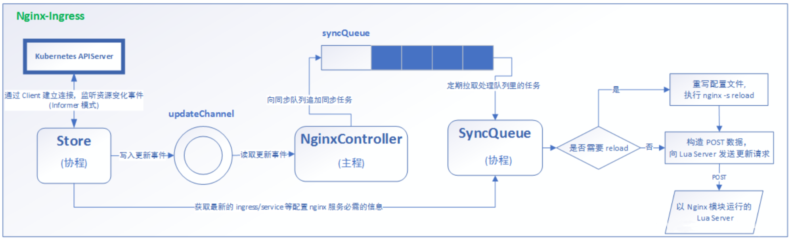
```shell
# master01
cd /usr/local/install-k8s/plugin/
mkdir ingress
cd ingress
# 先将这个 yaml 文件下载下来，可能以后会用到
wget https://raw.githubusercontent.com/kubernetes/ingress-nginx/master/deploy/static/mandatory.yaml
# 查看一下里面需要什么镜像，可以提前先下载下来
cat mandatory.yaml | grep image
# 在国外的服务器上直接pull
docker pull <刚刚 grep 的 image>
docker save -o ingress.contr.tar quay.io/kubernetes-ingress-controller/nginx-ingress-controller:0.25.0
tar -zcvf ingress.contr.tar.gz ingress.contr.tar
sz ingress.contr.tar.gz # 下载到本地
# master01
rz
scp ingress.contro.tar.gz root@k8s-node01:/root/
scp ingress.contro.tar.gz root@k8s-node02:/root/
# node01 node02
tar -zxvf ingress.contro.tar.gz
docker load -i ingress.contro.tar
# master01
kubectl apply -f mandatory.yaml
kubectl get pod -n ingress-nginx
wget https://raw.githubusercontent.com/kubernetes/ingress-nginx/master/deploy/static/provider/baremetal/service-nodeport.yaml
kubectl apply -f service-nodeport.yaml
kubectl get svc -n ingress-nginx
```

### Ingress HTTP 代理访问
1. deployment、service 文件`vim ingress.http.yaml`
```yaml
apiVersion: extensions/v1beta1
kind: Deployment
metadata:
  name: nginx-dm
spec:
  replicas: 2
  template:
    metadata:
      labels:
        name: nginx
    spec:
      containers:
        - name: nginx
          image: wangyanglinux/myapp:v1
          imagePullPolicy: IfNotPresent
          ports:
            - containerPort: 80
---
apiVersion: v1
kind: Service
metadata:
  name: nginx-svc
spec:
  ports:
    - port: 80
      targetPort: 80
      protocol: TCP
  selector:
    name: nginx
```
```shell
kubectl apply -f ingress.http.yaml
kubectl get svc
```
2. ingress `vim ingress1.yaml`
```yaml
apiVersion: extensions/v1beta1
kind: Ingress
metadata:
  name: nginx-test
spec:
  rules:
    - host: www1.atguigu.com
      http:
        paths:
        - path: /
          backend:
            serviceName: nginx-svc
            serviceport: 80
```
```shell
kubectl apply -f ingress1.yaml
# 在本地机器上 hosts 文件中映射
kubectl get svc -n ingress-nginx
# www1.atguigu.com:31345
```

### ingress实例
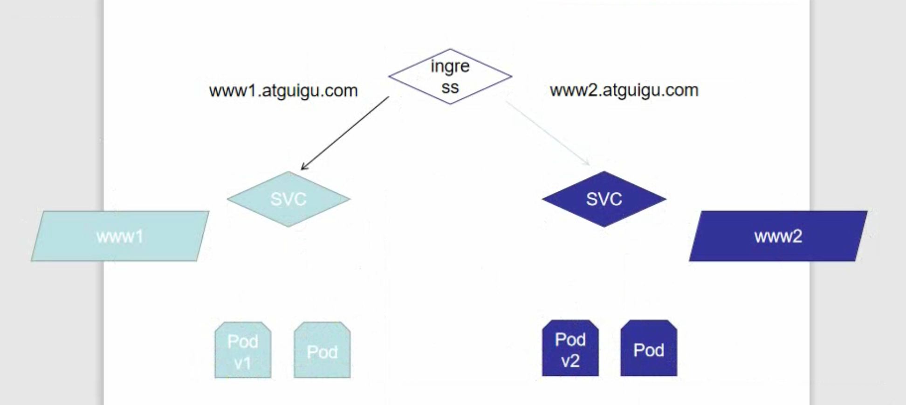
```shell
mkdir ingress-vh
cd ingress-vh
vim deployment1.yaml
```
```yaml
apiVersion: extensions/v1beta1
kind: Deployment
metadata:
  name: deployment1
spec:
  replicas: 2
  template:
    metadata:
      labels:
        name: nginx
    spec:
      containers:
        - name: nginx
          image: wangyanglinux/myapp:v1
          imagePullPolicy: IfNotPresent
          ports:
            - containerPort: 80
---
apiVersion: v1
kind: Service
metadata:
  name: svc-1
spec:
  ports:
    - port: 80
      targetPort: 80
      protocol: TCP
  selector:
    name: nginx
```
```shell
kubectl apply -f deployment1.yaml
kubectl get svc
curl 10.104.2.147
cp -a deployment1.yaml deployment2.yaml
vim deployment2.yaml
```
```yaml
apiVersion: extensions/v1beta1
kind: Deployment
metadata:
  name: deployment2
spec:
  replicas: 2
  template:
    metadata:
      labels:
        name: nginx2
    spec:
      containers:
        - name: nginx2
          image: wangyanglinux/myapp:v2
          imagePullPolicy: IfNotPresent
          ports:
            - containerPort: 80
---
apiVersion: v1
kind: Service
metadata:
  name: svc-2
spec:
  ports:
    - port: 80
      targetPort: 80
      protocol: TCP
  selector:
    name: nginx2
```
```shell
kubectl apply -f deployment2.yaml
kubectl get svc
curl 10.111.112.162
vim ingressrule.yaml
```
```yaml
apiVersion: extensions/v1beta1
kind: Ingress
metadata:
  name: ingress1
spec:
  rules:
    - host: www1.atguigu.com
      http:
        paths:
        - path: /
          backend:
            serviceName: svc-1
            serviceport: 80
---
apiVersion: extensions/v1beta1
kind: Ingress
metadata:
  name: ingress2
spec:
  rules:
    - host: www2.atguigu.com
      http:
        paths:
        - path: /
          backend:
            serviceName: svc-2
            serviceport: 80
```
```shell
kubectl apply -f ingressrule.yaml
kubectl get pod
kubectl get pod -n ingress-nginx
kubectl exec nginx-ingress-controller-... -n ingress-nginx -it -- /bin/bash
cat nginx.conf
# 再在 hosts 文件中添加对 www2.atguigu.com 的映射
kubectl get svc -n ingress-nginx # 查看 ingress-nginx 暴露的端口
kubectl get ingress
```

### Ingress HTTPS 代理访问
1. 创建证书，以及 cert 存储方式
```shell
mkdir https
cd https
openssl req -x509 -sha256 -nodes -days 365 -newkey rsa:2048 -keyout tls.key -out tls.crt -subj "/CN=nginxsvc/0=nginxsvc"
kubectl create secret tls tls-secret --key tls.key --cert tls.crt
cp ../ingress-vh/deployment1.yaml .
vim deployment1.yaml
```
2. deployment1.yaml 的规则
```yaml
apiVersion: extensions/v1beta1
kind: Deployment
metadata:
  name: deployment3
spec:
  replicas: 2
  template:
    metadata:
      labels:
        name: nginx3
    spec:
      containers:
        - name: nginx3
          image: wangyanglinux/myapp:v3
          imagePullPolicy: IfNotPresent
          ports:
            - containerPort: 80
---
apiVersion: v1
kind: Service
metadata:
  name: svc-3
spec:
  ports:
    - port: 80
      targetPort: 80
      protocol: TCP
  selector:
    name: nginx3
```
```shell
kubectl apply -f deployment1.yaml
kubectl get svc
curl 10.106.93.203
```
3. Ingress.yaml 文件`vim https.ingress.yaml`
```yaml
apiVersion: extnesions/v1beta1
kind: Ingress
metadata:
  name: https
spec:
  tls:
    - hosts:
      - www3.atguigu.com
      secretName: tls-secret
  rules:
    - host: www3.atguigu.com
      http:
        paths:
        - path: /
          nackend:
            serviceName: svc-3
            servicePort: 80
```
```shell
kubectl apply -f https.ingress.yaml
# 查看暴露出去的端口
kubectl get svc -n ingress-nginx
# 还需要在 hosts 中进行配置
```

### Nginx 进行 basicAuth
```shell
yum -y install httpd
mkdir basic-auth
cd basic-auth
htpasswd -c auth foo
kubectl create secret generic basic-auth --from-file=auth
vim ingress.yaml
```
```yaml
apiVersion: extensions/v1beta1
kind: Ingress
metadata:
  name: ingress-with-auth
  annotations:
    nginx.ingress.kubernetes.io/auth-type: basic
    nginx.ingress.kubernetes.io/auth-secret: basic-auth
    nginx.ingress.kubernetes.io/auth-realm: 'Authentication Required - foo'
spec:
  rules:
  - host: auth.atguigu.com
    http:
      paths:
      - path: /
        backend:
          serviceName: svc-1
          servicePort: 80
```

### Nginx 进行重写
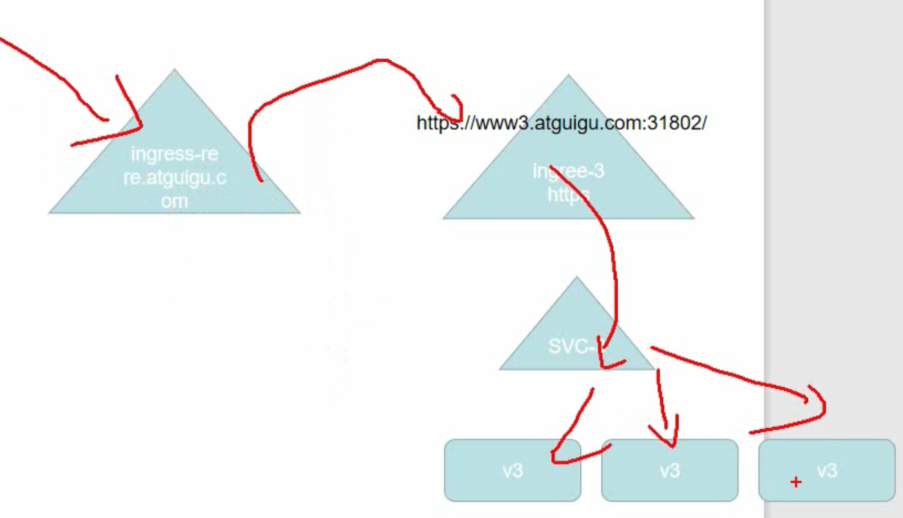
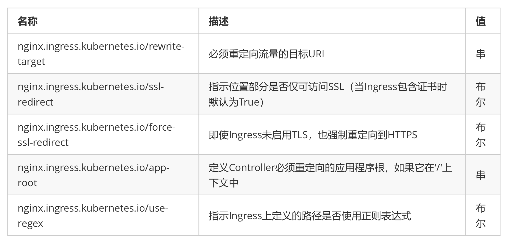
```yaml
apiVersion: extensions/v1beta1
kind: Ingress
metadata:
  name: nginx-test
  annotations:
    nginx.ingress.kubernetes.io/rewrite-target: https://www3.atguigu.com:31802
spec:
  rules:
  - host: re.atguigu.com
    http:
      paths:
      - path: /
        backend:
          serviceName: svc-1
          servicePort: 80
```