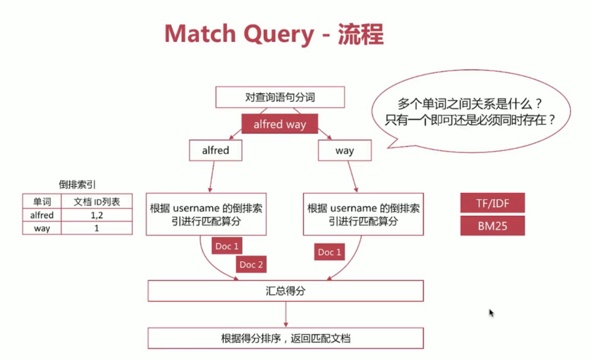
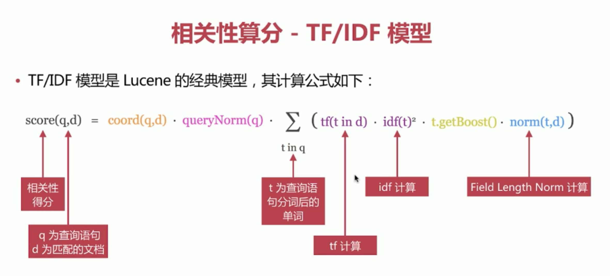
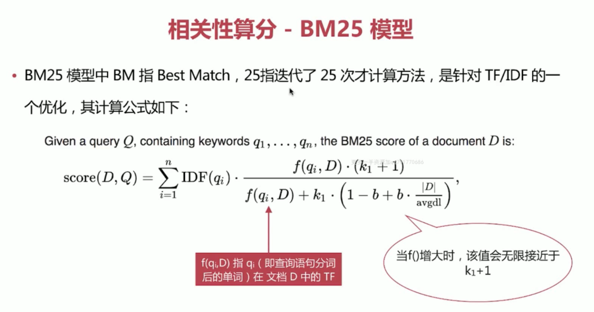

### Search API
1. 实现对 es 中存储的数据进行查询分析，endpoint 为 _search
```
# 对所有的索引进行查询 
GET /_search
# 对指定索引进行查询
GET /my_index/_search
# 可以指定多个
GET /my_index1,my_index2/_search
# 使用通配符指定索引
GET /my_*/_search
```
2. 查询主要有两种形式
  - URI Search
    - 操作简便，方便通过命令行测试
    - 仅包含部分查询语法
    ```
    GET /my_index/_search?q=user:alfred
    ```
  - Request Body Search
    - es 提供的完备查询语法 Query DSL(Domain Specific Language)
    ```
    GET /my_index/_search
    {
      "query": {
        "term": {"user": "alfred"}
      }
    }
    ```

### URI Search
1. 通过 url query 参数来实现搜索，常用参数如下
  - q 指定查询的语句，语法为Query String Syntax
  - df q 中不指定字段时默认查询的字段，如果不指定，es 会查询所有字段
  - sort 排序
  - timeout 指定超时时间，默认不超时
  - from，size用于分页
  ```
  # 查询 user 字段包含 alfred 的文档，结果按照 age 生序排列，返回第 5～14 个文档，如果超过 1s 没有结束，则以超时结束
  GET /my_index/_search?q=alfred&df=user&sort=age:asc&from=4&size=10&timeout=1s
  ```
2. Query String Syntax
  - term 与 phrase
    - `alfred way` 等效于 `alfred OR way`
    - `"alfred way"`词语查询，要求先后顺序
  - 泛查询
    - alfred 等效于在所有字段去匹配该 term
  - 指定字段
    - `name:alfred`
  - Group 分组设定，使用括号指定匹配的规则
    - `(quick OR brown) AND fox`
    - `status:(active OR pending) title:(full text search)`
  ```
  PUT test_search_index
  {
    "settings": {
      "index": {
        "number_of_shards": 1
      }
    }
  }
  
  POST test_search_index/doc/_bulk
  {"index":{"_id":"1"}}
  {"username":"alfred way","job":"java engineer","age":18,"birth":"1990-01-02","isMarried":false}
  {"index":{"_id":"2"}}
  {"username":"alfred","job":"java senior engineer and java specialist","age":28,"birth":"1980-05-07","isMarried":true}
  {"index":{"_id":"3"}}
  {"username":"lee","job":"java and ruby engineer","age":22,"birth":"1985-08-07","isMarried":false}
  {"index":{"_id":"4"}}
  {"username":"alfred hunior way","job":"ruby engineer","age":23,"birth":"1989-08-07","isMarried":false}
  ```
  ```
  # search API
  GET test_search_index/_search?q=alfred
  # 查看查询细则
  GET test_search_index/_search?q=alfred
  {
    "profile": true
  }
  GET test_search_index/_search?q=username:alfred
  GET test_search_index/_search?q=username:alfred way
  GET test_search_index/_search?q=username:"alfred way"
  GET test_search_index/_search?q=username:(alfred way)
  ```

  - 布尔操作符
    - `AND(&&),OR(||),NOT(!)`
      - `name:(tom NOT lee)`
      - 注意大写，不能小写
    - `+ -` 分别对应 must 和 must_not
      - `name:(tom +lee -alfred)`
      - `name:((lee && !alfred) || (tom && lee && !alfred))`
      - `+` 在 url 中会被解析为空格，要使用encode 后的结果才可以，为 `%2B`
  ```
  GET test_search_index/_search?q=username:alfred AND way
  GET test_search_index/_search?q=username:(alfred AND way)
  GET test_search_index/_search?q=username:(alfred NOT way)
  GET test_search_index/_search?q=username:(alfred +way)
  GET test_search_index/_search?q=username:(alfred %2Bway)
  ```

  - 范围查询，支持数值和日期
    - 区间写法，闭区间用`[]`,开区间用`{}`
      - `age:[1 TO 10]`意为`1<=age<=10`
      - `age:[1 TO 10}`意为`1<=age<10`
      - `age:[1 TO ]`意为`age>=1`
      - `age:[* TO 10]`意为`age<=10`
    - 算数符号写法
      - `age:>=1`
      - `age:(>=1 && <=10)` 或者 `age:(+>=1 +<=10)`
  ```
  GET test_search_index/_search?q=username:alfred AND age:>20
  GET test_search_index/_search?q=birth:(>1980 AND <1990)
  ```

  - 通配符查询
    - `?` 代表1个字符，`*`代表0或多个字符
      - `name:t?m`
      - `name:tom*`
      - `name:t*m`
    - 通配符匹配执行效率低，且占用比较多的内存，不建议使用
    - 如无特殊需求，不要将`?\*`放在最前面
  ```
  GET test_search_index/_search?q=username:alf*
  ```

  - 正则表达式匹配
    - `name:/[mb]oat/`
  ```
  GET test_search_index/_search?q=username:/[a]?l.*/
  ```

  - 模糊匹配 `fuzzy query`
    - `name:roam~1`
    - 匹配与 roam 差一个 character 的词，比如 foam roams 等
  - 近似度查询 `proximity search`
    - `"fox quick"~5`
    - 以 term 为单位进行差异比较，比如`"quick fox"` `"quick brown fox"`都会被匹配
  ```
  GET test_search_index/_search?q=username:alfd~1
  GET test_search_index/_search?q=username:alfd~2
  GET test_search_index/_search?q=job:"java engineer"
  GET test_search_index/_search?q=job:"java engineer"~1
  GET test_search_index/_search?q=job:"java engineer"~2
  ```

### Request Body Search
1. 将查询语句通过 http request body 发送到 es，主要包含如下参数
  - query 符合 Query DSL 语法的查询语句
  - from，size
  - timeout
  - sort
  - ......
  ```
  GET /my_index/_search
  {
    "query": {
      "term": {"user": "alfred"}
    }
  }
  ```

### Query DSL
1. 基于 JSON 定义的查询语言，主要包含如下两种类型
  - 字段类查询
    - 如 term，match，range 等，只针对某一个字段进行查询
  - 复合查询
    - 如 bool 查询等，包含一个或多个字段类查询或者复合查询语句

### Query DSL - 字段类查询
1. 字段类查询主要包括以下两类
  - 全文匹配
    - 针对 text 类型的字段进行全文检索，会对查询语句先进行分词处理，如 match，match_phrase 等 query 类型
  - 单词匹配
    - 不会对查询语句做分词处理，直接去匹配字段的倒排索引，如 term，terms，range 等 query 类型

### Match Query
1. 对字段做全文检索，最基本和常用的查询类型，API 示例如下
```
GET test_search_index/_search
{
  "profile": true,
  "query": {
    "match": {
      "username": "alfred way"
    }
  }
}
```

2. 通过 operator 参数可以控制单词间的匹配关系，可选项为 or 和 and
```
GET test_search_index/_search
{
  "query": {
    "match": {
      "username": {
        "query": "alfred way",
        "operator": "and"
      }
    }
  }
}
```
3. 通过 minimum_should_match 参数可以控制需要匹配的单词数
```
GET test_search_index/_search
{
  "query": {
    "match": {
      "username": {
        "query": "alfred way",
        "minimum_should_match": "2"
      }
    }
  }
}
```

### 相关性算分
1. 相关性算分是指文档与查询语句间的相关度，英文为 relevance
  - 通过倒排索引可以获取与查询语句相匹配的文档列表，那么**如何将最符合用户查询需求的文档放到前列呢？**
  - 本质是一个排序问题，排序的依据是相关性算分
2. 相关性算分的几个重要概念
  - Term Frequency(TF) 词频，即单词在该文档中出现的次数。词频越高，相关度越高
  - Document Frequency(DF) 文档频率，即单词出现的文档数
  - Inverse Document Frequency(IDF) 逆向文档频率，与文档频率相反，简单理解为 1/DF。即单词出现的文档数越少，相关度越高
  - Field-length Norm 文档越短，相关性越高
3. ES 目前主要有两个相关性算分模型，如下
  - TF/IDF 模型
  
  - BM25 模型 5.x 之后的默认模式
  
4. 可以通过 explain 参数来查看具体的计算方法，但要注意
  - es 的算分是按照 shard 进行的，即 shard 的分数计算是相互独立的，所以在使用 explain 的时候注意分片数
  - 可以通过设置索引的分片数为1来避免这个问题
  ```
  GET test_search_index/_search
  {
    "explain": true,
    "query": {
      "match": {
        "username": "alfred way"
      }
    }
  }
  PUT test_search_index
  {
    "settings": {
      "index": {
        "number_of_shards": "1"
      }
    }
  }
  ```

### Match Phrase Query
1. 对字段作检索，有顺序要求，API示例如下
```
GET test_search_index/_search
{
  "query": {
    "match_phrase": {
      "job": "java engineer"
    }
  }
}
```
2. 通过 slop 参数可以控制单词间的间隔
```
GET test_search_index/_search
{
  "query": {
    "match_phrase": {
      "job": {
        "query": "java engineer",
        "slop": 1
      }
    }
  }
}
```

### Query String Query
1. 类似于 URI Search 中的 q 参数查询
```
GET test_search_index/_search
{
  "query": {
    "query_string": {
      "default_field": "username", # 指明默认查询的字段名
      "query": "alfred AND way"
    }
  }
}

GET test_search_index/_search
{
  "query": {
    "query_string": {
      "fields": ["username", "job"], # 指明默认查询的字段名
      "query": "alfred AND way"
    }
  }
}
```

### Simple Query String Query
1. 类似 Query String，但是会忽略错误的查询语法，并且仅支持部分查询语法
2. 其常用的逻辑符号如下，不能使用 AND、OR、NOT 等关键词
  - `+` 代指 AND
  - `|` 代指 OR
  - `-` 代指 NOT
```
GET test_search_index/_search
{
  "query": {
    "simple_query_string": {
      "query": "alfred +way",
      "fields": ["username"]
    }
  }
}
```

### Term Query
1. 将查询语句作为整个单词进行查询，即不对查询语句做分词处理
```
GET test_search_index/_search
{
  "query": {
    "term": {
      "username": "alfred way" # 没有 alfred way 的倒排索引，索引查询出来的是0
    }
  }
}
```

### Range Query
1. 范围查询主要针对数值和日期类型，如下所示
```
GET test_search_index/_search
{
  "query": {
    "range": {
      "age": {
        "gte": 10,
        "lte": 20
      }
    }
  }
}
```
  - gt - greater than
  - gte - greater than or equal to
  - lt - less than
  - lte - less than or equal to
2. 针对日期做范围查询
```
GET test_search_index/_search
{
  "query": {
    "range": {
      "birth": {
        "gte": "1990-01-01",
        "lte": "now-20y" # Date Math
      }
    }
  }
}
```
3. 针对日期提供的一种更友好的计算方式，`now - 1d`
  - now 基准日期，也可以是具体的日期，比如 2018-01-01，使用具体日期的时候要用 `||` 做隔离
  - 计算公式，主要有3种
    - `+1h` 加1个小时
    - `-1d` 减1天
    - `/d` 将时间舍入到天
  - 单位主要有如下几种
    - `y - years`
    - `M - months`
    - `w - weeks`
    - `d - days`
    - `h - hours`
    - `m - minutes`
    - `s - seconds`

### Query DSL - 复合查询
1. 复合查询是指包含字段类查询或复合查询的类型，主要包括以下几类
  - constant_score query
    - 该查询将其内部的查询结果文档得分都设定为1或者 boost 的值,多用于结合 bool 查询实现自定义得分
    ```
    GET test_search_index/_search
    {
      "query": {
        "constant_score": {
          "filter": {
            "match": {
              "username": "alfred"
            }
          }
        }
      }
    }
    ```
  - bool query：布尔查询由一个或多个布尔子句组成
    - filter：只过滤符合条件的文档，不计算相关性得分
    - must：文档必须符合 must 中的所有条件，会影响相关性得分
    - must_not：文档必须不符合 must_not 中的所有条件
    - should：文档可以符合 should 中的条件，会影响相关性得分
    ```
    GET test_search_index/_search
    {
      "query": {
        "bool": {
          "must": [{}],
          "must_not": [{}],
          "should": [{}],
          "filter": [[{}]
        }
      }
    }
    ```
  - dis_max query
  - function_score query
  - boosting query

### Bool Query - Filter
1. Filter 查询只过滤符合条件的文档，不会进行相关性算分
  - es 针对 filter 会有智能缓存，因此其执行效率很高
  - 做简单匹配查询且不考虑算分时，推荐使用 filter 替代 query 等
```
GET test_search_index/_search
{
  "query": {
    "bool": {
      "filter": [
        {
          "term": {
            "username": "alfred"
          }
        }
      ]
    }
  }
}
```

### Bool Query - Must
1. 查询 username 包含 alfred 并且 job 包含 specialist 关键词的文档列表
2. 2 个 match query 文档最终得分为这两个查询得分加和
```
GET test_search_index/_search
{
  "query": {
    "bool": {
      "must": [
        {
          "match": {
            "username": "alfred"
          }
        },
        {
          "match": {
            "job": "specialist"
          }
        }
      ]
    }
  }
}
```

### Bool Query - Must_Not
1. 查询 job 中包含 java 关键词但不包含 ruby 关键词的文档列表
```
GET test_search_index/_search
{
  "query": {
    "bool": {
      "must": [
        {
          "match": {
            "job": "java"
          }
        }
      ],
      "must_not": [
        {
          "match": {
            "job": "ruby"
          }
        }
      ]
    }
  }
}
```

### Bool Query - Should
1. Should 使用分两种情况
  - bool 查询中只包含 should，不包含 must 查询
  - bool 查询中同事包含 should 和 must 查询
2. 只包含 should 时，文档必须满足至少一个条件
  - minimum_should_match 可以控制满足条件的个数或者百分比
  ```
  GET test_search_index/_search
  {
    "query": {
      "bool": {
        "should": [
          {"term": {"job": "java"}},
          {"term": {"job": "ruby"}},
          {"term": {"job": "specialist"}}
        ],
        "minimum_should_match": 2
      }
    }
  }
  ```
3. 同时包含 should 和 must 时，文档不必满足 should 中的条件，但是如果满足条件，会增加相关性得分
  - 查询 username 包含alfred 的文档，同时将 job 包含 ruby 的文档排在前面
  ```
  GET test_search_index/_search
  {
    "query": {
      "bool": {
        "must": [
          {"term": {"username": "alfred"}}
        ], 
        "should": [
          {"term": {"job": "ruby"}}
        ]
      }
    }
  }
  ```

### Query Context VS Filter Context
1. 当一个查询语句位于 Query 或者 Filter 上下文时，es 执行的结果会不同，对比如下

上下文类型 | 执行类型 | 使用方式
-------- | ------- | ------
Query | 查询与查询语句最匹配的文档，对所有文档进行相关性算分并排序 | query；bool 中的 must 和 should
Filter | 查找与查询语句相匹配的文档 | bool 中的 filter 和 must_not；constant_score 中的 filter

### Count API
1. 获取符合条件的文档数，endpoint 为 _count
```
GET test_search_index/_count
{
  "query": {
    "match": {
      "username": "alfred"
    }
  }
}
```

### Source Filtering
1. 过滤返回结果中 _source 中的字段，主要有如下几种方式
```
GET test_search_index/_search?_source=username
# 不返回 _source
GET test_search_index/_search
{
  "_source": false 
}
# 返回部分字段
GET test_search_index/_search
{
  "_source": ["username", "age"]
}
GET test_search_index/_search
{
  "_source": {
    "includes": "*i*",
    "excludes": "birth"
  }
}
```