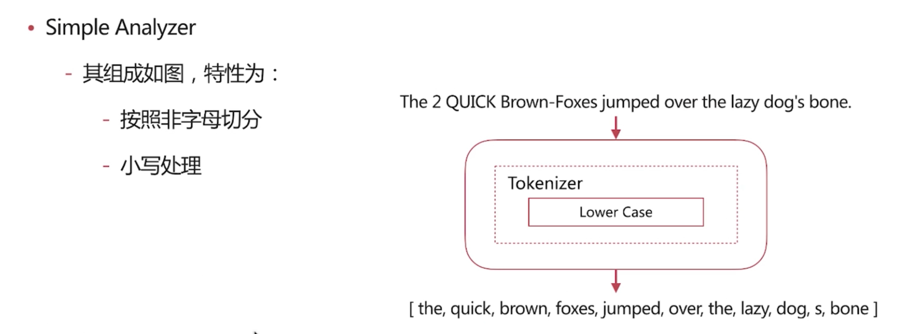
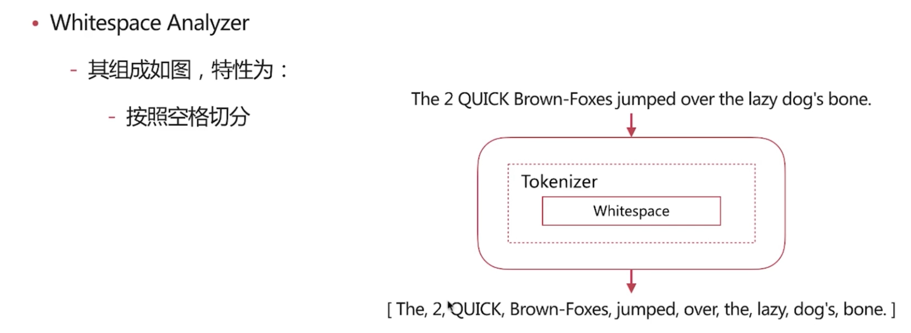
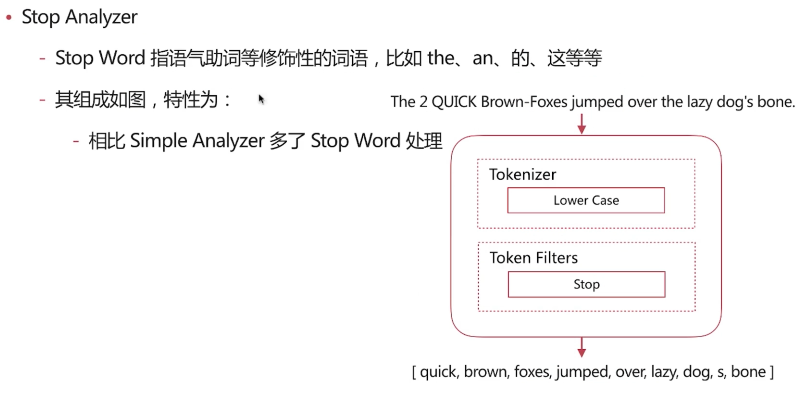
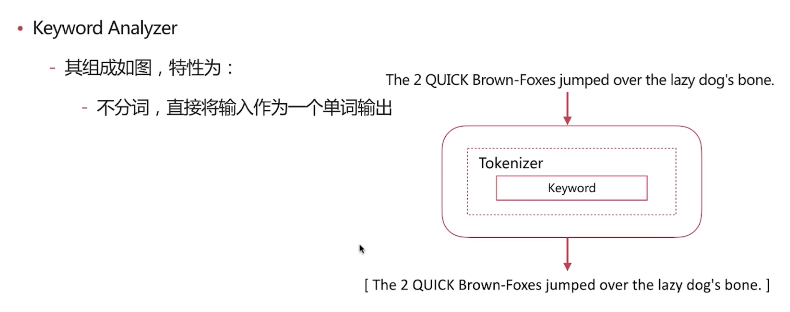
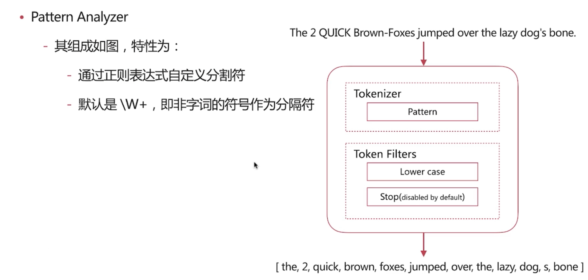
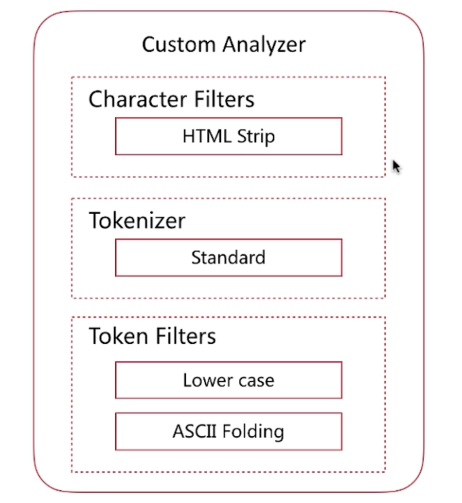
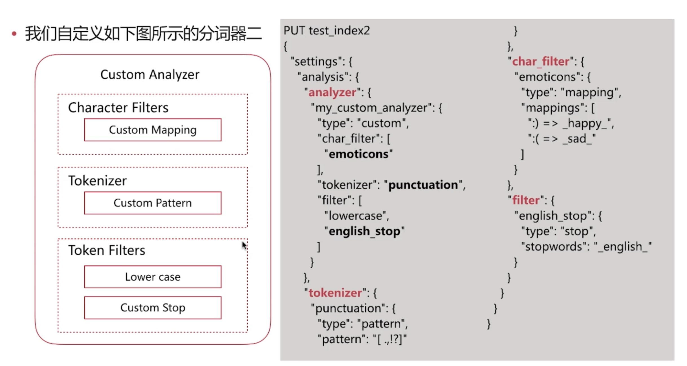

### 书与搜索引擎
1. 目录页对应正排索引：文档 Id 到文档内容/单词的关联关系
2. 索引页对应倒排索引：单词到文档 Id 的关联关系


### 倒排索引-查询流程
1. 查询包含“搜索引擎”的文档
2. 通过倒排索引获取“搜索引擎”对应的文档 ID 有 1 和 3
3. 通过正排索引查询 1 和 3 的完整内容
4. 返回用户最终结果

### 倒排索引组成
1. 倒排索引是搜索引擎的核心，主要包含两部分：
  - 单词词典（Term Dictionary）
    - 记录所有文档的单词，一般都比较大
    - 记录单词到倒排列表的关联信息
  - 倒排列表（Posting List

### 倒排索引-倒排列表
1. 倒排列表（Posting List）记录了单词对应的文档集合，由倒排索引项组成
2. 倒排索引项（Posting）主要包含如下信息
  - 文档 id，用于获取原始信息
  - 单词频率（TF，Term Frequency），记录该单词在该文档中的出现次数，用于后续相关性算分
  - 位置（Position），记录单词在文档中的分词位置（多个），用于做赐予搜索（Phrase Query）
  - 偏移（Offset），记录单词在文档的开始和结束位置，用于做高亮显示


### 分词
1. 分词是指将文本转换成一系列单词（term or token）的过程，也可以叫做文本分析，在 es 里面称为 Analysis
2. 分词器是 es 中专门处理分词的组件，英文为 Analyzer，它的组成如下
  - Character Filters：针对原始文本进行处理，比如去除 html 特殊标记符
  - Tokenizer：将原始文本按照一定规则切分为单词
  - Token Filters：针对 tokenizer 处理的单词就再进行加工，比如转小写、删除或新增等处理

### Analyze API
1. es 提供了一个测试分词的 api 接口，方便验证分词效果，endpoint 是 _analyze
  - 可以直接执行 analyzer 进行测试
  ```
  POST _analyze
  {
    "analyzer": "standard",
    "text": "hello world!"
  }
  ```
  
  - 可以直接指定索引中的字段进行测试
  ```
  POST test_index/_analyze
  {
    "field": "username",
    "text": "hello world"
  }
  ```
  
  - 可以自定义分词器进行测试
  ```
  POST _analyze
  {
    "tokenizer": "standard",
    "filter": ["lowercase"],
    "text": "Hello World!"
  }
  ```
  

### 预定义的分词器
1. es 自带如下的分词器
  - Standard
  ```
  POST _analyze
  {
    "analyzer": "standard",
    "text": "The 2 QUICK Brown-Foxes jumped over the lazy dog's bone."
  }
  ```
  
  - Simple
  ```
  POST _analyze
  {
    "analyzer": "simple",
    "text": "The 2 QUICK Brown-Foxes jumped over the lazy dog's bone."
  }
  ```
  
  - Whitespace
  ```
  POST _analyze
  {
    "analyzer": "whitespace",
    "text": "The 2 QUICK Brown-Foxes jumped over the lazy dog's bone."
  }
  ```
  
  - Stop
  ```
  POST _analyze
  {
    "analyzer": "stop",
    "text": "The 2 QUICK Brown-Foxes jumped over the lazy dog's bone."
  }
  ```
  
  - Keyword
  ```
  POST _analyze
  {
    "analyzer": "keyword",
    "text": "The 2 QUICK Brown-Foxes jumped over the lazy dog's bone."
  }
  ```
  
  - Pattern
  ```
  POST _analyze
  {
    "analyzer": "pattern",
    "text": "The 2 QUICK Brown-Foxes jumped over the lazy dog's bone."
  }
  ```
  
  - Language
    - 提供了30+常见语言的分词器
    - arabic，armenian......

### 中文分词
1. 常用分词系统
  - IK
    - 实现中英文单词的切分，支持ik_smart、ik_maxword等模式
    - 可自定义词库，支持热更新分词词典
    - https://github.com/medcl/elasticsearch-analysis-ik
  - jieba
    - python中最流行的分词系统，支持分词和此行标注
    - 支持繁体分词、自定义词典、并行分词等
    - https://github.com/singlee/elasticsearch-jieba-plugin
2. 基于自然语言处理的分词系统
  - Hanlp
    - 由一系列模型与算法组成的Java工具包，目标是普及自然语言处理在生产环境中的应用
    - https://github.com/hankcs/HanLp
  - THULAC
    - Thu Lexical Analyzer for Chinese,由清华大学自然语言处理与社会人文计算实验室研制推出的一套中文词法分析工具包，具有中文分词和此行标注功能
    - https://github.com/microbun/elasticsearch-thulac-plugin

### 自定义分词
1. 当自带的分词无法满足需求时，可以自定义分词
  - 通过自定义 Character、Tokenizer 和 Token Filter 实现
2. Character Filters
  - 在 Tokenizer 之前对原始文本进行处理，比如增加、删除或替换字符等
  - 自带的如下：
    - HTML Strip 去除 html 标签和转换 html 实体
    - Mapping 进行字符替换操作
    - Pattern Replace 进行正则匹配替换
  - 会影响后续 tokenizer 解析的 position 和 offset 信息
  ```
  POST _analyze
  {
    "tokenizer": "keyword", # keyword 类型的 tokenizer 可以直接看到输出结果
    "char_filter": ["html_strip"], # 指明要使用的 char_filters
    "text": "<p>I&apos;m so<b>happy</b>!</p>"
  }
  ```
3. Tokenizer
  - 将原始文本按照一定规则切分为单词（term or token）
  - 自带的如下：
    - standard 按照单词进行分割
    - letter 按照非字符类进行分割
    - whitespace 按照空格进行分割
    - UAX URL Email 按照 standard 分割，但不会分割邮箱和 url
    - Ngram 和 Edge NGram 连词分割
    - Path Hierarchy 按照文件路径进行切割
  ```
  POST _analyze
  {
    "tokenizer": "path_hierarchy",
    "text": "/one/two/three"
  }    
  ```
4. Token Filters
  - 对于 tokenizer 输出的单词(term)进行增加、删除、修改等操作
  - 自带的如下：
    + lowercase 将所有 term 转换为小写
    + stop 删除 stop words
    + NGram 和 Edge NGram 连词分割
    + Synonym 添加近义词的 term
  ```
  POST _analyze
  {
    "text": "a Hello, world!",
    "tokenizer": "standard",
    "filter": [
      "stop",
      "lowercase",
      {
        "type": "ngram",
        "min_gram": 4,
        "max_gram": 4
      }
    ]
  }
  ```
5. 自定义分词
  - 自定义分词需要在索引的配置中设定，如下所示：
  ```
  PUT test_index
  {
    "settings": {
      "analysis": { # 分词配置，可以自定义
        "char_filter": {},
        "tokenizer": {},
        "filter": {},
        "analyzer": {}
      }
    }
  }
  ```
  
  ```
  PUT test_index
  {
    "settings": {
      "analysis": {
        "analyzer": {
          "my_custom_analyzer": {
            "type": "custom",
            "tokenizer": "standard",
            "char_filter": [
              "html_strip"
            ],
            "filter": [
              "lowercase",
              "asciifolding"
            ]
          }
        }
      }
    }
  }

  POST test_index/_analyze
  {
    "analyzer": "my_custom_analyzer",
    "text": "Is this <b>a box</b>"
  }
  ```
  
  ```
  PUT test_index2
  {
    "settings": {
      "analysis": {
        "analyzer": {
          "my_custom_analyzer": {
            "type": "custom",
            "char_filter": [
              "emoticons"
            ],
            "tokenizer": "punctuation",
            "filter": [
              "lowercase",
              "english_stop"
            ]
          }
        },
        "tokenizer": {
          "punctuation": {
            "type": "pattern",
            "pattern": "[.,!?]"
          }
        },
        "char_filter": {
          "emoticons": {
            "type": "mapping",
            "mappings": [
              ":) => _happy_",
              ":(" => _sad_
            ]
          }
        },
        "filter": {
          "english_stop": {
            "type": "stop",
            "stopwords": "_english_"
          }
        }
      }
    }
  }

  POST test_index2/_analyze
  {
    "analyzer": "my_custom_analyzer",
    "text": "I'm :) person,and you?"
  }
  ```

### 分词使用说明
1. 分词会在如下两个时机使用：
  - 创建或更新文档时(Index Time)，会对相应的文档进行分词处理
  - 查询时(Search Time)，会对查询语句进行分词

### 索引时分词
1. 索引时分词是通过配置 Index Mapping 中每个字段的 analyzer 属性实现的，如下：
  - 不指定分词时，使用默认 standard
  ```
  PUT test_index
  {
    "mappings": {
      "doc": {
        "properties": {
          "title": {
            "type": "text",
            "analyzer": "whitespace" # 指定分词器
          }
        }
      }
    }
  }
  ```

### 查询时分词
1. 查询时分词的指定方式有如下几种：
  - 查询的时候通过 analyzer 指定分词器
  ```
  POST test_index/_search
  {
    "query": {
      "match": {
        "message": {
          "query": "hello",
          "analyzer": "standard"
        }
      }
    }
  }
  ```
  - 通过 index mapping 设置 search_analyzer 实现
  ```
  PUT test_index
  {
    "mappings": {
      "doc": {
        "properties": {
          "title": {
            "type": "text",
            "analyzer": "whitespace",
            "search_analyzer": "standard"
          }
        }
      }
    }
  }
  ```
2. 一般不需要特别指定查询时分词器，直接使用索引时分词器即可，否则会出现无法匹配的情况

### 分词的使用建议
1. 明确字段是否需要分词，不需要分词的字段就将 type 设置为 keyword，可以节省空间提供写性能
2. 善用`_analyze API`，查看文档的具体分词结果
3. 动手测试