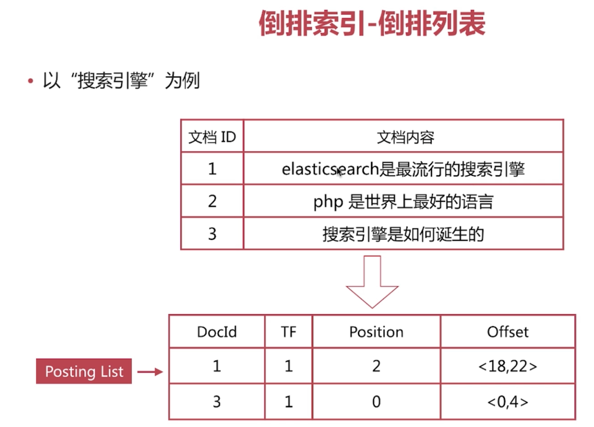

### 书与搜索引擎
1. 目录页对应正排索引：文档 Id 到文档内容/单词的关联关系
2. 索引页对应倒排索引：单词到文档 Id 的关联关系


### 倒排索引-查询流程
1. 查询包含“搜索引擎”的文档
2. 通过倒排索引获取“搜索引擎”对应的文档 ID 有 1 和 3
3. 通过正排索引查询 1 和 3 的完整内容
4. 返回用户最终结果

### 倒排索引组成
1. 倒排索引是搜索引擎的核心，主要包含两部分：
  - 单词词典（Term Dictionary）
    - 记录所有文档的单词，一般都比较大
    - 记录单词到倒排列表的关联信息
  - 倒排列表（Posting List

### 倒排索引-倒排列表
1. 倒排列表（Posting List）记录了单词对应的文档集合，由倒排索引项组成
2. 倒排索引项（Posting）主要包含如下信息
  - 文档 id，用于获取原始信息
  - 单词频率（TF，Term Frequency），记录该单词在该文档中的出现次数，用于后续相关性算分
  - 位置（Position），记录单词在文档中的分词位置（多个），用于做赐予搜索（Phrase Query）
  - 偏移（Offset），记录单词在文档的开始和结束位置，用于做高亮显示



### 分词
1. 分词是指将文本转换成一系列单词（term or token）的过程，也可以叫做文本分析，在 es 里面称为 Analysis
2. 分词器是 es 中专门处理分词的组件，英文为 Analyzer，它的组成如下
  - Character Filters：针对原始文本进行处理，比如去除 html 特殊标记符
  - Tokenizer：将原始文本按照一定规则切分为单词
  - Token Filters：针对 tokenizer 处理的单词就再进行加工，比如转小写、删除或新增等处理

### Analyze API
1. es 提供了一个测试分词的 api 接口，方便验证分词效果，endpoint 是 _analyze
  - 可以直接执行 analyzer 进行测试
  ```
  POST _analyze
  {
    "analyzer": "standard",
    "text": "hello world!"
  }
  ```
  
  - 可以直接指定索引中的字段进行测试
  ```
  POST test_index/_analyze
  {
    "field": "username",
    "text": "hello world"
  }
  ```
  
  - 可以自定义分词器进行测试
  ```
  POST _analyze
  {
    "tokenizer": "standard",
    "filter": ["lowercase"],
    "text": "Hello World!"
  }
  ```
  

### 预定义的分词器
1. es 自带如下的分词器
  - Standard
  ```
  POST _analyze
  {
    "analyzer": "standard",
    "text": "The 2 QUICK Brown-Foxes jumped over the lazy dog's bone."
  }
  ```
  
  - Simple
  - Whitespace
  - Stop
  - Keyword
  - Pattren
  - Language