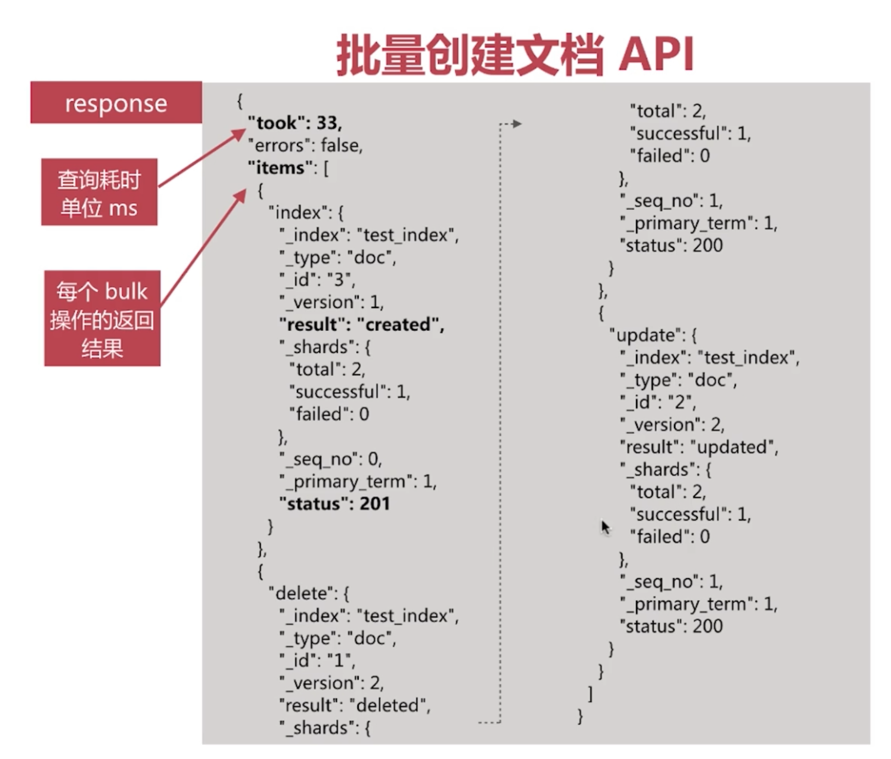

### 常见术语
1. 文档 Document：用户存储在 es 中的数据文档
2. 索引 Index：由具有相同字段的文档列表组成
3. 节点 Node：一个 Elasticsearch 的运行实例，是集群的构成单元
4. 集群 Cluster：由一个或多个节点组成，对外提供服务

### Document
JSON Object,由字段组成，常见的数据类型如下
1. 字符串：text，keyword
2. 数值型：long，integer，short，byte，double，float，half_float，scaled_float
3. 布尔：boolean
4. 日期：date
5. 二进制：binary
6. 范围类型：integer_range，float_range，long_range，double_range，date_range

### Document MetaData
元数据，用于标注文档的相关信息
1. _index：文档所在的索引名
2. _type：文档所在类型名
3. _id：文档唯一 id
4. _uid：组合 id，由 _type 和 _id 组成(6.x_type 不再起作用，同 _id 一样)
5. _source：文档的原始 json 数据，可以从这里获取每个字段的内容
6. _all：整合所有字段内容到该字段，默认禁用

### Index
1. 索引中存储具有相同结构的文档，每个索引都有自己的 mapping 定义，用于定义字段名和类型
2. 一个集群可以有多个索引，比如：
  - nginx 日志存储的时候可以按照日期每天生成一个索引来存储

### Rest API
1. Elasticsearch 集群对外提供 RESTful API
2. REST - REpresentational State Transfer
3. URI 指定资源，如 Index、Document 等
4. Http Method 指明资源操作类型，如 GET、POST、PUT、DELETE 等 

### 索引 API
1. 创建索引 api `PUT /test_index`
```json
{
  "acknowledged": true,
  "shards_acknowledged": true,
  "index": "test_index"
}
```
2. 查看现有索引 `GET _cat/indices`
3. 删除索引 `DELETE /test_index`

### 启动
```shell
bin/elasticsearch -Ecluster.routing.allocation.disk.threshold_enabled=false -Epath.data=imooc
bin/kibana

# 后台启动 elasticsearch
./elasticsearch -d
ps aux|grep elasticsearch # 查看启动情况
# 后台启动 kibana
bin/kibana &
exit # 退出终端
```

### 文档的 CURD
1. 指定 id 创建文档
```
PUT /test_index<index>/doc<type>/1<id>
{
  "username": "alfred",
  "age": 1
}
```
2. 不指定 id 创建文档
```
POST /test_index/doc
{
  "username": "tom",
  "age": 20
}
```
3. 查询文档
```
GET /test_index/doc/1
```
4. 查询所有文档，用到_search
```
GET /test_index/doc/_search
{
  "query": {
    "term": {
      "_id": "1"
    }
  }
}
```


5. 批量创建文档
```
POST _bulk
{"index":{"_index":"test_index","_type":"doc","_id":"3"}}
{"username":"alfred","age":10}
{"delete":{"_index":"test_index","_type":"doc","_id":"1"}}
{"update":{"_id":"2","_index":"test_index","_type":"doc"}}
{"doc":{"age":"20 "}}
```
  - create 创建文档时，如果已经存在会报错 
  - index 创建文档时，会覆盖已经存在的
  - update 更新
  - delete 删除


6. 批量查询文档
```
GET /_mget
{
  "docs": [
    {
      "_index": "test_index",
      "_type": "doc",
      "_id": "1"
    },
    {
      "_index": "test_index",
      "_type": "doc",
      "_id": "2"
    }
  ]
}
```