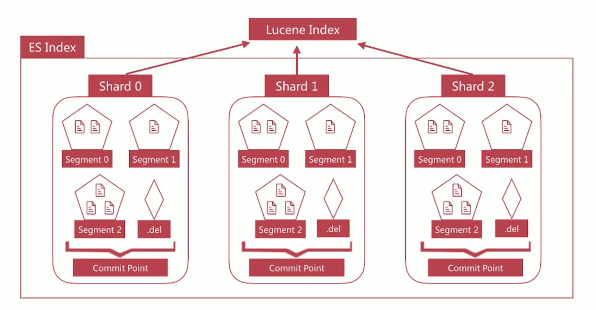

### 分布式特性
1. es 支持集群模式，是一个分布式系统，其好处主要有两个
  - 增大系统容量，如内存/磁盘，使得 es 集群可以支持 PB 级的数据
  - 提高系统可用性，即使部分节点停止服务，整个集群依然可以正常服务
2. es 集群由多个 es 实例组成
  - 不同集群通过集群名字来区分，可通过 cluster.name 进行修改，默认为 elasticsearch
  - 每个 es 实例本质上是一个 JVM 进程，且有自己的名字，通过 node.name 进行修改

### cerebro
1. [cerebro 地址](https://github.com/lmenezes/cerebro)
2. 在 releases 下直接点击 `cerebro-0.7.2.tgz` 下载
3. 进行解压 `tar zxvf cerebro-0.7.2.tgz`
4. 运行`bin/cerebro`
5. 在`Node address`中输入本地的 es 地址

### 启动一个节点
1. 运行如下命令可以启动一个 es 节点实例
  - `bin/elasticsearch -Ecluster.name=my_cluster -Epath.data=my_cluster_node1 -Enode.name=node1 -Ehttp.port=5200 -d`
2. es 集群相关的数据称为 cluster state,主要记录如下信息
  - 节点信息，比如节点名称、连接地址
  - 索引信息，比如索引名称、配置等
  - ......

### Master Node
1. 可以修改 cluster state 的节点称为 master 节点，一个集群只能有一个
2. cluster state 存储在每个节点上，master 维护最新版并同步给其他节点
3. master 节点是通过集群中所有节点选举产生的，可以被选举的节点称为 master-eligible 节点，相关配置如下
  - node.master:true
4. 处理请求的节点即为 coordinating 节点，该节点为所有节点的默认角色，不能取消
  - 路由请求到正确的节点处理，比如创建索引的请求到 master 节点
5. 存储数据的节点即为 data 节点，默认节点都是 data 类型，相关配置如下
  - node.data:true

### 提高系统可用性
1. 服务可用性
  - 2个节点的情况下，允许其中1个节点停止服务
2. 数据可用性
  - 引入副本(Replication)解决
  - 每个节点上都有完备的数据

### 增大系统容量
1. 如何将数据分布于所有节点上？
  - 引入分片(Shard)解决问题
2. 分片是 es 支持 PB 级数据的基石
  - 分片存储了部分数据，可以分布于任意节点上
  - 分片数在索引创建时指定且后续不允许再更改，默认为5个
  - 分片有主分片和副本分片之分，以实现数据的高可用
  - 副本分片的数据由主分片同步，可以有多个，从而提高读取的吞吐量

3. 此时增加节点是否能提高 test_index 的数据容量
  - 不能。因为只有3个分片，已经分布在3台节点上，新增的节点无法利用
4. 此时增加副本数是否能提高 test_index 的读取吞吐量？
  - 不能。因为新增的副本也是分布在这3个节点上，还是利用了同样的资源。如果要增加吞吐量，还需要新增节点
5. 分片数的设定很重要，需要提前规划好
  - 过小会导致后续无法通过增加节点实现水平扩容
  - 过大会导致一个节点上分布过多分片，造成资源浪费，同时会影响查询性能

### 故障转移
1. 集群由3个节点组成，此时集群状态是 green

2. node1 所在机器宕机导致服务器终止，此时集群会如何处理？
  - node2 和 node3 发现 node1 无法响应一段时间后会发起 master 选举，比如这里选择 node2 为 master 节点。此时由于主分片 P0 下线，集群状态变为 Red
  
  - node2 发现主分片 P0 未分配，将 R0 提升为主分片。此时由于所有主分片都正常分配，集群状态变为 Yellow
  
  - node2 为 P0 和 P1 生成新的副本，集群状态变为绿色
  
3. 模拟 node1 出故障，宕机
```
ps aux|grep -i elasticsearch|grep 5200|grep node1
```

### 文档分布式存储
1. 文档最终会存储在分片上，如下图所示
  - Document1 最终存储在分片 P1 上
  
2. Document1 是如何存储到分片 P1 的？选择 P1 的依据是什么？
  - 需要文档到分片的映射算法
3. 目的
  - 使得文档均匀分布在所有分片上，以宠粉利用资源
3. 算法
  - 随机选择或者 round-robin 算法？
  - 不可取，因为需要维护文档到分片的映射关系，成本巨大
  - 根据文档值实时计算对应的分片
4. es 通过如下的公式计算文档对应的分片
  - shard = hash(routing) % number_of_primary_shards
  - hash 算法保证可以将数据均匀的分散在分片中
  - routing 是一个关键参数，默认是文档 id，也可以自定指定
  - number_of_primary_shards 是主分片数
5. 该算法与主分片数相关，这也是分片数一旦确定后便不能更改的原因

### 文档创建的流程


### 文档读取的流程


### 文档批量创建的流程


### 文档批量读取的流程


### 脑裂问题
1. 脑裂问题，英文为 split-brain，是分布式系统中的经典网络问题，如下图所示：
  - node2 与 node3 会重新选举 master，比如 node2 成为了新 master，此时会更新 cluster state
  - node1 自己组成集群后，也会更新 cluster state
2. 同一个集群有两个 master，而且维护不同的 cluster state，网络恢复后无法选择正确的 master

3. 解决方案为仅在可选举 master-eligible 节点数大于等于 quorum 时才可以进行 master 选举
  - quorum = master-eligible 节点数/2 + 1，例如3个 master-eligible 节点时，quorum 为2
  - 设定 discovery.zen.minimum_master_nodes 为 quorum 即可避免脑裂

### 倒排索引的不可变更
1. 倒排索引一旦生成，不能更改
2. 其好处如下：
  - 不用考虑并发写文件的问题，杜绝了锁机制带来的性能问题
  - 由于文件不再更改，可以允许充分利用文件系统缓存，只需要载入一次，只要内存足够，对该文件的读取都会从缓存读取，性能高
  - 利于生成缓存数据
  - 利于对文件进行压缩存储，节省磁盘和内存存储空间
3. 坏处为需要写入新文档时，必须重新构建倒排索引文件，然后替换老文件后，新文档才能被检索出来，导致文档实时性差
4. 解决方案是新文档直接生成新的倒排索引文件，查询的时候同时查询所有的倒排文件，然后做结果的汇总计算即可

### 文档搜索实时性
1. Lucene 便是采用来这种方案，它构建的单个倒排索引称为 segment，合在一起称为 Index，与 ES 中的 Index 概念不同。ES 中的一个 Shard 对应一个 Luncene Index。
2. Luncene 会有一个专门的文件来记录所有的 segment 信息，称为 commit point


### 文档搜索实时性 - refresh
1. segment 写入磁盘的过程依然很耗时，可以借助文件系统缓存的特性，先将 segment 在缓存中创建并开放查询来进一步提升实时性，该过程在 es 中被称为 refresh
2. 在 refresh 之前文档会先存储在一个 buffer 中，refresh 时将 buffer 中的所有文档清空并生成 segment
3. es 默认每1秒执行一次 refresh，因此文档的实时性被提高到了1s，这也是 es 被称为金实时(Near Real Time)的原因

4. refresh 发生的时机主要有如下几种情况
  - 间隔时间到达时，通过 index.settings.refresh_interval 来设定，默认是1秒
  - index.buffer 占满时，其大小通过 indices.memory.index_buffer_size 设置，默认为 jvm heap 的 10%，所有 shard 共享
  - flush 发生时也会发生 refresh

### 文档搜索实时性 - translog
1. 如果在内存中的 segment 还没有写入磁盘前发生了宕机，那么其中的文档就无法恢复了，如何解决这个问题？
  - es 引入 translog 机制。写入文档到 buffer 时，同时将该操作写入 translog。
  - translog 文件会即时写入磁盘(fsync)，6.x默认每个请求都会落盘，可以修改为每5秒写一次，这样风险便是丢失5秒内的数据，相关配置为index.translog.*
  - es 启动时会检查 translog 文件，并从中恢复数据
![es-文档搜索实时性-translog(./images/es-文档搜索实时性-translog.png)
2. flush 发生的时机主要有如下几种情况
  - 间隔时间达到时，默认是 30 分钟，5.x 之前可以通过 index.translog.flush_threshold_period 修改，之后无法修改
  - translog 占满时，其大小可以通过 index.translog.flush_threshold_size 控制，默认是 512mb，每个 index 有自己的 translog

### 文档搜索实时性 - flush
1. flush 负责将内存中的 segment 写入磁盘，主要做如下的工作：
  - 将 translog 写入磁盘
  - 将 index buffer 清空，其中的文档生成一个新的 segment，相当于一个 refresh 操作
  - 更新 commit point 并写入磁盘
  - 执行 fsync 操作，将内存中的 segment 写入磁盘
  - 删除旧的 translog 文件


### 文档搜索实时性 - 删除与更新文档
1. segemnt 一旦生成就不能更改，那么如果你要删除文档该如何操作？
  - Lucene 专门维护一个 .del 的文件，记录所有已经删除的文档，注意 .del 上记录的是文档在 Lucene 内部的id
  - 在查询结果返回前会过滤掉 .del 中的所有文档
2. 更新文档如何进行呢？
  - 首先删除文档，然后再创建新文档

### 整体视角
1. ES Index 与 Lucene Index 的术语对照如下所示


### Segment Merging
1. 随着 segment 的增多，由于一次查询的 segment 数增多，查询速度会变慢
2. es 会定时在后台进行 segment merge 的操作，减少 segment 的数量
3. 通过 force_merge api 可以手动强制做 segment merge 的操作