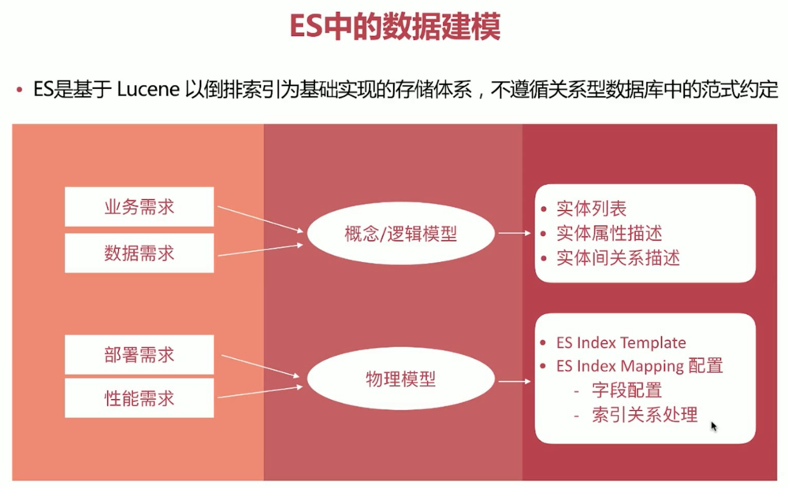
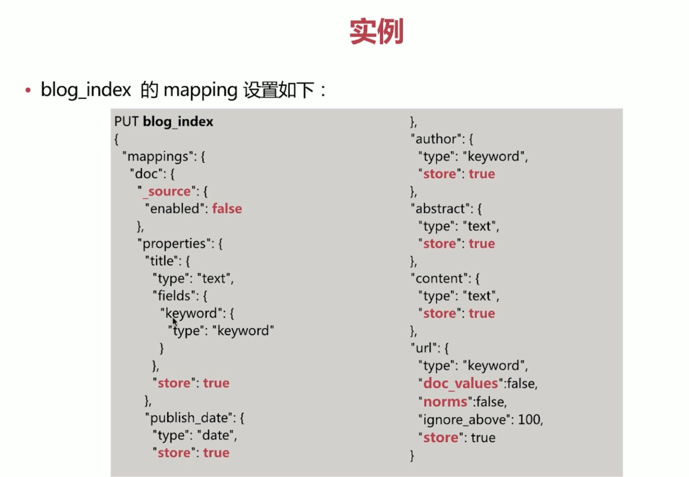

### 数据建模
1. 英文为 Data Modeling,为创建数据模型的过程
2. 数据模型(Data Model)
  - 对现实世界进行抽象描述的一种工具和方法
  - 通过抽象的实体及实体之间联系的形式去描述业务规则，从而实现对现实世界的映射

### 数据建模的过程
1. 概念模型
  - 确定系统的核心需求和范围边界，设计实体和实体时间的关系
2. 逻辑模型
  - 进一步梳理业务需求，确定每个实体的属性、关系和约束等
3. 物理模型
  - 结合具体的数据库产品，在满足业务读写性能等需求的前提下确定最终的定义
  - Mysql、MongoDB、elasticsearch 等
  - 第三范式

### ES 中的数据建模


### Mapping 字段的相关配置
1. enbaled
  - true | false
  - 仅存储，不做搜索或聚合分析
2. index
  - true | false
  - 是否构建倒排索引
3. index_options
  - docs | freqs | positions | offsets
  - 存储倒排索引的哪些信息
4. norms
  - true | false
  - 是否存储归一化相关参数，如果字段仅用于过滤和聚合分析，可关闭
5. doc_values
  - true | false
  - 是否启用 doc_values，用于排序和聚合分析
6. field_data
  - true | false
  - 是否为 text 类型启用 fielddata，实现排序和聚合分析
7. store
  - true | false
  - 是否存储该字段值
8. coerce
  - true | false
  - 是否开启自动数据类型转换功能，比如字符串转为数字、浮点转为整型等
9. multifields 多字段
  - 灵活使用多字段特性来解决多样的业务需求
10. dynamic
  - true | false | strict
  - 控制 mapping 自动更新
11. date_detection
  - true | false
  - 是否自动识别日期类型

### Mapping 字段属性的设定流程
1. 是何种类型？
2. 是否需要检索？
3. 是否需要排序和聚合分析？
4. 是否需要另行存储？

### 是何种类型？
1. 字符串类型
  - 需要分词则设定为 text 类型，否则设置为 keyword 类型
2. 枚举类型
  - 基于性能考虑将其设定为 keyword 类型，即便该数据为整型
3. 数值类型
  - 尽量选择贴近的类型，比如 byte 即可表示所有的数值时，即选用 byte，不要用 long
4. 其他类型
  - 比如布尔类型、日期、地理位置数据等

### 是否需要检索
1. 完全不需要检索、排序、聚合分析的字段
  - enabled 设置为 false
2. 不需要检索的字段
  - index 设置为 false
3. 需要检索的字段，可以通过如下配置设定需要存储的粒度
- index_options 结合需要设定
- norms 不需要归一化数据时关闭即可

### 是否需要排序和聚合分析？
1. 不需要排序或者聚合分析功能
  - doc_values 输定为 false
  - fielddata 设定为 false

### 是否需要另行存储？
1. 是都需要专门存储当前字段的数据？
  - store 设定为 true，即可存储该字段的原始内容(与 _source 中的不相关)
  - 一般结合 _source 的 enabled 设定为 false 时使用

### 实例
1. 博客文章 blog_index
  - 标题 title
  - 发布日期 publish_date
  - 作者 author
  - 摘要 abstract
  - 网络地址 url
```
# "title": {"type": "text"}对文章的标题进行全文检索，分词的
# "fileds": {"keyword": {"type": "keyword"}} 对文章的标题进行一个完全匹配，输入完整的标题匹配出内容
# author 设置为keyword，不需要对 author 进行分词
# abstract 需要进行全文检索
# url 只做展示，不需要搜索 url
PUT blog_index
{
  "mappings": {
    "doc": {
      "properties": {
        "title": {
          "type": "text",
          "fileds": {
            "keyword": {
              "type": "keyword"
            }
          }
        },
        "publish_date": {
          "type": "date"
        },
        "authpr": {
          "type": "keyword"
        },
        "abstract": {
          "type": "text"
        },
        "url": {
          "enabled": false
        }
      }
    }
  }
}
```
2. 如果此时增加来一个很大的内容 content 字段，将他设置为text类型，这样当你取数据的时候是通过 _source 取的，每一次取 _source 的时候都会将 content 取出来，会导致性能很满

```
GET blog_index/_search
{
  "stored_fields": ["title", "publish_date", "author", "abstract", "url"],
  "query": {
    "match": {
      "content": "word"
    }
  },
  "highlight": {
    "fields": {
      "content": {}
    }
  }
}
```

### 关联关系处理
1. ES 不擅长处理关系型数据库中的关联关系，比如文章表 blog 与评论表 comment 之前通过 blog_id 关联，在 ES 中可以通过如下两种手段变相解决
  - Nested Object
  - Parent/Child
2. 评论 Comment
  - 文章ID blog_id
  - 评论人 username
  - 评论日期 date
  - 评论内容 content
```
Blog 1
{
  "title": "Blog Number One"，
  "author": "alfred",
  "comments": [
    {
      "username": "lee",
      "date": "2017-01-02",
      "content": "awesome article!"
    },
    {
      "username": "fax",
      "date": "2017-04-02",
      "content": "thanks!"
    }
  ]
}
```
```
GET blog_index/_search
{
  "query": {
    "bool": {
      "must": [
        {
          "match": {
            "comments.username": "lee"
          }
        },
        {
          "match": {
            "comments.content": "thanks"
          }
        },
      ]
    }
  }
}
# 满足lee或者thanks的都会被查询出来
```
3. Comments 默认是 Object Array，存储结构类似下面的形式：
```
{
  "title": "Blog Number One",
  "author": "alfred",
  "comments.username": [
    "lee",
    "fax"
  ],
  "comments.date": [
    "2017-01-02",
    "2017-04-02"
  ],
  "comments.content": [
    "awesome article!",
    "thanks!"
  ]
}
```
4. Nested Object 可以解决这个问题
```
# 在建立索引的时候指明 comments 是 nested 类型
PUT blog_index_nested
{
  "mappings": {
    "doc": {
      "properties": {
        "title": {
          ...
        },
        ...
        "comments": {
          "type": "nested",
          "properties": {
            "username": {
              ...
            },
            ...
          }
        }
      }
    }
  }
}
# 查询的时候也需要再指明一次通过 nested 的方式进行查询
GET blog_index_nested/_search
{
  "query": {
    "nested": {
      "path": "comments",
      "query": {
        "bool": {
          "must": [
            {
              "match": {
                "comments.username": "lee"
              }
            },
            {
              "match": {
                "comments.content": "thanks"
              }
            }
          ]
        }
      }
    }
  }
}
```
5. Nested Object Array 的存储结构类似下面的形式
```
{
  "title": "Blog Number One",
  "author": "alfred"
}
{
  "comments.username": "lee",
  "comments.date": "2017-01-02",
  "comments.content": "awesome article!"
}
{
  "comments.username": "fax",
  "comments.date": "2017-04-02",
  "comments.content": "thanks!"
}
```

### 关联关系处理之 Parent/Child
1. ES 还提供了类似关系数据库中 join 的实现方式，使用 join 数据类型实现
```
# "type": "join" 指明类型     relations：指明父子关系   blog：父类型名称    comment：子类型名称  
PUT blog_index_parent_child
{
  "mappings": {
    "doc": {
      "properties": {
        "join": {
          "type": "join",
          "relations": {
            "blog": "comment"
          }
        }
      }
    }
  }
}

# 创建父文档
PUT blog_index_parent_child/doc/1
{
  "title": "blog",
  "join": "blog" # 指明父类型
}

# 创建子文档
PUT blog_index_parent_child/doc/comment-1?routing=1 # 指明 routing 值，确保父子文档在一个分片上，一般使用副文档 ID
{
  "comment": "comment world",
  "join": {
    "name": "comment", # 指明子类型
    "parent": 1 # 指明父文档 Id
  }
}
```
2. 常见 query 语法包括如下几种：
  - parent_id 返回某父文档的子文档
  ```
  GET blog_index_parent_child/_search
  {
    "query": {
      "parent_id": { # 关键词
        "type": "comment", # 指明子文档类型
        "id": "2" # 指明父文档 id
      }
    }
  }
  ```
  - has_child 返回包含某子文档的父文档
  ```
  GET blog_index_parent_child/_search
  {
    "query": {
      "has_child": { # 关键词
        "type": "comment", # 指定子文档类型
        "query": { # 指明子文档的查询条件
          "match": {
            "comment": "world"
          }
        }
      }
    }
  }
  ```
  - has_parent 返回包含某父文档的子文档
  ```
  GET blog_index_parent_child/_search
  {
    "query": {
      "has_parent": { # 关键词
        "parent_type": "blog", # 指定父文档类型
        "query": { # 指明父文档的查询条件
          "match": {
            "title": "blog"
          }
        }
      }
    }
  }
  ```

### Nested Object VS Parent/Child
对比 | Nested Object | Parent/Child
------------- | ------------- | -------------
优点 | 文档存储在一起，因此读取性能高 | 父子文档可以独立更新，互不影响
缺点 | 更新父或者子文档时需要更新整个文档 | 为了维护 join 的关系，需要占用部分内存读取性能较差
场景 | 子文档偶尔更新，查询频繁 | 子文档更新频繁

> 建议尽量选择 nested object 来解决问题

### Reindex
1. 指重建所有数据的过程，一般发生在如下情况：
  - mapping 设置变更，比如字段类型变化、分词器字典更新等
  - index 设置变更，比如分片数更改等
  - 迁移数据
2. ES 提供了现成的 API 用于完成该工作
  - _update_by_query 在现有索引上重建
  - _reindex 在其他索引上重建

### Reindex - _update_by_query
```
# 将 blog_index 的所有文档重建一遍 conflicts= proceed：如果遇到版本冲突，覆盖并继续执行
POST blog_index/_update_by_query?conflicts= proceed

POST blog_index/_update_by_query
{
  "script": { # 更新文档的字段值
    "source": "ctx._source.likes++",
    "lang": "painless"
  },
  "query": { # 可以更新部分文档
    "term": {
      "user": "tom"
    }
  }
}
```

### Reindex - _reindex
```
# 将 source 的数据重建到 dest 中
POST _reindex
{
  "conflicts": "proceed",
  "source": {
    "index": "blog_index",
    "query": {
      "term": {
        "user": "tom"
      }
    }
  },
  "dest": {
    "index": "blog_new_index"
  }
}
```

### Reindex - Task
1. 数据重建的时间受源索引文档规模的影响，当规模越大时，所需要的时间越多，此时需要通过设定 url 参数 wait_for_completion 为 false 来异步执行，ES 以 task 来描述此类执行任务
2. ES 提供了 Task API 来查看任务的执行进度和相关数据


### 数据模型版本管理
1. 对 Mapping 进行版本管理
  - 包含在代码或者以专门的文件进行管理，添加好注视，并加入 Git 等版本管理仓库中，方便回顾
  - 为每个增加一个 metadata 字段，在其中维护一些文档相关的元数据，方便对数据进行管理
  ```
  # mapping 版本，可以自行指定，比如每次更新 mapping 设置湖，该 version 加 1
  {
    "metadata": {
      "version": 1
    },
    "username": "alfred",
    "job": "engineer"
  }
  ```

### 防止字段过多
1. 字段过多主要有如下的坏处：
  - 难于维护，当字段成百上千时，基本很难有人能明确知道每个字段的含义
  - mapping 的信息存储在 cluster state 里面，过多的字段会导致 mapping 过大，最终导致更新变慢
2. 通过实质 index.mapping.total_fields.limit 可以限定索引中最大字段数，默认是 1000
3. 可以通过 key/value 的方式解决字段过多的问题，但并不完美


### Key/Value 方式详解
1. 虽然通过这种方式可以极大的减少 Field 数目，但也有一些明显的坏处
  - query 语句复杂度飙升，且有一些可能无法实现，比如聚合分析相关的
  - 不利于在 Kibana 中做可视化分析

### 防止字段过多
1. 一般字段过多的原因是由于没有高质量的数据建模导致的，比如 dynamic 设置为 true
2. 考虑拆分多个索引来解决问题