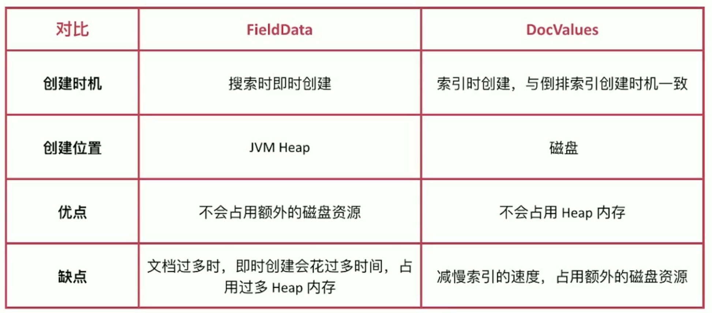

### Search 的运行机制
1. Search 执行的时候实际分两个步骤运作的
  - Query 阶段
  - Fetch 阶段
2. Query-Then-Fetch

### Search 的运行机制 - Query 阶段
1. node3 在接受到用户的 search 请求后，会先进行 Query 阶段(此时是 Coordinating Node 角色)
2. node3 在 6 个主副分片中随机选择 3 个分片(涵盖所有的数据)，发送 search request
3. 被选中的 3 个分片会分别执行查询并排序，返回 from + size 个文档 Id 和排序值
4. node3 整合 3 个分片返回的 from + size 个文档 Id，根据排序值排序后选取 from 到 from + size 的文档 Id

### Search 的运行机制 - Fetch 阶段
1. node3 根据 Query 阶段获取的文档 Id 列表去对应的 shard 上获取文档详情数据
2. node3 向相关的分片发送 multi_get 请求
3. 3 个分片返回文档详细数据
4. node3 拼接返回的结果并返回给客户

### Search 的运行机制 - 相关性算分问题
1. 相关性算分在 shard 与 shard 间是相互独立的，也就意为着同一个 Term 的 IDF 等值在不同的 Shard 上是不同的。文档的相关性算分和它所处的 shard 相关
2. 在文档数量不多时，会导致相关性算分严重不准的情况发生
3. 解决思路有两个：
  - 一是设置分片数为1个，从根本上排除问题，在文档数量不多的时候可以考虑该方案，比如百万到千万级别的文档数量
  - 二是使用 DFS Query-Then-Fetch 查询方式
4. DFS Query-Then-Fetch 是在拿到所有文档后再重新完整的计算一次相关性算分，耗费更多的 cpu 和内存，执行性能也比较低下，一般不建议使用。使用方式如下：
```
GET test_search_relevance/_search?search_type=dfs_query_then_fetch
{
  "query": {
    "match": {
      "name": "hello"
    }
  }
}
```

### 排序
1. es 默认会采用相关性算分排序，用户可以通过设定 sorting 参数来自行设定排序规则
```
GET test_search_index/_search
{
  "sort": {
    "birth": "desc"
  }
}
```
2. 按照多个字段排序分别按照出生日期倒排，得分倒排，文档内部 Id 倒排
```
GET test_search_index/_search
{
  "query": {
    "match": {
      "username": "alfred"
    }
  },
  "sort": [
    {
      "birth": "desc"
    },
    {
      "_score": "desc"
    },
    {
      "_doc": "desc"
    }
  ]
}
```
3. 按照字符串陪许比较特殊，因为 es 有 text 和 keyword 两种类型，针对 text 类型排序，如下所示
```
GET test_search_index/_search
{
  "sort": {
    "username": "desc"
  }
}
# 会报错，Fielddata is disabled on text fields by default......
# 解决办法，使用 keyword 进行排序
GET test_search_index/_search
{
  "sort": [
    {
      "username.keyword": "desc"
    }
  ]
}
```

### 排序
1. 排序的过程实质是对字段内容排序的过程，这个过程中倒排索引无法发挥作用，需要用到正排索引，也就是通过文档 Id 和字段可以快速得到字段原始内容
2. es 对此提供了2种实现方法
  - fielddata 默认禁用
  - doc values 默认启用，除了 text 类型

### FieldData VS DocValues


### Fielddata
1. Fielddata 默认是关闭的，可以通过如下 api 开启：
  - 此时字符串是按照分词后的 term 排序，往往结果很难符合预期
  - 一般是对分词做聚合分析的时候开启
```
# fielddata： true 可以随时开启和关闭
PUT test_search_index/_mapping/doc
{
  "properties": {
    "username": {
      "type": "text",
      "fielddata": true
    }
  }
}
```

### Doc Values
1. Doc Values 默认是启用的，可以在创建索引的时候关闭
  - 如果后面要在开启 doc values ，需要做 reindex 操作
```
PUT test_doc_values1/
{
  "mappings": {
    "doc": {
      "properties": {
        "username": {
          "type": "keyword",
          "doc_values": false
        }
      }
    }
  }
}
# 可以通过该字段获取 fielddata 或者 doc values 中存储的内容
GET test_search_index/_search
{
  "docvalue_fields": [
    "username",
    "username.keyword",
    "age"
  ]
}
```

### 分页与遍历
1. es 提供了 3 种方式来解决分页与遍历的问题
  - from/size
  - scroll
  - search_after

### From/Size
1. 最常用的分页方案
  - from 指明开始位置
  - size 指明获取总数
  ```
  GET test_search_index/_search
  {
    "from": 1,
    "size": 2
  }
  ```
2. 深度分页是一个经典的问题：在数据分片存储的情况下如何获取前1000个文档？
  - 获取从990～1000的文档时，会在每个分片上都先获取1000个文档，然后再由Coordinating Node 聚合所有分片的结果再排序选取前1000个文档
  - 页数越深，处理文档越多，占用内存越多，耗时越长。尽量避免深度分页，es 通过 index.max_result_window 限定最多到 100000 条数据

### Scroll
1. 遍历文档集的 api，以快照的方式来避免深度分页的问题
  - 不能用来做实时搜索，因为数据不是实时的
  - 尽量不要使用复杂的 sort 条件，使用 _doc 最高校
  - 使用稍嫌复杂
2. 第一步需要发起1个 scroll serach，如下所示：
  - es 在收到该请求后会根据查询条件创建文档 Id 合集的快照
  ```
  # scroll=5m 该 scroll 快照有效时间
  # size: 1 指明每次 scroll 返回的文档数
  GET test_search_index/_search?scroll=5m
  {
    "size": 1
  }

  # _scroll_id 后续调用 scroll api 时的参数
  {
    "_scroll_id": "xxxxxx"
  }
  ```
3. 第二步调用 scroll search 的 api，获取文档集合，如下所示：
  - 不断迭代调用直到返回 hits.hits 数组为空时停止
  ```
  POST _search/scroll
  {
    "scroll": "5m,
    "scroll_id": "......"
  }
  # 下一次调用
  {
    "_scroll_id": "xxxxx
  }
  ```
3. 过多的 scroll 调用会占用大量内存，可以通过clear api 删除过多的 scroll 快照：
```
DELETE /_search/scroll
{
  "scroll_id": [
    "xxxxx",
    "XXXXX"
  ]
}

DELETE /_search/scroll/_all
```

### Search_After
1. 避免深度分页的性能问题，提供实时的下一页文档获取功能
  - 缺点是不能使用 from 参数，即不能指定页数
  - 只能下一页，不能上一页
  - 使用简单
2. 第一步为正常搜索，但是指定 sort 值，并保证值唯一
3. 第二步为使用上一步最后一个文档的 sort 值进行查询
```
# 要保证 sort 值唯一
GET test_search_index/_search
{
  "size": 1,
  "sort": {
    "age": "desc",
    "_id": "desc"
  }
}
```
4. 如何避免深度分页问题？
  - 通过唯一排序值定位将每次要处理的文档数都控制在 size 内
  - 每个分片只需要返回给我在这个排序值后面的10个文档就可以了，然后汇总到Coordinating Node进行处理，将50个文档排序后返回前10个文档
  - 将每次要处理的文档数都控制在一个较小的范围内

### 应用场景
类型 | 场景
------------- | -------------
Form/Size | 需要实时获取顶部的部分文档，且需要自由翻页
Scroll | 需要全部文档，如导出所有数据的功能
Search_After | 需要全部文档，不需要自由翻页