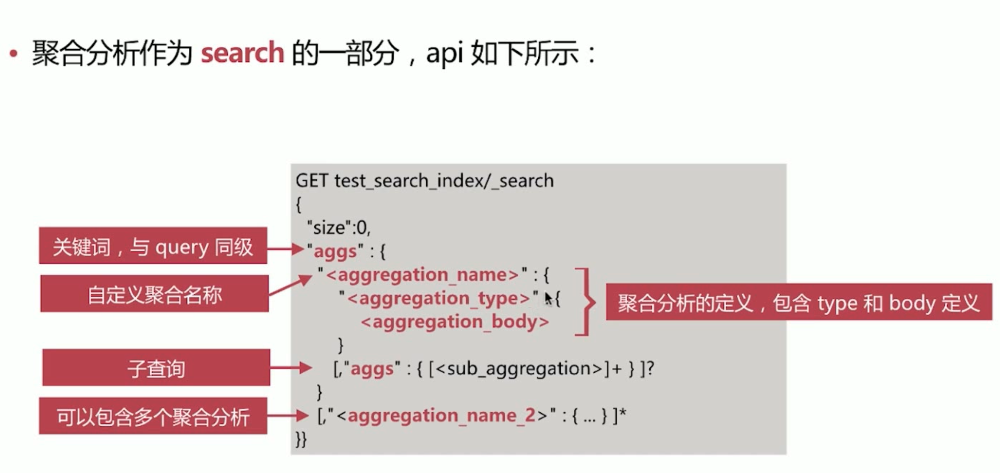
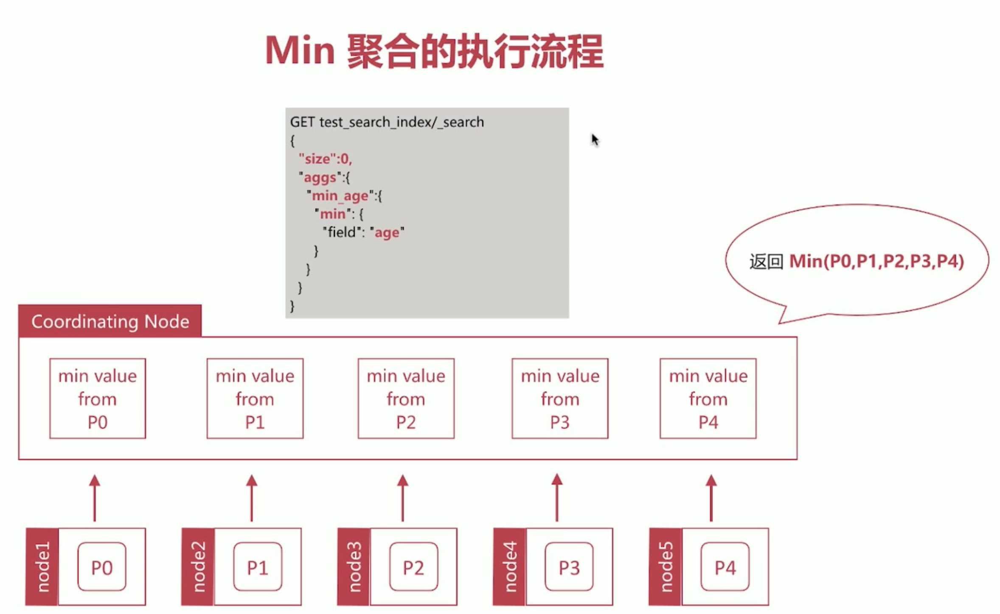
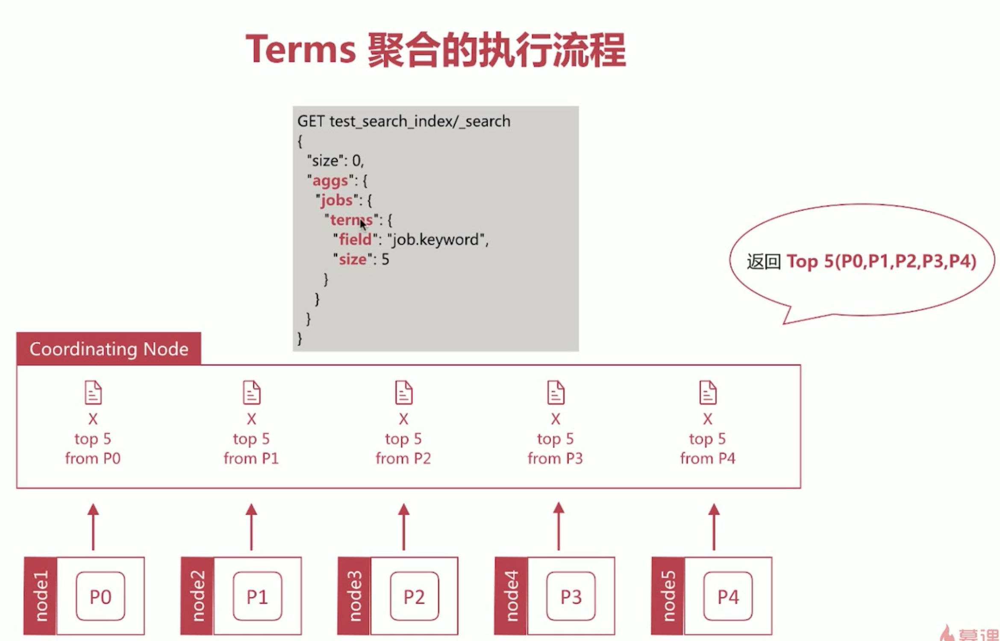
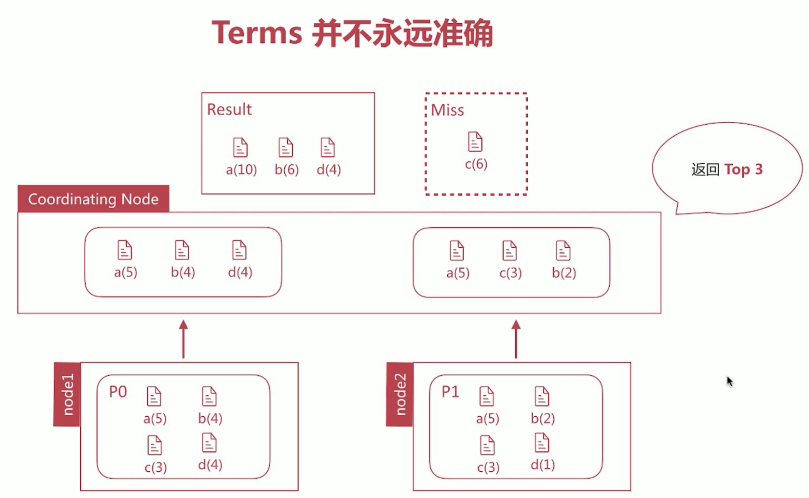
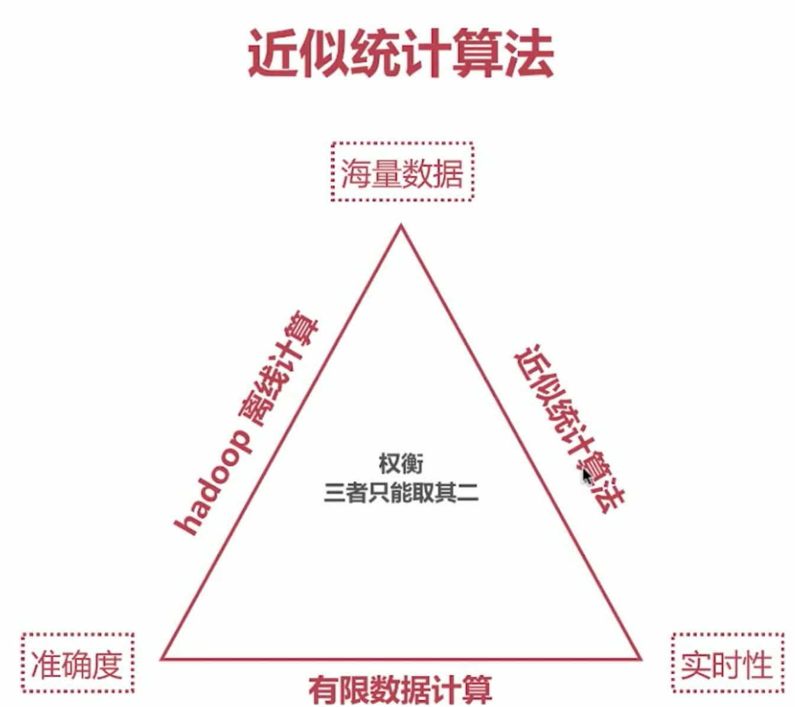

### 什么是聚合分析？
1. 搜索引擎用来回答如下问题
  - 请告诉我地址为上海的所有订单？
  - 请告诉我最近1天内创建但没有付款的所有订单？
2. 聚合分析可以回答如下问题
  - 请告诉我最近1周每天的订单成交量有多少？
  - 请告诉我最近1个月每天的平均订单金额是多少？
  - 请告诉我最近半年卖的最火的前5个商品是哪些？

### 聚合分析
1. 聚合分析，英文为 Aggregation，是 es 除搜索功能外提供的针对 es 数据做统计分析的功能
  - 功能丰富，提供 Bucket、Metric、Pipeline 等多种分析方式，可以满足大部分的分析需求
  - 实时性高，所有的计算记过都是即时返回的，而 hadoop 等大数据系统一般都是 T+1 级别的

2. q=请告诉我公司目前在职人员工作岗位的分布情况？
```
GET test_search_index/_search
{
  "size": 0,
  "aggs": {
    "people_per_job": {
      "terms": {
        "field": "job.keyword"
      }
    }
  }
}
```
3. 为了便于理解，es 将聚合分析主要分为如下4类
  - Bucket，分桶类型，类似 SQL 中的 Group BY语法
  - Metric，指标分析类型，如计算最大值、最小值、平均值等等
  - Pipleline，管道分析类型，基于上一级的聚合分析结果进行再分析
  - Matrix，矩阵分析类型

### Metric 聚合分析
1. 主要分如下两类：
  - 单值分析，只输出一个分析结果
    - min，max，avg，sum
    - cardinality
  - 多值分析，输出多个分析结果
    - stats，extended stats
    - percentile，percentile rank
    - top hits

### Metric 聚合分析
1. 返回数值类字段的最小值 - Min
```
GET test_search_index/_search
{
  "size": 0,
  "aggs": {
    "min_age": {
      "min": {
        "field": "age"
      }
    }
  }
}
```
2. 返回数值类字段的最大值- Max
```
GET test_search_index/_search
{
  "size": 0,
  "aggs": {
    "max_age": {
      "max": {
        "field": "age"
      }
    }
  }
}
```
3. 返回数值类字段的平均值 - Avg
```
GET test_search_index/_search
{
  "size": 0,
  "aggs": {
    "avg_age": {
      "avg": {
        "field": "age"
      }
    }
  }
}
```
4. 返回数值类字段的总和 - Sum
```
GET test_search_index/_search
{
  "size": 0,
  "aggs": {
    "sum_age": {
      "sum": {
        "field": "age"
      }
    }
  }
}
```
5. 一次返回多个聚合结果
```
GET test_search_index/_search
{
  "size": 0,
  "aggs": {
    "min_age": {
      "min": {
        "field": "age"
      }
    },
    "max_age": {
      "max": {
        "field": "age"
      }
    },
    "avg_age": {
      "avg": {
        "field": "age"
      }
    },
    "sum_age": {
      "sum": {
        "field": "age"
      }
    }
  }
}
```
6. Cardinality，意为集合的势，或者基数，是指不同数值的个数，类似 SQL 中的 distinct count 概念
```
GET test_search_index/_search
{
  "size": 0,
  "aggs": {
    "count_of_job": {
      "cardinality": {
        "field": "job.keyword"
      }
    }
  }
}
```
7. Stats - 返回一系列数值类型的统计值，包含 min、max、avg、sum 和 count
```
GET test_search_index/_search
{
  "size": 0,
  "aggs": {
    "stats_age": {
      "stats": {
        "field": "age"
      }
    }
  }
}
```
8. Extended Stats - 对 stats 的扩展，包含了更多的统计数据，比如方差、标准差等等
```
GET test_search_index/_search
{
  "size": 0,
  "aggs": {
    "stats_age": {
      "extended_stats": {
        "field": "age"
      }
    }
  }
}
```
9. Percentile - 百分位数统计
```
# percents 可以去掉
GET test_search_index/_search
{
  "size": 0,
  "aggs": {
    "per_age": {
      "percentiles": {
        "field": "salary",
        "percents": [
          95,
          99,
          99.9
        ]
      }
    }
  }
}
```
10. Percentile Rank - 百分位数统计
```
GET test_search_index/_search
{
  "size": 0,
  "aggs": {
    "per_salary": {
      "percentile_ranks": {
        "field": "salary",
        "values": [
          11000,
          30000
        ]
      }
    }
  }
}
```
11. Top Hits - 一般用于分桶后获取该桶内最匹配的顶部文档列表，即详情数据
```
GET test_search_index/_search
{
  "size": 0,
  "aggs": {
    "jobs": {
      "terms": {
        "fields": "job.keyword",
        "size": 10
      },
      "aggs": {
        "top_employee": {
          "top_hits": {
            "size": 10,
            "sort": [
              {
                "age": {
                  "order": "desc"
                }
              }
            ]
          }
        }
      }
    }
  }
}
```

### Bucket 聚合分析
1. Bucket，意为桶，即按照一定的规则将文档分配到不同的桶中，达到分类分析的目的
2. 按照 Bucket 的分桶策略，常见的 Bucket 聚合分析如下：
  - Terms
  - Range
  - Date Range
  - Histogram
  - Date Histogram
3. Terms - 该分桶策略最简单，直接按照 term 来分桶，如果是 text 类型，则按照分词后的结果分桶
```
GET test_search_index/_search
{
  "size": 0,
  "aggs": {
    "jobs": {
      "terms": {
        "field": "job.keyword",
        "size": 5
      }
    }
  }
}
```
4. Range - 通过指定数值的范围来设定分桶规则
```
# ranges 指定每个 range 的范围
GET test_search_index/_search
{
  "size": 0,
  "aggs": {
    "salary_range": {
      "range": {
        "field": "salary",
        "ranges": [
          {
            "key": "<10000",
            "to": 10000
          },
          {
            "from": 10000,
            "to": 20000
          },
          {
            "key": ">20000"
            "from": 20000
          }
        ]
      }
    }
  }
} 
```
5. Date Range - 通过指定日期的范围来设定分桶规则
```
# range：关键词 fromat：指定返回结果的日期格式 from to ：指定日期，可以使用 date math
GET test_search_index/_search
{
  "size": 0,
  "aggs": {
    "date_range": {
      "range": {
        "field": "birth",
        "format": "yyyy",
        "ranges": [
          {
            "from": "1980",
            "to": "1990"
          },
          {
            "from": "1990",
            "to": "2000"
          },
          {
            "from": "2000"
          }
        ]
      }
    }
  }
}
```
6. Historgram - 直方图，以固定间隔的策略来分割数据
```
# histogram：关键词 interval：指定间隔大小 extended_bounds：指定数据范围
GET test_search_index/_search
{
  "size": 0,
  "aggs": {
    "salary_hist": {
      "histogram": {
        "filed": "salary",
        "interval": 5000,
        "extended_bounds": {
          "min": 0,
          "max": 40000
        }
      }
    } 
  }
}
```
7. Date Historgram - 针对日期的直方图或者柱状图，是时序数据中常用的聚合分析类型
```
GET test_search_index/_search
{
  "size": 0,
  "aggs": {
    "by_year": {
      "date_histogram": {
        "filed": "birth",
        "interval": "year",
        "format": "yyyy"
      }
    }
  }
}
```

### Bucket + Metric 聚合分析
1. BUcket 聚合分析允许通过添加子分析来进一步进行分析，该子分析可以是 Bucket 也可以是 Metric。这也使得 es 的聚合分析能力变得异常强大
2. 分桶后再分桶
```
GET test_search_index/_search
{
  "size": 0,
  "aggs": {
    "jobs": {
      "terms": {
        "field": "job.keyword",
        "size": 10
      },
      "aggs": {
        "age_range": {
          "range": {
            "field": "age",
            "range": {
              { "to": 20 },
              { "from": 20, "to": 30 },
              { "from": 30 }
            }
          }
        }
      }
    }
  }
}
```
3. 分桶后进行数据分析
```
GET test_search_index/_search
{
  "size": 0,
  "aggs": {
    "jobs": {
      "terms": {
        "field": "job.keyword",
        "size": 10
      },
      "aggs": {
        "salary": {
          "stats": {
            "field": "salary"
          }
        }
      }
    }
  }
}
```

### Pipeline 聚合分析
1. 针对聚合分析的结果再次进行聚合分析，而且支持链式调用，可以回答如下问题：
  - 订单月平均销售额是多少？
```
POST order/_search
{
  "size": 0,
  "aggs": {
    "sales_per_month": {
      "date_histogram": {
        "field": "date",
        "interval": "month"
      },
      "aggs": {
        "slaes": {
          "sum": {
            "filed": "price"
          }
        }
      }
    },
    "avg_monthly_sales": {
      "avg_bucket": {
        "buckets_path": "sales_per_month>sales"
      }
    }
  }
}
```
2. Pipeline 的分析结果会输出到原结果中，根据输出位置的不同，分为以下两类：
  - Parent 结果内嵌到现有的聚合分析结果中
    - Derivative
    - Moving Average
    - Cumulative Sum
  - Sibling 结果与现有聚合分析结果同级
    - Max/Min/Avg/Sum Bucket
    - Stats/Extended Stats Bucket
    - Percentiles Bucket
3. Sibling - Min Bucket - 找出所有 Bucket 中值最小的 Bucket 名称和值
```
GET test_search_index/_search
{
  "size": 0,
  "aggs": {
    "jobs": {
      "terms": {
        "field": "job.keyword",
        "size": 10
      },
      "aggs": {
        "avg_salary": {
          "avg": {
            "field": "salary"
          }
        }
      }
    },
    "min_salary_by_job": {
      "min_bucket": {
        "buckets_path": "jobs>avg_salary"
      }
    }
  }
}
```
4. Sibling - Max Bucket - 找出所有 Bucket 中值最大的 Bucket 名称和值
5. Sibling - Avg Bucket - 计算所有 Bucket 中平均值
6. Sibling - Sum Bucket - 计算所有 Bucket 值的总和
7. Sibling - Stats Bucket - 计算所有 Bucket 值的  Stats 分析
8. Sibling - Percentiles Bucket - 计算所有 Bucket 值的百分位数
9. Parent - Derivative - 计算 Bucket 值的导数
```
GET test_search_index/_search
{
  "size": 0,
  "aggs": {
    "birth": {
      "date_histogram": {
        "field": "birth",
        "interval": "year",
        "min_doc_count": 0
      },
      "aggs": {
        "avg_salary": {
          "avg": {
            "field": "salary"
          }
        },
        "derivative_avg_salary": {
          "derivative": {
            "buckets_path": "avg_salary"
          }
        }
      }
    }
  }
}
```
10. Parent - Moving Acerage - 计算 Bucket 值的移动平均值
```
GET test_search_index/_search
{
  "size": 0,
  "aggs": {
    "birth": {
      "date_histogram": {
        "field": "birth",
        "interval": "year",
        "min_doc_count": 0
      },
      "aggs": {
        "avg_salary": {
          "avg": {
            "field": "salary"
          }
        },
        "mavg_salary": {
          "moving_avg": {
            "buckets_path": "avg_salary"
          }
        }
      }
    }
  }
}
```
11. Parent - Cumulative Sum - 计算 Bucket 值的累计加和
```
GET test_search_index/_search
{
  "size": 0,
  "aggs": {
    "birth": {
      "date_histogram": {
        "field": "birth",
        "interval": "year",
        "min_doc_count": 0
      },
      "aggs": {
        "avg_salary": {
          "avg": {
            "field": "salary"
          }
        },
        "cumulative_salary": {
          "cumulative_sum": {
            "buckets_path": "avg_salary"
          }
        }
      }
    }
  }
}
```

### 聚合分析作用范围
1. es 聚合分析默认作用范围是 query 的结果集，可以通过如下的方式改变其作用范围：
  - filter
  - post_filter
  - global
```
GET test_search_index/_search
{
  "size": 0,
  "query": {
    "match": {
      "username": "alfred"
    }
  },
  "aggs": {
    "jobs": {
      "terms": {
        "field": "job.keyword",
        "size": 10
      }
    }
  }
}
```
2. filter - 为某个聚合分析设定过滤条件，从而在不更改整体 query 语句的情况下修改来作用范围
```
GET test_search_index/_search
{
  "size": 0,
  "aggs": {
    "jobs_salary_small": {
      "filter": {
        "range": {
          "salary": {
            "to": 10000
          }
        }
      },
      "aggs": {
        "jobs": {
          "terms": {
            "field": "job.keyword"
          }
        }
      }
    },
    "jobs": {
      "terms": {
        "field": "job.keyword"
      }
    }
  }
}
```
3. post-filter - 作用于文档过滤，但在聚合分析后生效
```
GET test_search_index/_search
{
  "aggs": {
    "jobs": {
      "terms": {
        "filed": "job.keyword"
      }
    }
  },
  "post_filter": {
    "match": {
      "job.keyword": "java engineer"
    }
  }
}
```
4. global - 无视 query 过滤条件，基于全部文档进行分析
```
GET test_search_index/_search
{
  "query": {
    "match": {
      "job.keyword": "java engineer"
    }
  },
  "aggs": {
    "java_avg_salary": {
      "avg": {
        "field": "salary"
      }
    },
    "all": {
      "global": {},
      "aggs": {
        "avg_salary": {
          "avg": {
            "field": "salary"
          }
        }
      }
    }
  }
}
```

### 聚合分析排序
1. 可以使用自带的关键数据进行排序，比如
  - _count 文档数
  - _key 按照 key 值排序
```
GET test_search_index/_search
{
  "size": 0,
  "aggs": {
    "jobs": {
      "terms": {
        "field": "job.keyword",
        "size": 10,
        "order": [
          {
            "_count": "asc"
          },
          {
            "_key": "desc"
          }
        ]
      }
    }
  }
}
```
```
# 按照 job.keyword 进行分桶，然后在每个分桶中按照 avg_salary 降序排列
GET test_search_index/_search
{
  "size": 0,
  "aggs": {
    "jobs": {
      "terms": {
        "field": "job.keyword",
        "size": 10,
        "order": [
          {
            "avg_salary": "desc" 
          }
        ]
      },
      "aggs": {
        "avg_salary": {
          "avg": {
            "filed": "salary"
          }
        }
      }
    }
  }
}
# 如果是 stats 进行分析，需要在 order 中指定是哪个指标
GET test_search_index/_search
{
  "size": 0,
  "aggs": {
    "jobs": {
      "terms": {
        "field": "job.keyword",
        "size": 10,
        "order": [
          {
            "stats_salary.sum": "desc" 
          }
        ]
      },
      "aggs": {
        "avg_salary": {
          "stats": {
            "filed": "salary"
          }
        }
      }
    }
  }
}
```

### Min聚合的执行流程


### Terms 聚合的执行流程


1. Terms 不准确的原因
  - 数据分散在多个 Shard 上，Coordinating Node 无法得悉数据全貌
2. Terms 不准确的解决方法
  - 设置 Shard 数为 1，消除数据分散的问题，但无法承载大数据量
  - 合理设置 Shard_Size 大小，即每次从 Shard 上额外多获取数据，以提升准确度
  ```
  GET test_search_index/_search
  {
    "size": 0,
    "aggs": {
      "jobs": {
        "terms": {
          "field": "job.keyword",
          "size": 1,
          "shard_size": 10
        }
      }
    }
  }
  ```
3. Shard_Size 的小的设定方法
  - terms 聚合返回结果中有如下两个统计值：
    - doc_count_error_upper_bound 被遗漏的 term 可能的最大值
    - sum_other_doc_count 返回结果 bucket 的 term 外其他 term 的文档总数
  - 设定 show_term_doc_count_error 可以查看每个 bucket 误算的最大值
  ```
  GET test_search_index/_search
  {
    "size": 0,
    "aggs": {
      "jobs": {
        "terms": {
          "field": "job.keyword",
          "size": 2,
          "show_term_doc_count_error": true
        }
      }
    }
  }
  ```
4. Shard_Size 默认大小如下
  - shard_size = (size*1.5) + 10
5. 通过调整 Sherd_Size 的大小降低 doc_count_error_upper_bound 来提升准确度
  - 增大来整体的计算量，从而降低来响应时间

### 近似统计算法

1. 在 ES 的聚合分析中，Cardinality 和 Percentile 分析使用的是近似统计算法
  - 结果是近似准确的，但不一定精准
  - 可以通过参数的调整使其结果精准，但同时也意味着更多的计算时间和更大的性能消耗