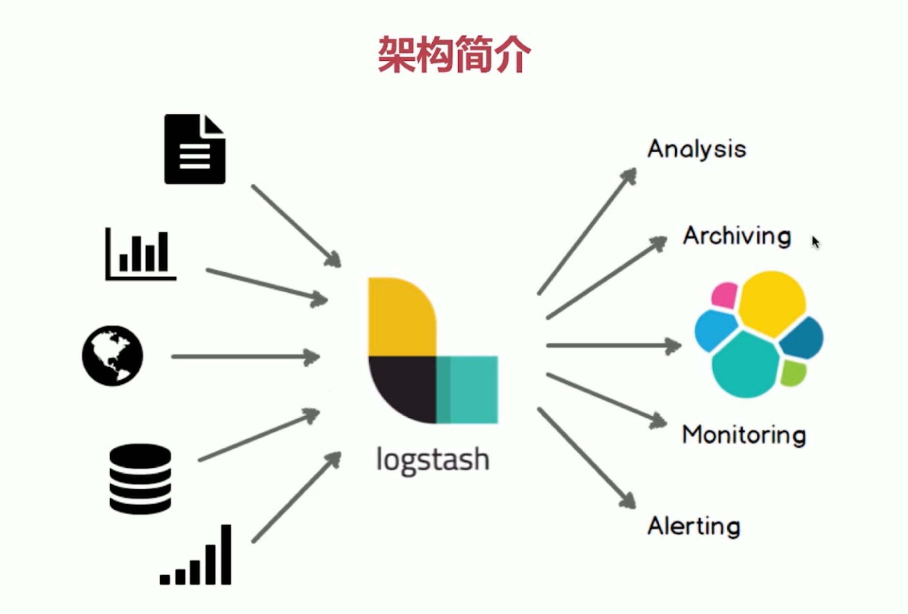
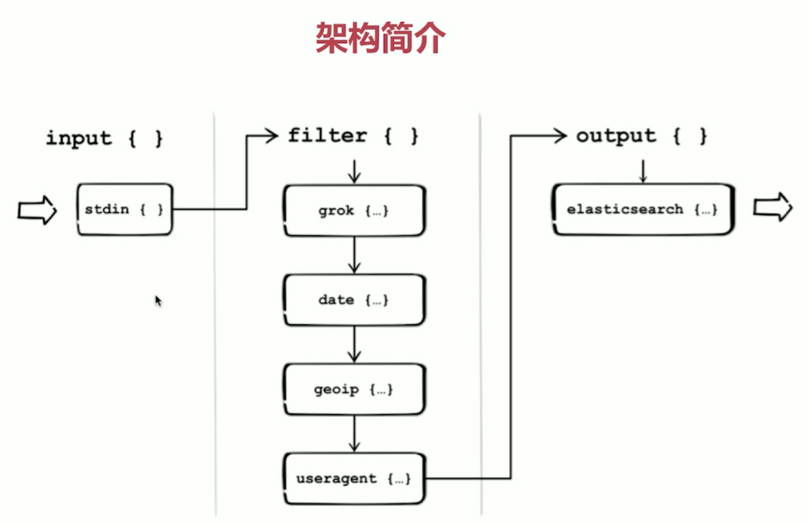
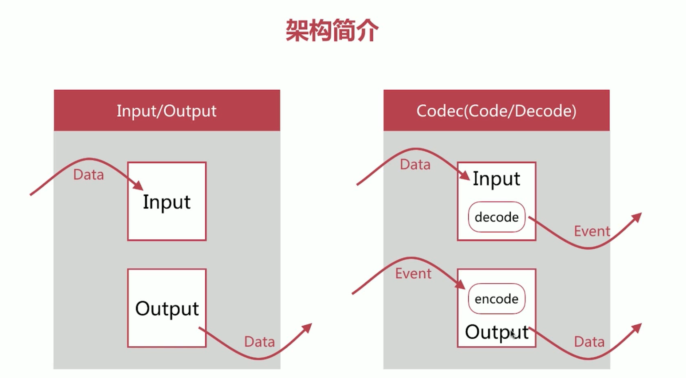
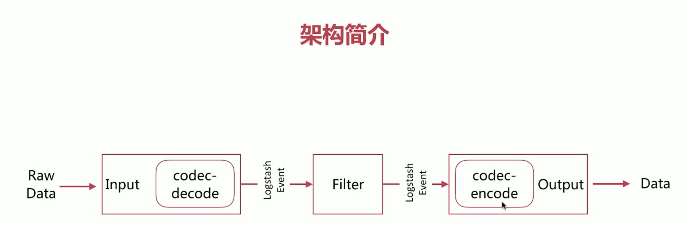
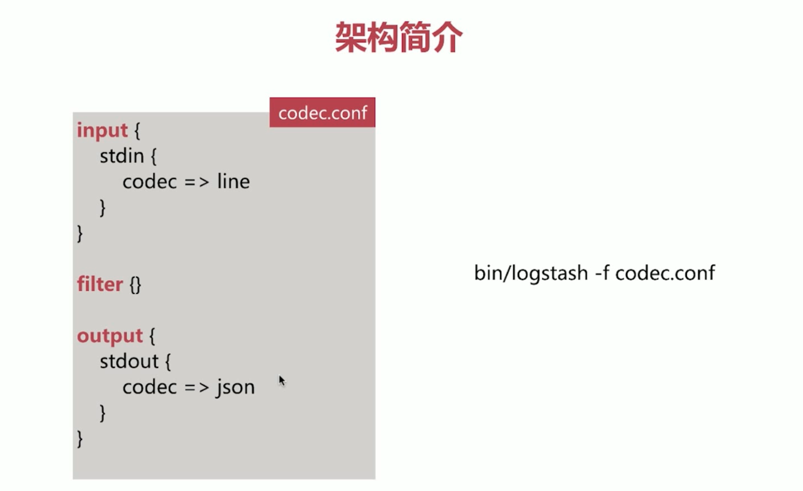
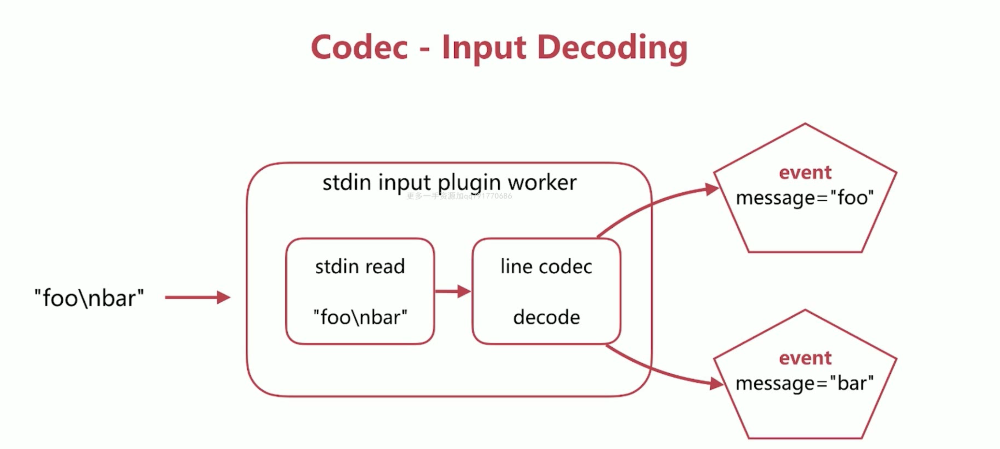
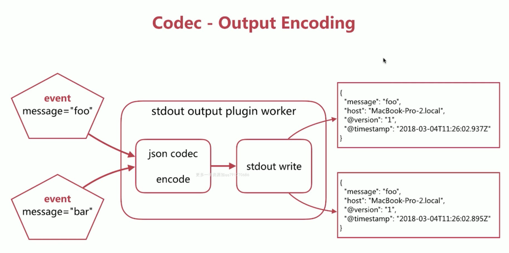
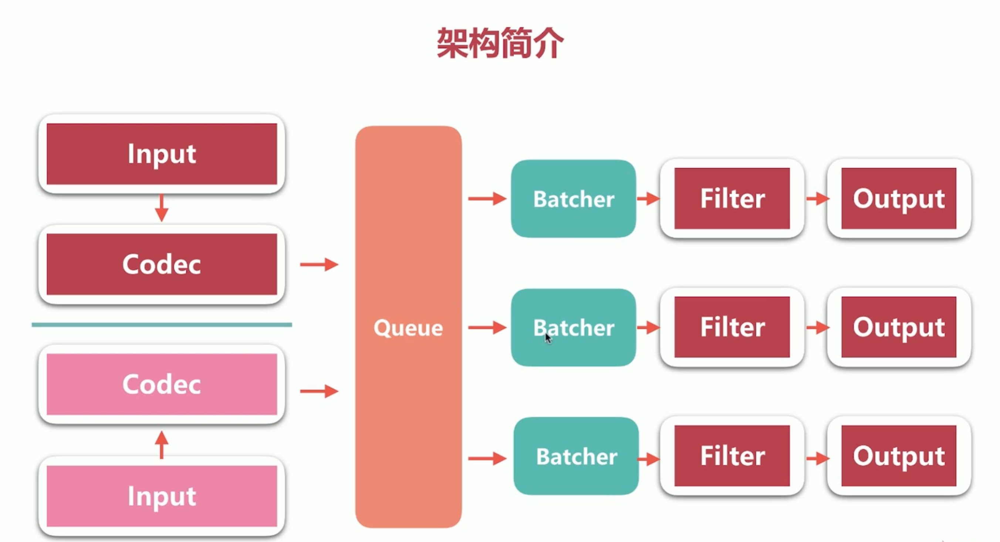
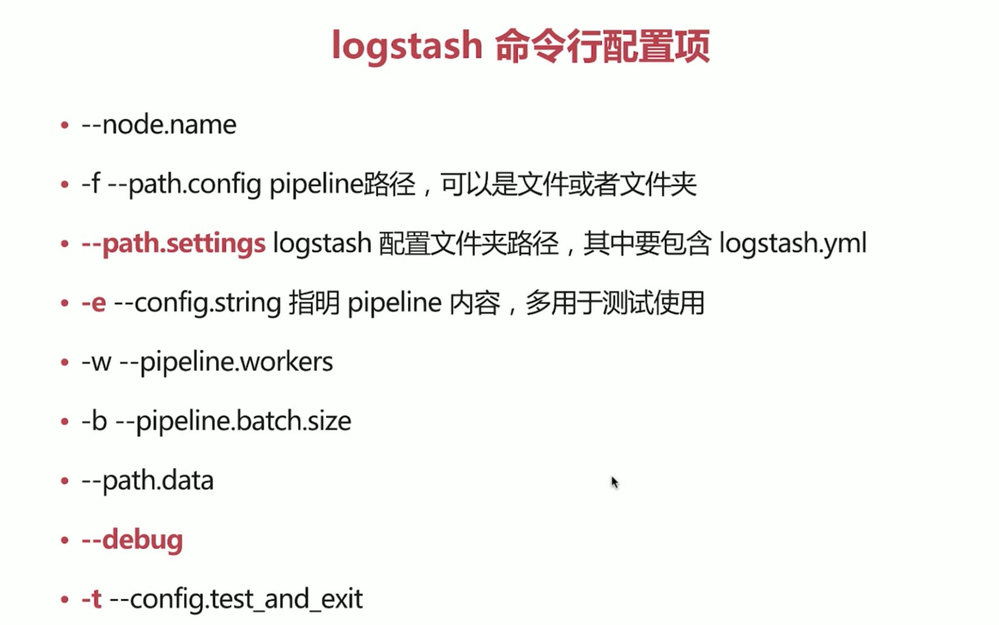

### 架构简介


1. Pipeline
  - input-filter-output 的 3 阶段处理流程
  - 队列管理
  - 插件生命周期管理
2. Logstash Event
  - 内部流转的数据表现形式
  - 原属数据在 input 被转换为 Event，在 output event 被转换为目标格式数据
  - 在配置文件中可以对 Event 中的属性进行增删改查







### Queue 的分类
1. In Memory
  - 无法处理进程 Crash、机器宕机等情况，会导致数据丢失
2. Persistent Queue inDisk
  - 可处理进程 Crash 等情况，保证数据不丢失
  - 保证数据至少消费一次
  - 充当缓冲区，可以替代 Kafka 等消息队列的作用

### PQ 的基本配置
1. queue.type:persisted
  - 默认是 memory
2. queue.max_bytes:4gb
  - 队列存储最大数据量

### 架构简介 - 相关配置
1. pipeline.workers | -w
  - pipeline 线程数，即 filter_output 的处理线程数，默认是 cpu 核数
2. pipeline.batch.size | -b
  - Batcher 一次批量获取的待处理文档数，默认 125，可以根据输出进行调整，越大会占用越多的 heap 空间，可以通过 jvm.options 调整
3. pipeline.batch.delay | -u
  - Batcher 等待的时长，单位为 ms

### VisualVM
1. 可以下载这个 VisualVM 对 JAVA 的线程进行查看

### Logstash 配置文件
1. logstash 设置相关的配置文件(在 conf 文件夹中，setting files)
  - logstahs.yml logstash 相关的配置，比如 node.name、path.data、pipeline.workers、queue.type 等，这其中的配置可以被命令行参数的相关参数覆盖
  - jvm.options 修改 jvm 的相关参数，比如修改 heap size 等
2. pipeline 配置文件
  - 定义数据处理流程的文件，以 .conf 结尾

### logstash.yml
1. 使用 yaml 语法，支持如下两种形式：
```
# 层级结构
pipeline:
  batch:
    size: 125
    delay: 50

# 扁平结构
pipeline.batch.size:125
pipeline.batch.delay:50
```
2. node.name
  - 节点名，便于识别
3. path.data
  - 持久化存储数据的文件夹，默认是 logstash home 目录下的 data
4. path.config
  - 设定 pipeline 配置文件的目录
5. path.log
  - 设定 pipeline 日志文件的目录
6. pipeline.workers
  - 设定 pipeline 的线程数(filter+putput)，优化的常用项
7. pipeline.batch.size/delay
  - 设定批量处理数据的数目和延迟
8. queue.type
  - 设定队列类型，默认是 memory
9. queue.max_bytes
  - 队列总容量，默认是1g

### Logstash 命令行配置项


### Logstash 配置方式建议
1. 线上环境推荐采用配置文件的方式来设定 logstash 的相关配置，这样可以减少犯错的机会，而且文件便于进行版本化管理
2. 命令行形式多用来进行快速的配置测试、验证、检查等

### logstash 多实例运行方式
1. bin/logstash --path.settings instance1
2. bin/logstash --path.settings instance2
3. 不同 instance 中修改 logstash.yml，自定义 path.data，确保其不相同即可

### pipeline 配置语法
1. 主要有如下数值类型：
2. 布尔类型 Boolean
  - isFailed => true
3. 数值类型 Number
  - port => 33
4. 字符串类型 String  
  - name => "Hello world"
5. 数组 Array/List
  - users => [{id => 1, name => bob}, {id => 2, name => jane}]
  - path => ["/var/log/messages", "/var/log/*.log"]
6. 哈希类型 Hash
  - match => {
    "field1" => "value1"
    "field2" => "value2"
  }
7. 注释
  - 井号
  - #`this is a comment`
8. 在配置中可以饮用 Logstash Event 的属性(字段)，主要有如下两种方式：
  - 直接引用字段值
    - 直接 [] 即可，嵌套字段写多层 [] 即可
    ```
    ...
    {
      "request": "/index.html"
    },
    ...
    "ua": {
      "os": "Windows 7"
    }
    ...

    ...
    if[request] =~ "index"{
    ...
    ...
    if[ua][os] =~ "windows"{
    ...
    ```
  - 在字符串中以 sprintf 方式引用
    - 使用 %{} 来实现
    ```
    ...
    req => "request is %{request}"
    ...
    ...
    ua => "ua is %{[ua][os]}"
    ...
    ```
9. 支持条件判断语法，从而扩展来配置的多样性，主要格式如下：
```
if EXPRESSION {
  ...
} else if EXPRESSION {
  ...
} else {
  ...
}
```
10. 表达式主要包括如下的操作符：
  - 比较：==、!=、<、>、<=、>=
  - 正则是否匹配：=~、!~
  - 包含(字符串或者数组)：in、not in
  - 布尔操作符：and、or、nand、xor、!
  - 分组操作符：()