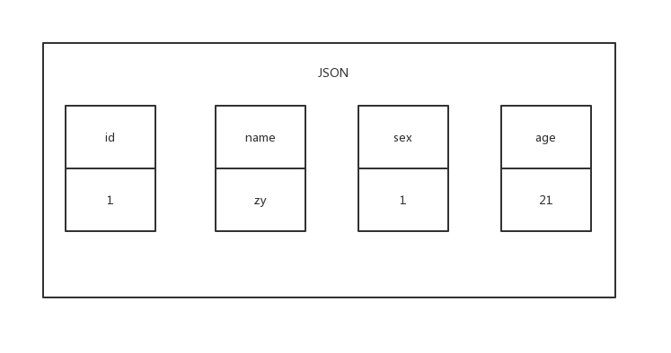
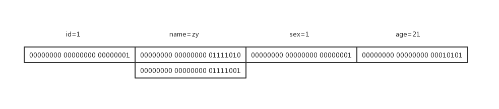
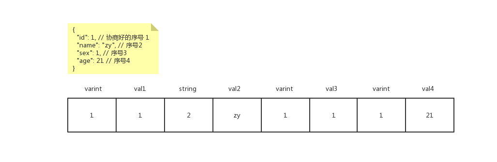
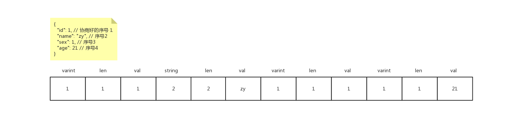

1. 人员介绍：XXX技术部有个leader A，大神B，小菜C
2. 经过第一个版本的迭代，终于开发完了第一个版本，准备给其他组里的其他同学内部先演示下成果
3. 打开网站，看见有个圈圈一直转一直转，隔了1分钟左右，页面数据才显示出来
4. 有人在下面提问说，这个打开怎么这么慢，很浪费时间呢？leader A站在台上表示有点小尴尬，还是大概解释了下原因，不过心里面还是记下了这个需要优化的点
5. 回去后，和组里的小伙伴开了一个会，提了一下这个数据拉取慢的问题，大神B提出了一种构想使用PB来提升一下数据传输的速度，最后决策也想试用下这种方式
6. 小菜C表示听的一脸懵逼，会后，找到大神B：“大神，大神，可以问一下刚刚说的那个PB是什么啊？”
7. 大神B：“PB是Protocol Buffers的一种简写，或者也可以说成protobuf，是谷歌推出的一种与语言无关，平台无关的可扩展机制，用于序列化结构化数据”
8. 小菜C感觉还是没怎么听懂的样子，大神B就说：“要不我们一起做个小Demo吧，你会一些Nodejs吧，我们就用Nodejs来简单实现下吧”
9. 大神B：“我之前有说过PB与语言无关，平台无关，你看我们这边有Python、JAVA、还有Nodejs等等这么多语言，我们就以Nodejs作为中台，JAVA作为后台来进行模拟”
10. 大神B：“首先我们两边的语言是不一致的，我们要先商定好一种数据交互的规范，其实可以选择的有XML、JSON、还有这个PB，XML你也知道，这种方式实在是太复杂了，有很多的标签，而且格式很死板，又很大，很早之前就基本淘汰了，JSON呢，我们之前那个后台返回的数据格式就是用JSON，你也看到了，当处理很大的数据的时候，它还是有些慢的”
11. 小菜B：“恩恩，是有点慢，PB是不是另外一种数据格式呢？比XML和JSON更加的高效呢？”
12. 大神B：“是的，PB比JSON快了接近5倍，而且体积也小很多，这样在传输的时候会更快。”
13. 小菜C：“哇，听起来好棒啊！”
14. 大神B：“来来来，我们先看一个应用模型，假设我们要传递的数据语义形式是->姓名：张三，我们就可以和后端同学(JAVA端)同学进行商定，新建一个.proto扩展的文件”
```
// user.proto

syntax = "proto3"; // 使用proto3的语法进行编写，proto2是之前的版本，3比2支持更多的语言但是简洁。去掉了一些复杂的语法和特性，更强调约定而弱化语法

message User{ // 所有结构化的数据被称为 message
  int32  user_id = 0; // int32:整形
  string name = 1; // string:字符串类型
}
```
15. 小菜C：“这个Nodejs应该直接使用不了吧，这个要怎么解析呢？”
16. 大神B：“有很多种方式，我这边采取protoc的形式去进行解析，首先，我们要先去[这里](https://github.com/google/protobuf/releases)下载对应的protoc，如果为了以后方便使用，可以加到环境变量中，但是我们这里就先演示，后面自行加入环境变量恩。”
17. 大神B: “需要使用下载好的protoc对.proto文件进行解析，可以使用如下命令”
```shell
protoc --js_out=import_style=commonjs,binary:. user.proto
```
18. 大神B：“执行完后就会生成一个user_pb.js的文件，里面的东西看起来会有点小复杂，我们可以不用细看，主要是会使用就行，在你的nodejs中的Controller中可以直接引入，然后就可以使用了,还有要记得安装google-protobuf的包依赖”
```js
var Userpb = require('./user_pb.js');
var userpb = new Userpb.User();
class User{
  getInfo() {
    console.log(userpb.getUserId())
    console.log(userpb.getName())
  }
}
let u = new User()
u.getInfo()
```
19. 小菜C：“那如果是要对数据进行修改是不是使用set...”
20. 大神B：“正是如此，是不是很简单，而且JS文件中是有对应的方法的，要不我们看个复杂点的例子，比如说我现在有这么一个诉求，需要将一批用户的数据进行一个批量的同步，首先先定义一个.proto文件”
```
syntax = "proto3";

message UserOne
{
  int32  id                               = 1; // 用户ID
  bytes  sex                              = 2; // 1：男，2：女
  string name                             = 3; // 用户姓名
  int32  hobby                            = 4; // 爱好
}

message UserAll
{
  repeated UserOne user_list              = 1; // UserOne类型的数组
  string           update_time            = 2; // 更新时间
}
```
21. 大神B： “然后就是你的一些处理逻辑”
```js
var Userpb = require('./user_pb.js');
var moment = require('moment');

// mock 用户的假数据
var user_list = [{
  id: 1,
  sex: 1, // 男
  name: 'aaa',
  hobby: 1 // 羽毛球
}, {
  id: 2,
  sex: 0, // 女
  name: 'bbb',
  hobby: 2 // 瑜伽
}]

// 实例化一个UserAll类型的对象
var userpb = new Userpb.UserAll();

// 对UserAll这个message中的修改时间update_time进行填充值
userpb.setUpdateTime(moment().format('YYYY-MM-DD HH:mm:ss'));

// 遍历需要修改的值
for (var i = 0; i < user_list.length; i++) {
  var one = user_list[i];
  var userItem = userpb.addUserList();
  // 对单个用户数据进行填充
  userItem.setId(one.id);
  userItem.setSex(one.sex);
  userItem.setName(one.name);
  userItem.setHobby(one.hobby);
}

// 传输的时候将数据转换为二进制传输
const postData = querystring.stringify({
  data: new Buffer(userpb.serializeBinary()).toString('base64')
});
var options = {
  hostname: '11.11.11.11',
  port: 80,
  path: 'update-users',
  method: 'POST',
  headers: {
    'Content-Type': 'application/x-www-form-urlencoded',
    'Content-Length': Buffer.byteLength(postData)
  }
};
// 发送请求
const reqU = http.request(options, (res) => {
  // ...... 请求的一些中间处理
});
reqU.write(postData);
```
22. 小菜C：“大神，但是这么弄，不是变复杂了么？之前用JSON好像没有这么麻烦的”
23. 大神B：“其实也就是一点点的麻烦，需要进行转换下，但是，这样速度会快很多，而且体积也小特别多”
24. 小菜C：“那请问下，为什么说protobuf要比JSON快很多而且还小很多呢？”
25. 大神B：“我跟你讲一下大概的原理吧，我们就基于传统的JSON串来进行优化，比如说有下面一个JSON串”
```json
{
  "id": 1,
  "name": "zy",
  "sex": 1,
  "age": 21
}
```



26. 大神B：“其实你看JSON里面的这些引号，逗号其实都没有什么用，我们可以将它去掉。”
```
// 伪代码
{
  id 1
  name zy
  sex 1
  age 21
}
```
27. 大神B：“这样虽然是减少了一些，但是其实往往是不够的，再做一个大胆一点的尝试，其实这些键：id，name，sex，hobby等等对于数据传输根本就没有用，传输过程中根本不管你是叫个什么名字，其实也完全可以去掉么”
28. 小菜C：“那去掉之后，只有数据了，确实是小了很多，但是没办法知道这个是什么意思了”
29. 大神B：“别着急，我们看看简化后可以用什么样的方式存储起来，可以使用一个链表将数据存储起来，链表是有索引的，我们就可以约定索引为0表示id，索引为1表示name。。。。。。这样我们数据是不是又小了很多，但是这个还不够小哦，你看看有什么地方可以优化的”


30. 小菜C：“这个......，这个都没啥了，还不够优化么？嗯......（思考了一会），我觉得是不是可以从数据的长度上进行一个优化呢？比如说我们存储一个年龄，假设是21岁，因为是一个整形，是32位，那转换成二进制就是00000000 00000000 00010101，其实这前面的那些0都是没用的，也可以去掉的感觉”



31. 大神B：“good，就是这样的，可以将前面那些没什么用的0去掉，所以再设计的时候，protobuf就是将数据设置为可变长的varint，但是如果其间某个数据没有填写，那中间就空了一个出来，使用这种链表的形式进行存储，数据就可以会混乱，还是需要对结构进行一个调整”



32. 大神B：“给每一项增加以type组合成type-val的形式，这里的type同样也是用一个varint进行存储的，就是一个数字的表示位置，比虽然是增加了一定的空间，但是相比于之前的是字符串的已经是省了很多空间，只占用一个字节，这样即使没有值可以可以使用type进行占位的。这样就不会数据串了。但是，还是有优化空间的，你看，比如说一些boolean值，不是false就是true，其实转换一下就是不是0就是1，其实在解析的时候是不是只要解析这个字段的一位就行了，发现是一个boolean，就只用解析一位，这样是不是又会快好多，省了很多解析的时间”
33. 小菜C：“但是感觉还是又些缺陷的，这个应该只能解析像boolean这种固定长度的，如果是一个string类型，这个长度是不可控的，就没有办法使用上面的方式了”
34. 大神B：“还是可以使用的，不过我们要换一种方式，给每项追加一个长度表示位，我们在写入数据的时候，会对长度先做以一个解析，计算出数据的长度，然后存储到len中，这样是不是在读取的时候就知道读取多长了”



35. 大神B：“你看其实protobuf就是这么实现的，这样你说是不是快了很多，而且传输的时候是使用二进制进行传输的，这样到机器那一层又少了一些解析的过程”
36. 小菜C：“哇，原来是这样，今天又get了一个技能，大神，请受小弟一拜。。。。。。”